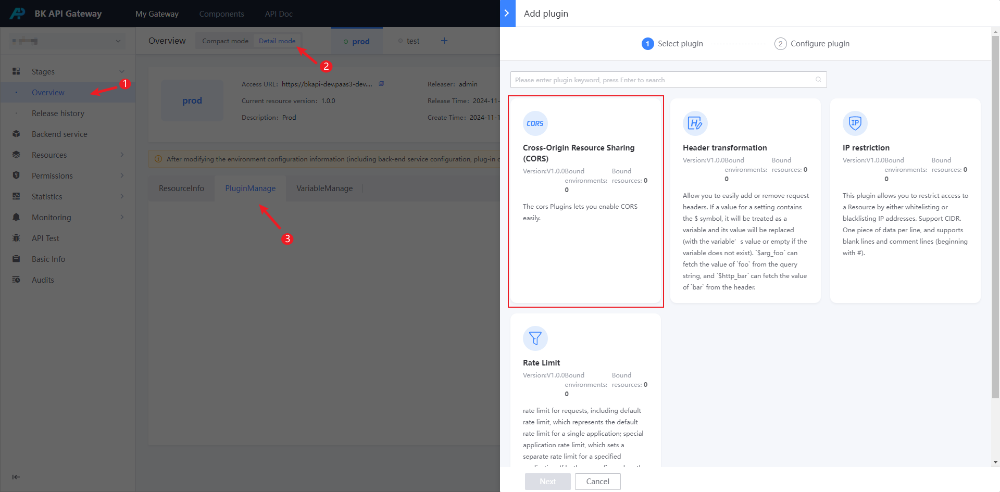
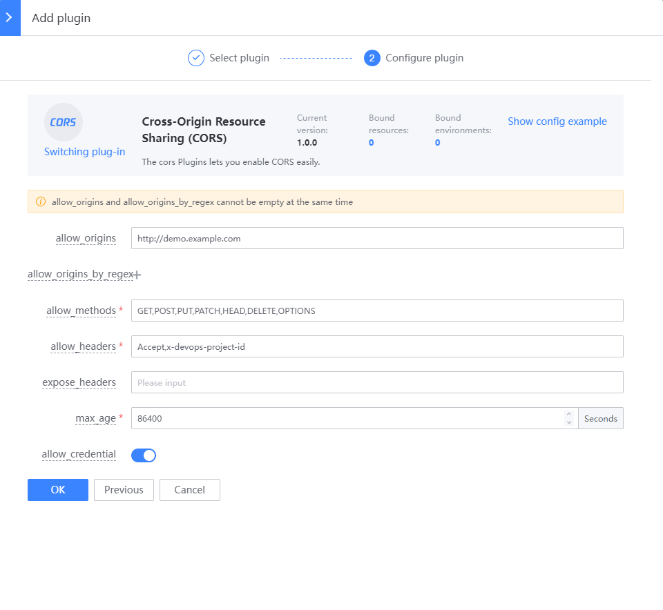
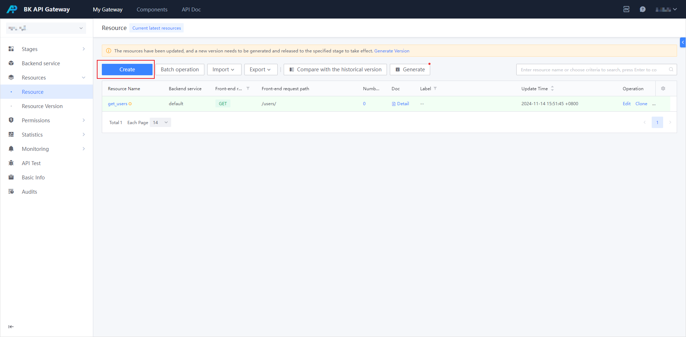
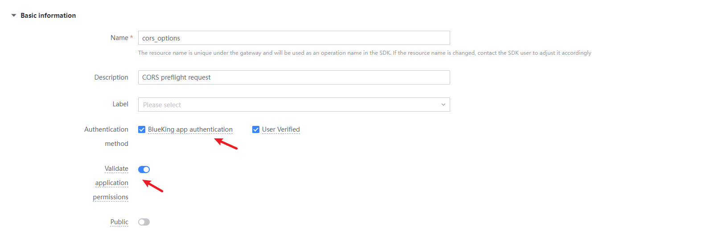
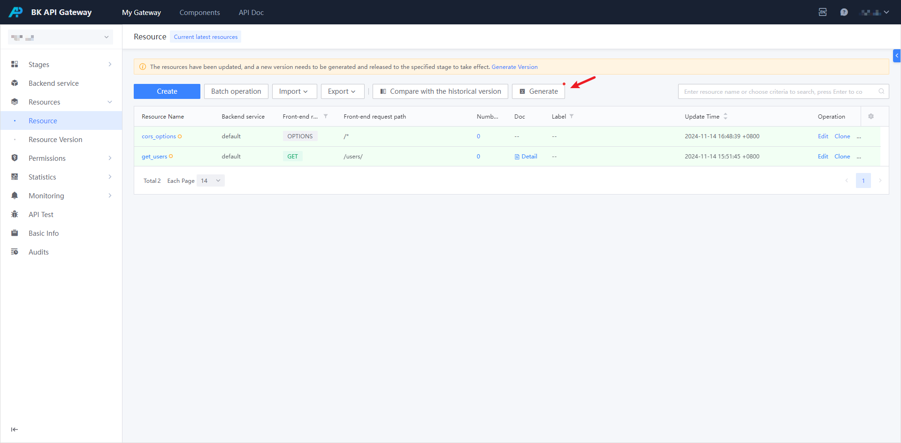

# Support cross-domain CORS

## Background

[Cross-origin resource sharing (CORS)](https://developer.mozilla.org/zh-CN/docs/Web/HTTP/Access_control_CORS) is a mechanism that uses additional HTTP headers to enable web applications to access resources from another source in the browser.

For security reasons, browsers restrict cross-origin HTTP requests initiated in scripts. According to the same-origin policy, applications can only request HTTP resources from the same domain unless the response message contains the correct CORS response header.

In some scenarios, such as BlueShield pipeline accessing third-party plug-in interfaces, if cross-domain is not configured, it will be blocked by the browser. In this case, the interface can be connected to the BlueKing API Gateway and the CORS plug-in can be bound to solve the cross-domain problem.

Note:
- If cross-domain CORS is enabled for both the environment and the resource, **cross-domain CORS for the resource will take effect (highest priority)**

## Steps

### 1. Create a new CORS plugin

#### Entry

Select the [Cross-domain Resource Sharing (CORS)] plugin in [Environment Management] - Details Mode - [Plugin Management] - [Add Now]

`Note: It is recommended to configure the CORS plugin in the environment, not on the resource, otherwise the pre-check + all resources that need to take effect must be configured separately; if it is missed, it will be found that it will not take effect`



#### Configuration instructions



1. **allowed origins**: The header `Access-Control-Allow-Origin` specifies the request domains that are allowed to access the service, such as `http://demo.example.com`
- **Important**: Generally configured to request cloud API The domain name of the page in the browser supports wildcard domain names. In this case, please configure **allow_origins_by_regex** (note that only one of allow_origins and allow_origins_by_regex is valid)
  - For example, to allow all example domain names inside and outside, you need to configure it as:
    - `^http://.*\.example\.com$`
    - `^https://.*\.example\.com$`
  - Other examples: `^https://.*\.example\.com:8081$` This rule allows https://a.example.com:8081, https://b.example.com:8081
2. **allowed_methods**: Header `Access-Control-Allow-Methods`, used for pre-check request responses, indicating the HTTP methods allowed for actual requests
3. **allowed_headers**: Header `Access-Control-Allow-Headers`, used for pre-check request responses, indicating the header fields allowed in actual requests
- **Important**: If a custom request header is included when requesting a cloud API, this request header needs to be added to Allowed headers. For example, if the BlueShield request includes the request header `x-devops-project-id`, this request header needs to be added to Allowed headers
4. **expose_headers**: Header `Access-Control-Expose-Headers`, indicating the response header fields that the browser is allowed to access
5. **max_age**: Header Access-Control-Max-Age, indicating the cache time of the pre-check result, in seconds
6. **allow_credential**: Header `Access-Control-Allow-Credentials` indicates whether to allow identity credentials, such as Cookies, HTTP authentication information, etc.

### 2. Create a preflight request resource

The cross-origin resource sharing specification requires that for HTTP requests that may have side effects on server data, the browser must first use the `OPTIONS` method to initiate a preflight request `preflight request` to learn whether the server allows the cross-origin request. To support `preflight request`, the gateway needs to create a resource with the request method OPTIONS.

#### Entry

In [Resource Management] - [Resource Configuration] - [New]



Create a new resource

#### Configuration instructions

**Basic information**:

- Name: cors_options

- Description: CORS preflight request
- Authentication method
  - Application authentication: Yes/No (pre-check request, this configuration will be ignored)
  - User authentication: No
- Verify access rights: No (pre-check request, this configuration will be ignored)
- Public: No



**Front-end configuration**:
- Request method: OPTIONS
- Request path: /, match all sub-paths: Yes


**Back-end configuration**:
- Service: default (or other effective back-end services)
- Request method: OPTIONS
- Request path: /, append matching sub-paths: Yes


### 3. Generate version and publish

New resources need to generate a version and publish it to the environment to take effect

Entrance: [Resource Management]- [Resource Configuration]- [Generate version]



After generating the version, publish it to the target environment (create the environment corresponding to the CORS plug-in in the first step)


### 4. Verify whether it is effective

Simulate the pre-check request, call the corresponding interface, and confirm whether the response header contains the configuration in the first step CORS

- Origin is replaced with the address of the source site

- url is replaced with the accessed gateway api url

```bash
curl -vv -XOPTIONS -H "Origin: https://demo.example.com" https://bkapi.example.com/xxxxx/prod/aaa/bbb/ccc
```

## Others

### If the backend also configures CORS-related response headers, which one is effective?

If the environment or resource is configured with the `Cross-Origin Resource Sharing (CORS)` plugin, and the backend interface also generates CORS-related response headers, the CORS response header generated by the gateway will be **preferred**

```
# Gateway generates CORS response header
Access-Control-Allow-Origin: http://demo.example.com
Access-Control-Allow-Credentials: true

# Backend interface generates response header
Access-Control-Allow-Origin: http://demo2.example.com
Access-Control-Allow-Credentials: true

# CORS response header obtained by the requester
Access-Control-Allow-Origin: http://demo.example.com
```