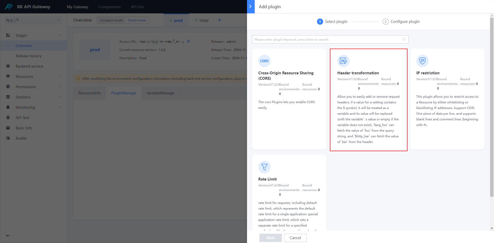
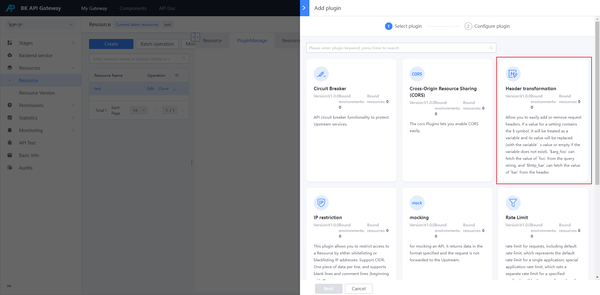
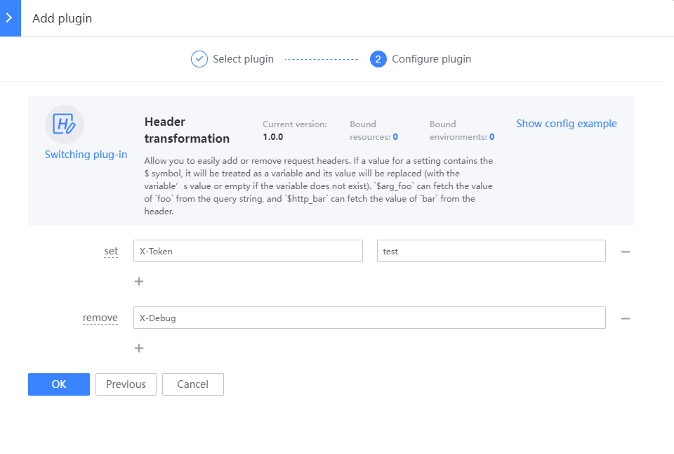

# Request header conversion

## Background

By default, the header in the caller's request will be transparently passed to the gateway's backend service; in some scenarios, the header needs to be processed, for example, deleting a fixed header, or adding a new header to all requests.

At this time, you can use the [Header Conversion] plug-in to achieve

Request header conversion, which can be configured in the environment and resources:
- Configure in the environment, and it will take effect on all resources in the environment;
- Configure on a certain resource, and it will only take effect on this resource; if this plug-in is also configured in the environment at this time, the environment's header conversion will be executed first, and then the resource's header conversion will be executed

## Steps

### Select environment or resource

If it takes effect on all resources in an environment, you can create a new [Header Conversion] plug-in in the environment
Entrance: [Environment Overview] - [Details Mode] - [Plugin Management]

If it only takes effect on a certain resource, you can create a new [Header Conversion] plug-in on the resource
Entrance: [Resource Management] - [Resource Configuration] - Find the resource - Click the plug-in name or plug-in number - [Add plug-in]

### Configure [Header [Conversion] plugin

Header conversion, supports two configurations: `Set` and `Delete`:

- Set: means setting the request header to the specified value, such as setting Header X-Token to test

- Delete: means deleting the specified request header, such as deleting Header X-Debug

### Confirm whether it is effective

- If a new plugin is created on the environment, it will take effect immediately

- If a new plugin is created on the resource, a resource version needs to be generated and published to the target environment

## Advanced configuration

### The `$` symbol is supported in the key value of set to obtain variables

If the value in the setting has the `$` symbol, it will be considered that the variable is replaced by the value of the variable

1. `$arg_foo` can obtain the value of `foo` in the query string. If `/get?foo=1`, then the value of this header is `1`

2. `$http_bar` can obtain the value of `bar` in the header. If the header exists in the request `bar=2`, then the header value is `2`
3. `123$not_exists` If the variable value does not exist, it will be rendered as `123`;