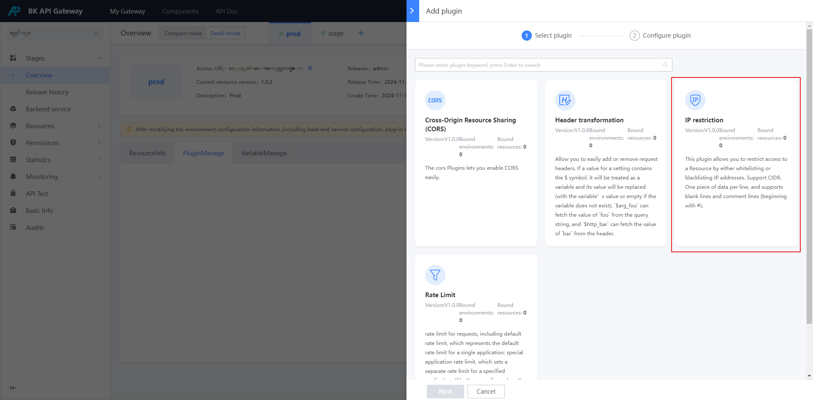
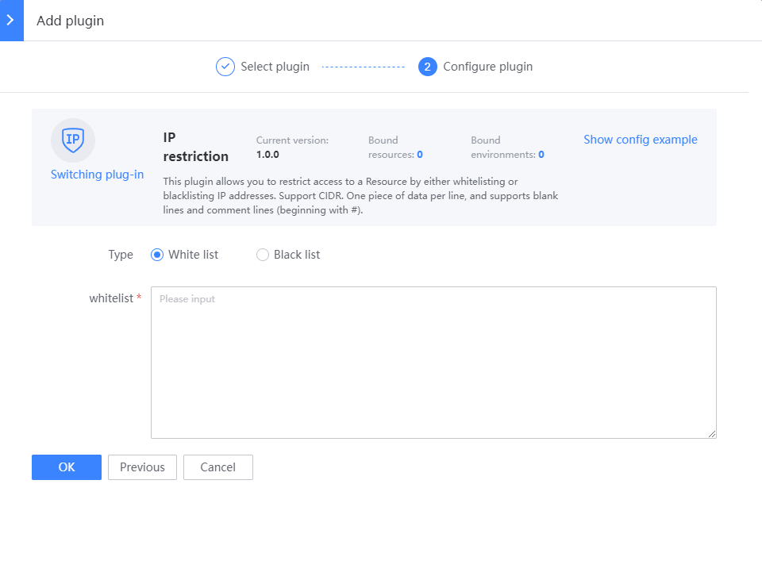

# Enable IP access control

## Background

IP access control is used to "allow" or "deny" certain request source IPs from accessing resources, thus implementing permission control based on the request source IP.
- "Allow" IP access, that is, set up an IP whitelist, only the specified IP can access resources
- "Deny" IP access, that is, set up an IP blacklist, deny the specified IP access to resources, and other unspecified IPs can access resources

Note:
- If IP access control is enabled for both the environment and the resource, **the IP access control of the resource will take effect (highest priority)**

## Steps

### Select an environment or resource

If it is effective for all resources in an environment, you can create a new [IP Access Protection] plug-in on the environment
Entrance: [Environment Overview] - [Details Mode] - [Plugin Management]

If it is effective only for a certain resource, you can create a new [IP Access Protection] plug-in on the resource
Entrance: [Resource Management] - [Resource Configuration] - Find the resource - Click the plug-in name or plug-in number - [Add Plug-in]

### Configure [IP Access Protection] Plugin

Select whitelist or blacklist as needed, one IP or CIDR per line, and support blank lines and comments (lines starting with `#`)

### Confirm whether it is effective

- If you create a new plugin on the environment, it will take effect immediately
- If you create a new plugin on the resource, you need to generate a resource version and publish it to the target environment