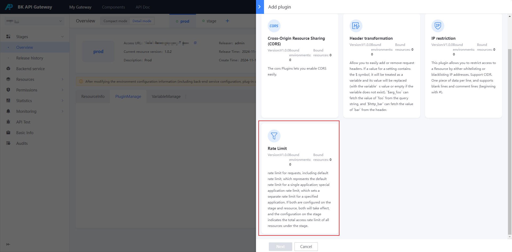
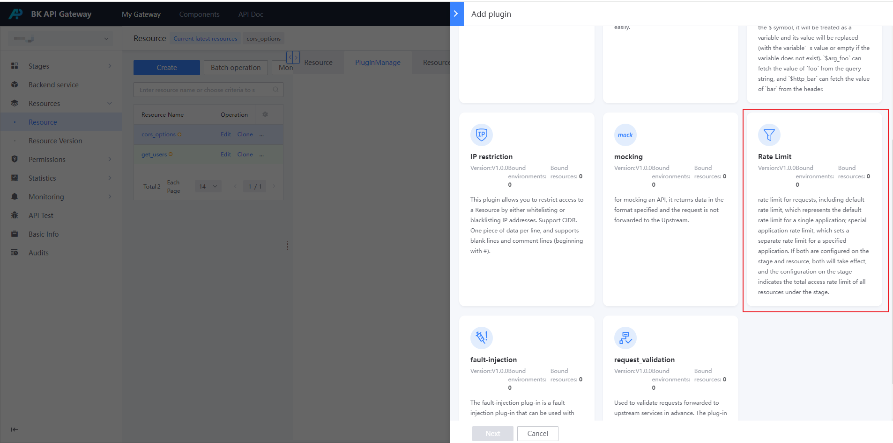
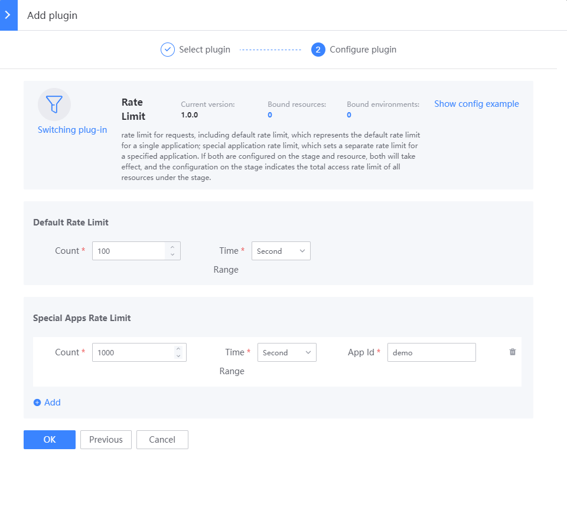

# Enable frequency limit

## Background

In some scenarios, the gateway needs to frequency limit the upstream caller. Avoid affecting the backend service due to short-term high traffic in the upstream.

Frequency control plug-in
- Supports limiting in seconds, minutes, hours, and days
- Supports configuring the default frequency limit (effective for each application) and configuring a separate frequency limit for special applications (the size of special applications can be adjusted)

Note:
- If the frequency control plug-in is configured on the environment, it means **limiting the total access frequency of the application accessing all resources in the environment**
- If the frequency control plug-in is configured on the resource, it means **limiting the frequency of the application accessing a single resource**
- If the frequency control plug-in is configured on both the environment and the resource, **both will take effect**, first checking the frequency limit of the resource, and then checking the total frequency limit of the environment

Others:
- The gateway will directly reject the application's request that exceeds the frequency limit, and will have no effect on the requests of other applications.
- The response status code is [429](../../FAQ/error-response.md)
- The gateway uses a fixed window algorithm. There are some defects

## Steps

### Select environment or resource

If it is effective for all resources in an environment, you can create a new [Frequency Control] plug-in on the environment
Entrance: [Environment Overview] - [Details Mode] - [Plugin Management]

If it is effective only for a certain resource, you can create a new [Frequency Control] plug-in on the resource
Entrance: [Resource Management] - [Resource Configuration] - Find the resource - Click the plug-in name or number of plug-ins - [Add plug-in]

### Configure [Frequency Control] plug-in

### Confirm whether it is effective

- If you create a new plug-in on the environment, it will take effect immediately
- If you create a new plug-in on the resource, you need to generate a resource version and publish it to the target environment