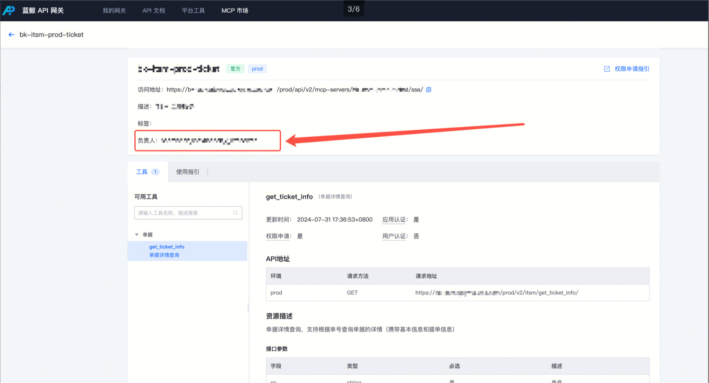

# MCP Server Permission Application Guide

## Apply

1. Enter the Developer Center/Cloud API Permission Management/MCP Server

 2. Find the corresponding MCP Server and apply for it

##  Approval

Approver:

Approval Entry:

