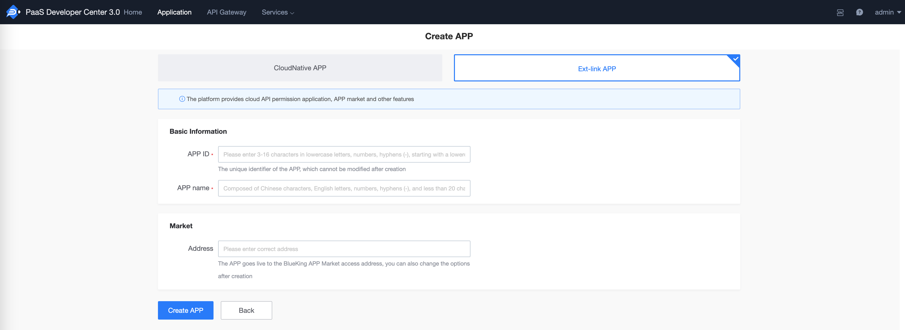
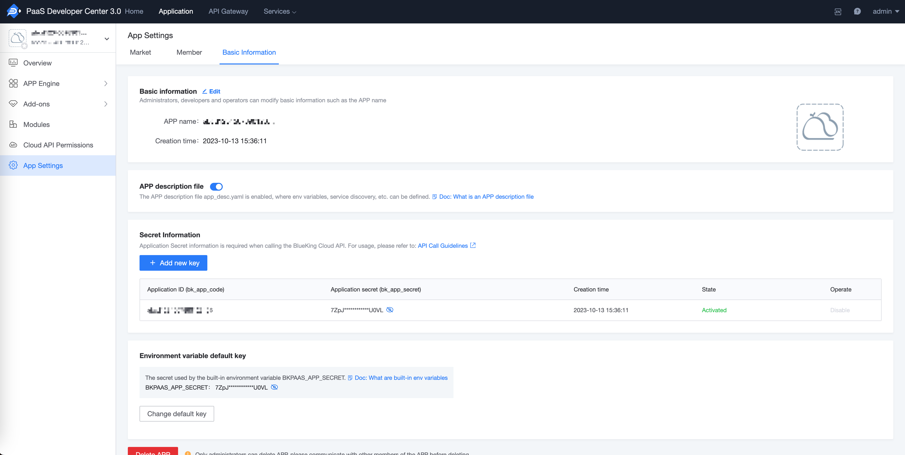
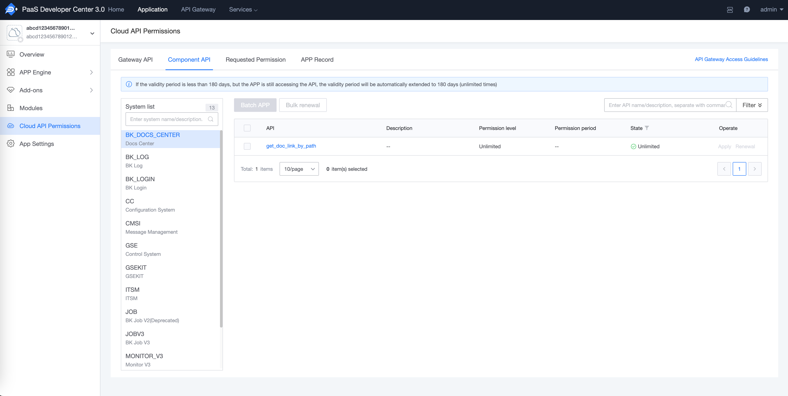
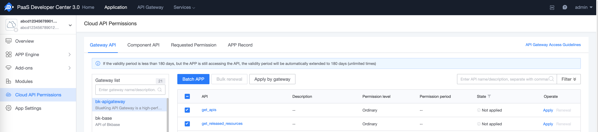
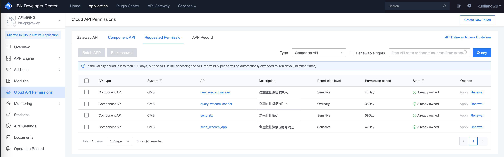

# Call ESB API

[toc]

## 1. Get BlueKing application identity

When accessing the cloud API, if the cloud API has enabled **application authentication**, you need to provide a BlueKing application account when calling. For more authentication-related explanations, see [Authentication](../Explanation/authorization.md)

The following steps guide you to create a BlueKing application and obtain a BlueKing application account (application ID: `bk_app_code`, application secret key: `bk_app_secret`).

### 1.1 Determine the application type and create an application

Go to BlueKing Developer Center - Create Application

The BlueKing Developer Center provides two types of applications:
- If you only need to call the gateway interface, create an **external link application**
- If you have application development and deployment needs in the future, you can choose **cloud native application**



### 1.2 Get an application account

Go to BlueKing Developer Center - Application Development, search for applications, and enter the application management page.

On the application management page, expand the left menu **Application Configuration** and click **Basic Information**.

The `bk_app_code` and `bk_app_secret` in the authentication information on the right page are the BlueKing application accounts required to access the cloud API.



## 2. Get BlueKing user identity

When accessing the cloud API, if the cloud API has enabled **user authentication**, you need to provide information representing the user identity when calling. For more authentication-related explanations, see [Authentication](../Explanation/authorization.md)

Currently, the gateway supports the following two types of BlueKing user identity information:

- User login state: After the user logs in to BlueKing, the user login credentials stored in the browser Cookies are generally valid for no more than 24 hours

- User access_token: After the user logs in to BlueKing, the user access_token exchanged for the user login state is valid for 180 days

### 2.1 User login state

> Recommended to use first

After the user logs in to BlueKing, the user's login credentials will be stored in the browser Cookies. This login credential can represent the user's identity.

Use Chrome browser to log in to any BlueKing site, F12-Application-Cookies, search for `bk_token`

The login status information of BlueKing users is as follows:

| Cookies field | Description |
|--------------|------|
| bk_token | User login status |

### 2.2 User access_token

> Use in offline tasks/scripts and other scenarios

Use the user login status to call the bkoauth interface to exchange for user access_token + refresh_token;
The access_token is valid for **180** days and can be refreshed with refresh_token.

For details, see [access_token](../Explanation/access-token.md)

## 3. Apply for the corresponding ESB API call permission

Visit BlueKing Developer Center - Application Development, search for applications, and enter the application management page.

Click **Cloud API Permission** on the left menu to enter the Cloud API Permission Management page and switch to the **Component API** page.



In the system list, filter out the component system for which permissions are to be applied, click the system name, then select the component API to be accessed on the right page and click **Batch Application**.

In the application record, you can view the application details. After the permission is approved, you can access the component API.



Enter the Cloud API Permission Management page, switch to the **Existing Permission** page, select `Component API` as the type, and you can view the component API permission list currently owned by the application.



## 4. Call API

### 4.1 HTTP direct call

Request parameters:

- Request protocol: request method and request address, which can be viewed in the component API document

- Authentication information: application information (`bk_app_code + bk_app_secret`), user information (`user login status` or `access_token`), passed through the request header `X-Bkapi-Authorization`, the value is a JSON format string.

- Component API parameters: can be viewed in the component API document

Curl call example:
```shell
curl -XPOST ' https://bkapi.example.com/xxxxx/prod/aaa/bbb/ccc' \
    -H 'X-Bkapi-Authorization: {"bk_app_code": "x", "bk_app_secret": "y", "bk_token": "z"}' \
    -d '{"bk_biz_id": 1}'
```

Python call example：

```python
import json
import requests

requests.post(
    " https://bkapi.example.com/xxxxx/prod/aaa/bbb/ccc",
    headers={
        "X-Bkapi-Authorization": json.dumps({
            "bk_app_code": "x",
            "bk_app_secret": "y",
            "bk_token": "z"
        })
    },
    json={"bk_biz_id": 1},
)
```

### 4.2 Calling via SDK

Visit API Help Center - Component API SDK

- On the **SDK List** page, you can view or download the latest version of the component SDK currently available

- On the **SDK Instructions** page, you can view how to use the component SDK

Note:

1. You need to use the **BlueKing Development Framework** + **BlueKing Developer Center** to inject `BK_COMPONENT_API_URL` at runtime to call it

2. If you want to call it for local development, you need to export this environment variable, otherwise the exception `EndpointNotSetError` will be reported
