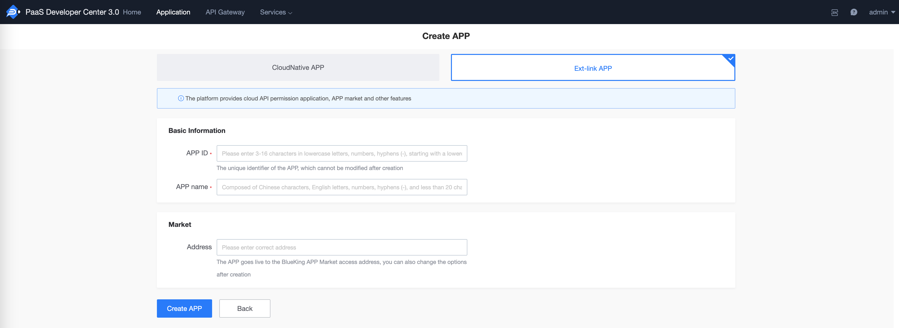
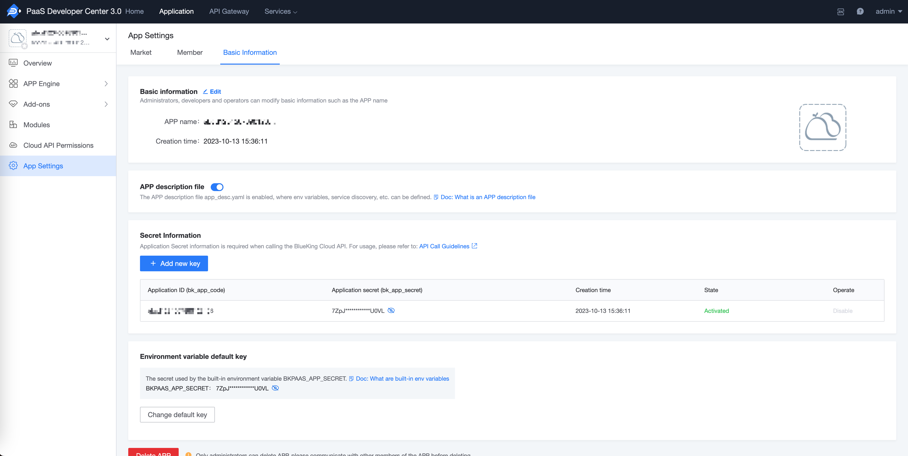
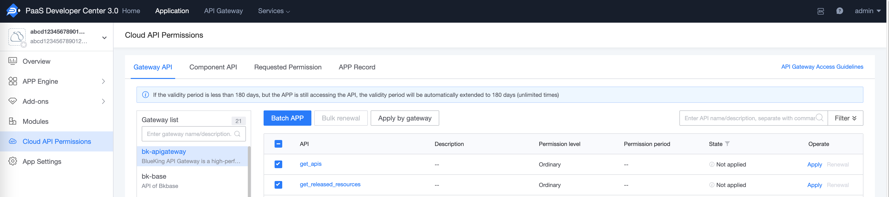
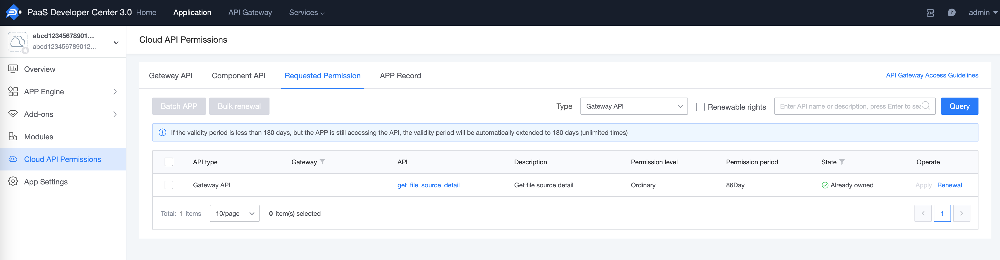

# Calling the Gateway API

[toc]

## 1. Obtaining the BlueKing Application Identity

When accessing the Cloud API, if the Cloud API has enabled **Application Authentication**, you need to provide a BlueKing application account when calling. For more explanations on authentication, see [Authentication](../Explanation/authorization.md)

The following steps guide you to create a BlueKing application and obtain a BlueKing application account (application ID: `bk_app_code`, application secret key: `bk_app_secret`).

### 1.1 Determine the application type and create an application

Go to BlueKing Developer Center - Create Application

The BlueKing Developer Center provides two types of applications:
- If you only need to call the gateway interface, create an **external link application**
- If you have application development and deployment needs in the future, you can choose **cloud native application**



### 1.2 Get an application account

Go to BlueKing Developer Center - Application Development, search for applications, and enter the application management page.

On the application management page, expand the left menu **Application Configuration** and click **Basic Information**.

The `bk_app_code` and `bk_app_secret` in the secret information on the right page are the BlueKing application accounts required to access the cloud API.



## 2. Get BlueKing user identity

When accessing the cloud API, if the cloud API has enabled **user authentication**, you need to provide information representing the user identity when calling. For more authentication-related explanations, see [Authentication](../Explanation/authorization.md)

Currently, the gateway supports the following two types of BlueKing user identity information:

- User login state: After the user logs in to BlueKing, the user login credentials stored in the browser Cookies are generally valid for no more than 24 hours

- User access_token: After the user logs in to BlueKing, the user access_token exchanged for the user login state is valid for 180 days

### 2.1 User login state

> Recommended to use first

After the user logs in to BlueKing, the user's login credentials will be stored in the browser Cookies. This login credential can represent the user's identity.

The login status information of BlueKing users is as follows:

| Cookies field | Description |
|-------------|------|
| bk_token | User login status |

### 2.2 User access_token

> Use in offline tasks/scripts and other scenarios

Using the user login status, calling the bkoauth interface can exchange for user access_token + refresh_token;
The access_token is valid for **180** days and can be refreshed with refresh_token.

## 3. Apply for the corresponding gateway API call permission

This section will guide you to apply for gateway API access rights for the BlueKing application.

There are two ways to apply for gateway API access rights: application by the application owner and active authorization by the gateway administrator.

### 3.1 Application by the person in charge of the application

Visit BlueKing Developer Center - Application Development, search for the application, and enter the application's management page.

Click **Cloud API Permission** on the left menu to enter the Cloud API Permission Management page, and switch to the **Gateway API** page.

In the gateway list, filter out the gateways for which permissions are to be applied, click the gateway name, then select the gateway APIs to be accessed on the right page, and click **Batch Application**.

In the application record, you can view the application details. After the permissions are approved, you can access the gateway API.



### 3.2 Active authorization by the gateway administrator

The person in charge of the application provides the BlueKing application ID (i.e. `bk_app_code`) and the list of gateway APIs for which permissions are to be applied, and contacts the gateway administrator for active authorization.

### 3.3 View the gateway API permissions of the application

Visit BlueKing Developer Center - Application Development, search for the application, and enter the application's management page.

Click **Cloud API Permission** on the left menu to enter the Cloud API Permission Management page, click **Existing Permission**, select `Gateway API` as the type, and you can view the list of Gateway API permissions currently owned by the application.



## 4. Calling API

For more authentication-related explanations, see [Authentication](../Explanation/authorization.md)

### 4.1 HTTP direct call

Request parameters:
- Request protocol: request method and request address, which can be viewed in the Gateway API document
- Authentication information: application information (`bk_app_code + bk_app_secret`), user information (`user login status` or `access_token`), passed through the request header `X-Bkapi-Authorization`, the value is a JSON format string.
- Gateway API parameters: can be viewed in the Gateway API document

Curl call example:
```powershell
curl 'http://bkapi.example.com/prod/users/' \
    -H 'X-Bkapi-Authorization: {"bk_app_code": "x", "bk_app_secret": "y", "access_token": "z"}' \
    -d '{"bk_biz_id": 1}'

```

Python call example：

```python
import json
import requests

requests.post(
    "http://bkapi.example.com/prod/users/",
    headers={
        "X-Bkapi-Authorization": json.dumps({
            "bk_app_code": "x",
            "bk_app_secret": "y",
            "access_token": "z"
        })
    },
    json={"bk_biz_id": 1}
)
```
### 4.2 Calling via SDK

Visit API Help Center - Gateway API SDK

- On the **SDK List** page, you can search for the gateway SDK. If the gateway does not provide an SDK, you can contact the gateway administrator to generate a gateway SDK.
- On the **SDK Description** page, you can see how to use the gateway SDK

Note that you need to use the **BlueKing Development Framework** + **BlueKing Developer Center** to inject `BK_API_URL_TMPL` at runtime to call it

For local development, you need to export this environment variable

> You can also use the `BlueKing Cloud API Client (Golang)` golang sdk to call it directly. For specific usage, see: https://github.com/TencentBlueKing/bk-apigateway-sdks/tree/main/core

## 5. Other issues

### 5.1 Can gzip be used to improve interface performance?

In the internal cloud version, gzip is enabled by default in the nginx access layer; in the external version, gzip is not enabled by default; (it does not affect the client code logic and is compatible)

Generally speaking, no special specification is required, but the internal cloud version has a large amount of data, which will cause the response body of some requests to be very large.

When the response body of the request is relatively large, such as 5M or 10M, you can try to specify the header `Accept-Encoding: gzip` when initiating the request. If the server supports gzip, the response body will be compressed and returned. The http client of various languages ​​will automatically parse gzip normally, without the developer's additional processing;

- [python requests FAQ: Encoded Data?](https://requests.readthedocs.io/en/latest/community/faq/#encoded-data)
- The golang net/http client will add `Accept-Encoding: gzip` by default and automatically decompress it. There is no need to manually specify the header (if you specify it manually, you need to decompress the response.Body yourself
- For other languages ​​or libraries, please read the relevant documents and confirm

You can test the performance difference of opening/not opening the corresponding interface by yourself

Test with curl

```
$ curl -vv http://example.com/path -H "Accept-Encoding: gzip" | gunzip -

> GET /path HTTP/1.1
> Host: example.com
> User-Agent: curl/8.4.0
> Accept: */*
> Accept-Encoding: gzip # Note the request header here
>
< HTTP/1.1 200 OK
< Content-Type: application/json
< Connection: keep-alive
< X-Bkapi-Request-ID: ec460a99-594b-491b-adf8-1addbca691ee
< X-Request-ID: 8ab564901eebff619fbe2f02a2f4c2a5
< content-encoding: gzip # This response header indicates that gzip is in effect, and the compressed body is returned
< transfer-encoding: chunked