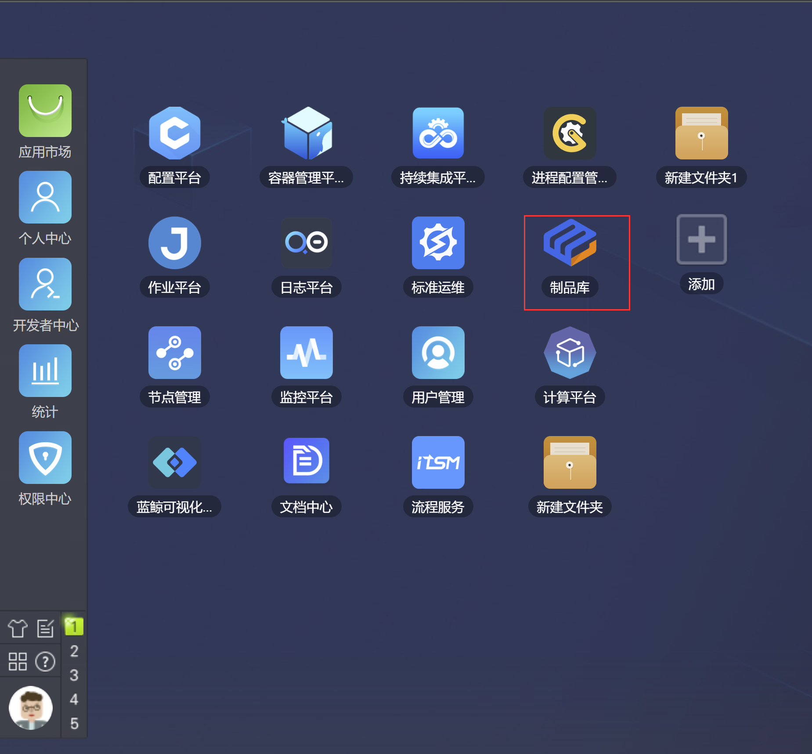

# 业务接入 Helm

本文先简单介绍什么是 Helm，然后以蓝鲸小游戏为例，介绍如何使用蓝鲸容器服务部署 Helm Release。

## 什么是 Helm
Helm 是 Kubernetes 的一个包管理工具，用来简化应用的部署和管理。可以把 Helm 比作 CentOS 的 yum 工具。

使用 Helm 可以完成以下事情：

- 管理 Kubernetes manifest files
- 管理 Helm 安装包 Charts
- 基于 Chart 的 Kubernetes 应用分发

更多可以参考 [Helm 官方文档](https://helm.sh/docs/intro/) 。


## Helm Chart 仓库

平台会给项目分配 Helm Chart 仓库，用于存放项目的 Chart，仓库的读写操作均需要密码；另外，所有项目只读共享一个公共仓库，用于共享公共资源，比如社区中常用开源组件的部署方案，所有项目对公共仓库享有只读权限。


如果用户的 Chart 需要推送到公共仓库，可以在 制品库页面的 `blueking` 项目下的 `public-charts` 仓库中管理。




## 推送业务 Helm Chart 到仓库

如果您的环境还没有部署helm与helm-push命令行工具，需要先部署好这两个工具，安装方式有几种，请选择适合您环境的部署方式

1. helm命令行工具部署（如果已存在此命令行工具请忽略）
   ```bash
   # 通过命令行方式部署，这种方式会去 github.com 上下载对应操作系统的二进制文件自动部署，
     如果您所在的网络环境与 github.com 网络不通，请选择手工部署方式
     curl https://raw.githubusercontent.com/helm/helm/main/scripts/get-helm-3 | bash
   
   # 通过包管理器部署
     # 【macOS】使用Homebrew部署
     brew install helm
   
     # 【Windows】使用Chocolatey与Scoop部署
     choco install kubernetes-helm
     scoop install helm
   
     # 【Debian/Ubuntu】使用apt部署
     curl https://baltocdn.com/helm/signing.asc | gpg --dearmor | sudo tee /usr/share/keyrings/helm.gpg > /dev/null
     sudo apt-get install apt-transport-https --yes
     echo "deb [arch=$(dpkg --print-architecture) signed-by=/usr/share/keyrings/helm.gpg] https://baltocdn.com/helm/stable/debian/ all main" | sudo tee /etc/apt/sources.list.d/helm-stable-debian.list
     sudo apt-get update
     sudo apt-get install helm
     
     # 【fedora】使用dnf部署
     sudo dnf install helm
   
     # 【FreeBSD】 使用pkg
     pkg install helm
     
   # 手工安装方式部署
     # 访问页面 https://github.com/helm/helm/releases 找到最新版本和您部署的对应平台下载
     
     # 下载完成后把二进制包helm-v3.xx.xx-xxx-xxx.tar.gz分发到你需求环境，在所需环境上执行：
     tar xf helm-v3.xx.xx-xxx-xxx.tar.gz
     cp -a {平台目录}/helm /usr/bin/
   ```

2. helm-push命令行工具部署（如果已存在此命令行工具请忽略）
   ```bash
   # 使用helm plugin命令行部署，这种方式会去 github.com 上下载对应操作系统的二进制文件自动部署，
     如果您所在的网络环境与 github.com 网络不通，请选择手工部署方式
     helm plugin install https://github.com/chartmuseum/helm-push
   
   # 手工部署
     # 使用浏览器打开：https://github.com/chartmuseum/helm-push/releases，找到最新版本和您部署的对应平台下载
   
     # 下载完成后把二进制包helm-push_0.xx.xx_linux_xxx.tar.gz分发到你需求环境
     
     # 安装push插件
     helm_push_plugin_dir=$(helm env HELM_PLUGINS)/cm-push
     mkdir -p ${helm_push_plugin_dir}
     tar xf helm-push_0.xx.xx_linux_xxx.tar.gz -C ${helm_push_plugin_dir}
     
     # 查看插件是否安装成功
     helm plugin list
   ```

3. 获取Helm Chart项目仓库信息
   

4. 添加Helm Chart项目仓库
   ```bash
   # 添加项目仓库命令
   helm repo add {repo名称} {仓库地址} --username={用户名} --password={密码}
   
   # 添加项目仓库示例
   helm repo add example-project-name http://helm.bkrepo.xxx.com/example-project-name/example-project-name/ --username=admin-xxx --password=xxxx
   
   # example-project-name：repo名称，这里和项目代号保持一致
   # http://helm.bkrepo.xxx.com/example-project-name/example-project-name/：仓库地址
   # admin-xxx：用户名
   # xxxx：密码
   
   # 查看repo是否添加成功
   helm repo list
   ```

5. 制作helm chart包

   制作helm chart包可以参考以下文档，如果您已经有helm chart包请忽略此步骤

   https://helm.sh/zh/docs/chart_template_guide/getting_started/

6. 推送helm chart到项目仓库
   ```bash
   # 下载示例helm chart包
   helm repo add bitnami https://charts.bitnami.com/bitnami
   helm pull bitnami/nginx
   
   # 解压示例helm chart包
   tar xf nginx-xx.x.xx.tgz
   
   # 查看 push 插件版本
   helm plugin list
   
   # 如果 push 插件版本高于等于0.10.0，必须使用如下命令推送helm chart包
   helm cm-push nginx/ {example-project-name}
   # nginx/：解压chart包后的chart目录
   # {example-project-name}：repo名称
   
   # 如果 push 插件版本低于0.10.0，必须使用如下命令推送helm chart包
   helm push nginx/ {example-project-name}
   
   # 成功推送 Chart 后，可看到类似如下输出
   Pushing nginx-xx.x.xx.tgz to {example-project-name}...
   Done.
   ```

   

## FAQ

1. 如果添加仓库成功了，推送 Chart 失败，错误码 411, 返回一段 Html 页面, 请先关闭代理再试试
   ```html
   Error: 411: could not properly parse response JSON:
   <!DOCTYPE HTML PUBLIC "-//W3C//DTD HTML 4.01 Transitional//EN" "http://www.w3.org/TR/html4/loose.dtd">
   <HTML><HEAD>
   <META HTTP-EQUIV="Content-Type" CONTENT="text/html; charset=gb2312">
   ...
   ```

2. Chart 版本已经存在, 如果出现如下 409 错误信息，请修改 Chart 版本号后重试。为保障您的数据安全，禁止对同一个版本重复推送

   ```
   Pushing rumpetroll-0.1.22.tgz to tkex-ieg-experience...
   Error: 409: rumpetroll-0.1.22.tgz already exists
   Error: plugin "push" exited with error
   ```
