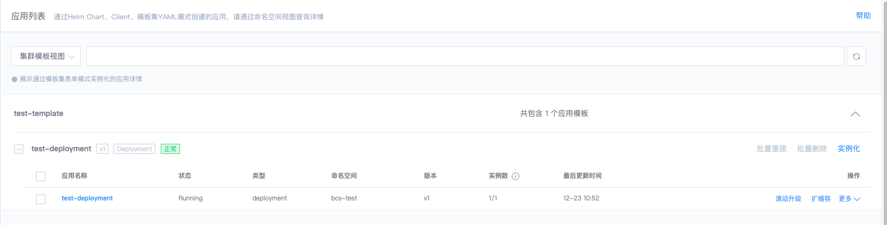
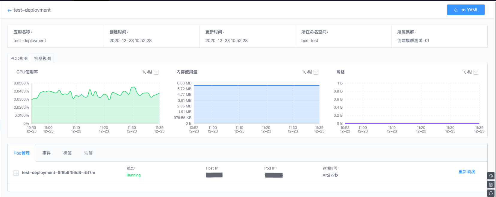

# 应用列表

容器服务应用列表分为两个视图展示："集群模板"视图和"命名空间"视图。其中，集群模板视图展示由"表单模板集"页面实例化的应用，命名空间视图展示集群中所有命名空间下的应用，包含模板集、Helm、Client(kubectl、K8S Api 等) 方式部署的应用。通过应用页面可以方便查看应用详情、调度 Pod 以及对应用做滚动升级、扩缩容等操作。

## 应用类型

- Deployment
- DaemonSet
- Job
- StatefulSet

## 查询展示

- 应用列表

- 应用详情

- 容器详情

## 应用管理

- 滚动升级

选择【更新版本】，查看版本差异，点击【确定】滚动升级

- 扩缩容

增加或缩减实例数量

- 回滚上一版本

回滚到上一个版本

- 重建应用

重新调度应用下的 Pod

- 删除应用

- Pod 重新调度

