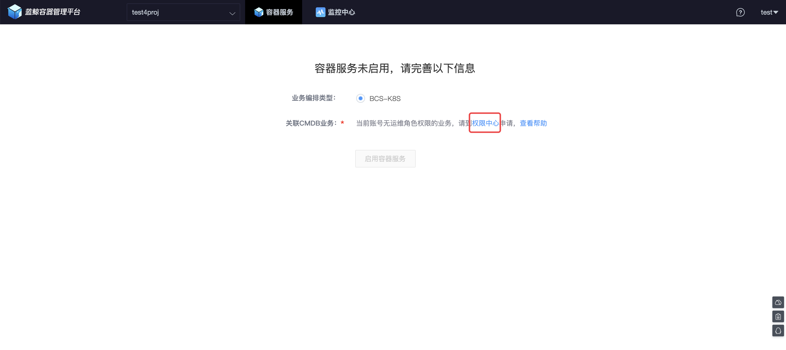
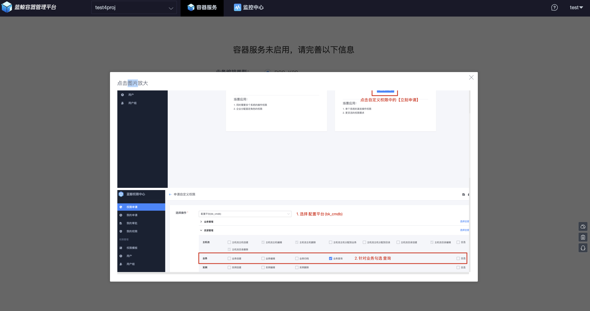
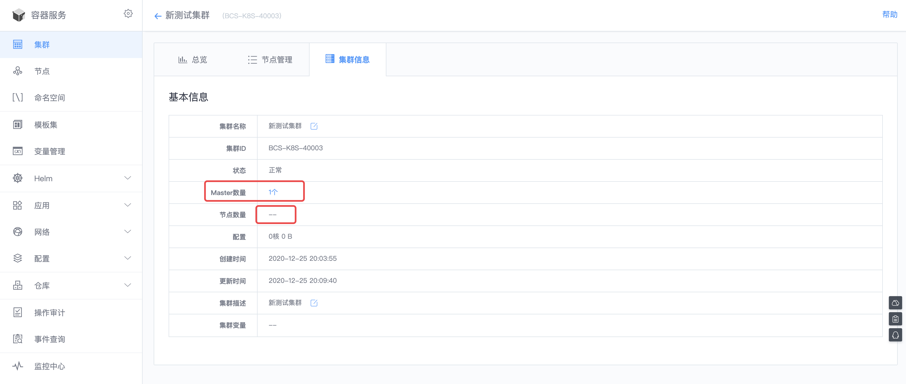
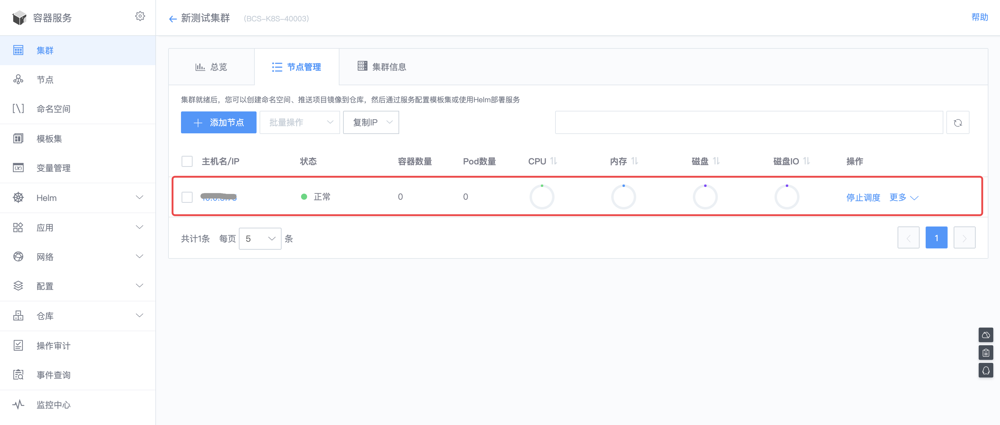

# 集群管理

## 1. 启用容器服务
如果当前项目未启用过容器服务，会看到如下的启用页面。如果是管理员，这里会直接出现有权限的业务列表(业务列表来源于配置平台)；非管理员需要单独申请。


可以点击【查看帮助】，了解如何申请业务权限。


通过绑定有权限的业务，正式【启用容器服务】


## 2. 创建集群
集群作为容器调度的基础，启用完容器服务后，首先需要创建集群。平台提供了两种创建集群的方式，一种是新建集群，另一种是导入已有集群。


###  新建集群
####  创建集群 Master 节点
选择【新建集群】，通过【选择服务器】，完成 Master 节点的选择。


点击【确定】后，开始创建集群。可以通过【查看日志】观察集群的创建过程。


集群 Master 创建完成后，可以点击【总览】查看集群状态。


可以看到成功添加了一个 Master 节点。但其实当前集群并非可用，因为通常 Master 节点并不会设置成调度节点，而是需要添加 Node 节点(业务容器实际运行所在的主机)。



####  添加集群 Node 节点

选中【节点管理】标签，点击【添加节点】。选择主机的方式和创建 Master 类似。【确定】后，节点的添加会进入初始化阶段，直到最终完成添加。



【节点管理】标签除了可以查看集群的所有节点外，还提供了一些集群日常管理的操作，如【停止调度】等，具体可以参考[K8S 官方介绍](https://kubernetes.io/zh/docs/concepts/architecture/nodes/)。


### 导入已有集群
除了可以新建集群，容器服务也支持用户导入已有的集群。


注意：只有符合条件的集群才能够被容器服务纳管，这里给出集群需要满足的条件：
- 主机已经导入配置平台
- 支持的 K8S 集群版本在 1.12-1.18 之间
- kubectl 命令路径需要在环境变量中，可以直接执行 kubectl 命令

如果集群节点上需要使用容器服务自带的 Harbor 私有仓库，则需要手动完成以下操作：
- bcs dns 配置: 

所有的节点服务器上需要在`/etc/resolv.conf`文件的第一行加上`nameserver xx.xx.xx.xx`，xx.xx.xx.xx 是 bcs-dns-service 服务所在的 IP 地址。具体可以参考集群被纳管后 Master 服务器上的`/etc/resolv.conf`文件的第一条 nameserver，也可以在蓝鲸中控机上执行以下命令获取：
   ```bash
    $ source /data/install/load_env.sh
    $ ping -c 1 ${BCS_API_IP}
   ```
   
- 添加 harbor https 证书:

    （1）在所有节点服务器创建目录：
    ```bash
    $ mkdir -p /etc/docker/certs.d/harbor-api.service.consul
    ```
    （2）复制 Master 服务器上的`/etc/docker/certs.d/harbor-api.service.consul/ca.crt`到节点上的目录`/etc/docker/certs.d/harbor-api.service.consul/`
         
- 重启所有服务器的 docker 服务（Master & Node）

注意：重启 docker 服务前请确认 docker 服务是否启用了`--live-restore`参数，如果没有启用会影响到目前运行的 docker 容器
```bash
$ systemctl restart docker
```

- 重建 coredns 或 kube-dns 应用

注意：通常 coredns 或 kube-dns 都有 2 个及以上的实例，重建时需要单个处理，以免影响到集群业务。"参考命令"如下
```bash
$ kubectl delete pod coredns-b65cd664d-glt9r -n kube-system
$ kubectl delete pod coredns-b65cd664d-mwlgn -n kube-system
```

- 检查容器监控与 Web Console 状态
```bash
$ kubectl get pod -n thanos
    NAME                                                 READY   STATUS    RESTARTS   AGE
    po-kube-prometheus-stack-operator-5dbd6d85c9-v5bgm   1/1     Running   0          11h
    po-kube-state-metrics-7796587c9c-fjk96               1/1     Running   0          11h
    po-prometheus-node-exporter-6dknv                    1/1     Running   1          11h
    po-prometheus-node-exporter-v2d7t                    1/1     Running   0          11h
    prometheus-po-kube-prometheus-stack-prometheus-0     3/3     Running   1          4m21s
```

通过执行完上述步骤，集群 Master 节点在导入成功后，用户在集群页面可以看到 `Imported` 标记，同时可以看到性能指标和 Node 节点，其中 Node 节点会自动添加，无需再单独添加。


