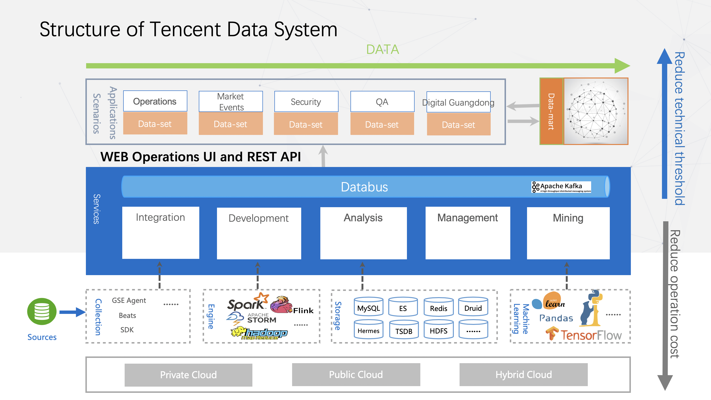

### Platform architecture

The platform architecture is generally divided into four layers (top-down):

- Resource layer: Can support deployment in cloud environments such as private cloud, public cloud, and hybrid cloud.
- Component layer: can support a variety of open source and Tencent self-developed big data components

> 1. Data pipeline: open source Beats collector, GSE Agent collection developed by Tencent, etc.
>
> 2. Computing engine: MapReduce, Flink, Spark, etc.
>
> 3. Storage system: relational MySQL, ElasticSearch for log retrieval, KV storage redis, and distributed file system HDFS, etc.
>
> 4. Machine learning frameworks and algorithm libraries: TensorFlow, Pandas, SK-learn, etc.

- Intermediate service layer:

> 1. Data integration service, mainly composed of a data bus with Kafka message queue as the core. Its functions include data access, data caching, data preprocessing, and data distribution. It is like a bus connecting data processing and storage query.
>
> 2. Data development service, which hides the complexity of various computing frameworks to form a unified computing service. Based on SQL and graphics drag and drop, it combines real-time stream processing and offline batch processing. Unified computing can be used to perform real-time, offline, aggregation, and correlation of data. and other complex data processing.
>
> 3. Data exploration service, the query engine supports a variety of storage systems, including relational database MySQL, offline storage HDFS, full-text search Elasticsearch, time series database TSDB and KV storage Redis, etc. The latest version at this stage supports both ANSI SQL and text retrieval. Class query method.
>
> 4. Full-link data asset management, providing services such as metadata management, lineage analysis, data standards, data quality and data rights management.

- Data application layer: intelligent operation and maintenance platform (AIOps), monitoring platform, log platform, etc.