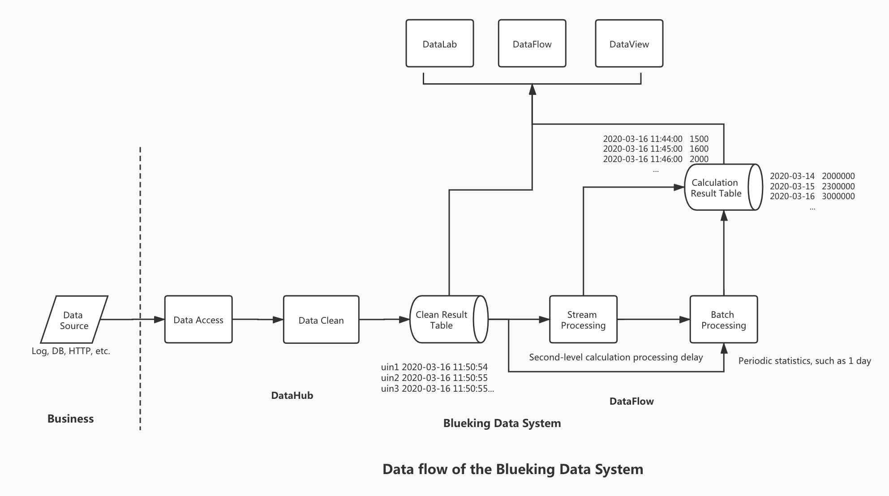

## Terminology explanation

- Data integration
     - **[Data Source](../user-guide/datahub/data-access/concepts.md)**: The original data of the business can be reported to the platform through logs, databases, message queues, etc.
     - **[Cleaning](../user-guide/datahub/data-clean/detail.md)**: Perform formatting, extraction, transformation and other structured operations on the original data source according to fields
- Data development
     - **[Real-time Computing](../user-guide/dataflow/stream-processing/concepts.md)**: Second-level calculation and processing delay, real-time mining of the value behind the data
     - **[Offline calculation](../user-guide/dataflow/batch-processing/concepts.md)**: Periodic statistical data by hour and day, generally used for reporting statistical data
- Data exploration
     - Data query: use standard SQL to uniformly query different types of stored data
     - **[Interactive Notebook](../user-guide/datalab/datalab.md)**: Interactive analysis of data through SQL or Python, Java and other languages, supporting writing and running code in web documents.
- **Result Data Table**: Also called result table, it is a data table that can be used for query, calculation, and visualization in the platform. It is generally generated by raw data cleaning and real-time/offline calculations.
- **Visualization**: Present the result table in the form of charts. For details, please see the BlueKing Chart Platform.