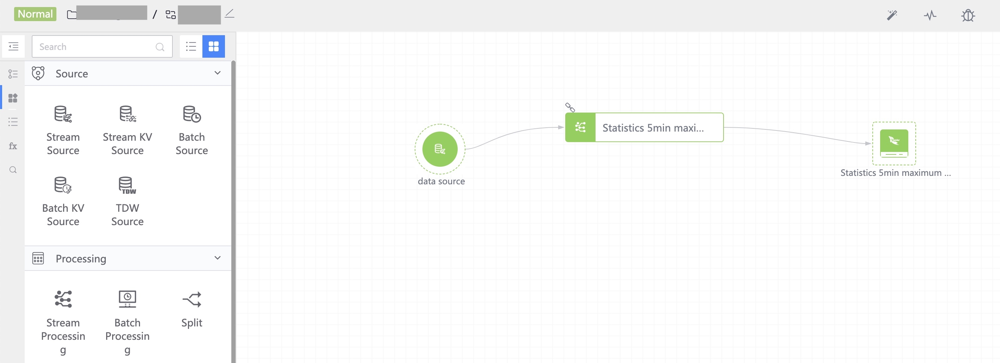

## Develop data analysis SaaS

## Scenario

Statistics of the largest CPU and memory occupied every 5 minutes can be implemented using SQL, but the query is very slow.

You can use the real-time calculation of data development to do pre-calculation, and you can directly query the pre-calculated data.


## Prerequisites

- [Create a project on the platform and apply for a result data table permission for the project](../user-guide/user-center/projects.md)
- Be familiar with a scripting language, such as `Python`. This tutorial uses `Python` as an example
- [Use the platform's interface for data query](../user-guide/auth-management/token.md)

## Steps

- Create DataFlow
- Start Flow
- Preview effect
  

### Create DataFlow

To create DataFlow, you first need to clarify the role of each node on DataFlow, and then construct the parameters required for node configuration.

```python
# -*- coding: utf-8 -*-
import json
import requests
# Information about each DataFlow node. Different node configurations are different. Please refer to the platform API documentation.
# The following is the maximum memory and CPU within 5 minutes of simple calculation, xxx is the business ID
nodes = [
   {
             "result_table_id": "xxx_system_proc",
             "bk_biz_id": xxx,
             "from_nodes": [],
             "frontend_info": {
                 "y": 50,
                 "x": 30
             },
             "id": 1,
             "node_type": "stream_source",
             "name": "data source"
         },
         {
             "id": 2,
             "bk_biz_id": xxx,
             "count_freq": 300,
             "window_type": "scroll",
             "table_name": "system_proc_ip_grp",
             "from_nodes": [
                 {
                     "from_result_table_ids": [
                         "xxx_system_proc"
                     ],
                     "id": 1
                 }
             ],
             "output_name": "Statistics of maximum memory and cpu in 5 minutes",
             "waiting_time": 60,
           "frontend_info": {
                 "y": 50,
               "x": 350
             },
           "sql": """SELECT max(mem_res) as mem, max(cpu_usage_pct) as cpu_usage_pct,max(mem_usage_pct) as mem_usage_pct,ip,pid
                        FROM xxx_system_proc
                      group by ip, pid""",
             "node_type": "realtime",
             "name": "Statistics of maximum memory and cpu in 5 minutes"
         },
         {
             "indexed_fields": [
                 "create_by",
                 "biz_id",
                 "visitor_department",
                 "visitor_group"
             ],
             "expires": 3,
             "result_table_id": "xxx_cpu_mem_test_5min",
             "bk_biz_id": xxx,
             "from_nodes": [
                 {
                     "from_result_table_ids": [
                         "xxx_system_proc_ip_grp"
                     ],
                     "id": 2
                 }
             ],
             "frontend_info": {
                 "y": 50,
                 "x": 600
             },
             "id": 3,
             "cluster": "yyy-lasting",
             "node_type": "tspider_storage",
             "name": "Statistics on the maximum memory and cpu in 5 minutes"
         }
]
PROJECT_ID = 1 # ID of the project created on the platform
BK_DATA_URL = 'http://<BK_PAAS_HOST>/api/c/compapi/data/v3/' # Platform address
headers = {"Content-Type": "application/json; charset=utf-8"} # Request headers
data = json.dumps({
      "bk_app_code": '<YOUR bk_app_code>', # app_code
        "bk_app_secret": '<YOUR bk_app_secret>', # app_secret
      "bkdata_authentication_method": "user", # Authorization mode, authorization based on user
        "bk_username": '<YOUR bk_username>', # User requesting the interface
      "project_id": PROJECT_ID,
        "flow_name": 'data-test', # The name of DataFlow
        "nodes": nodes # flow node information
      })
response = requests.post(
        url=BK_DATA_URL + '/dataflow/flow/flows/create/', # api request address
        headers=headers,
        data=data
      )
print("Status Code: {status_code}".format(
        status_code=response.status_code))
print("Response Body: {content}".format(
        content=response.content))
return json.loads(response.content)
```

The result returned by creating a DataFlow includes the ID of the DataFlow and the ID of each node.

```json
{'errors': None,
  'message': 'ok',
  'code': '1500200',
  'data': {'flow_id': 25966, 'node_ids': [179685, 179686, 179687]},
  'result': True
}
```
  
### Start Flow
  
After creating DataFlow, DataFlow is only a static configuration file and has not generated actual computing tasks. Therefore, you need to call the interface to start DataFlow to start DataFlow and create a table to store data.
  
```python
# -*- coding: utf-8 -*-
import json
import requests
flow_id = 1 # flowID returned when creating DataFlow
BK_DATA_URL = 'http://<BK_PAAS_HOST>/api/c/compapi/data/v3/' # Platform interface address
headers = {"Content-Type": "application/json; charset=utf-8"} # Request headers
data = json.dumps({
   "bk_app_code": 'data-test', # app_code
   "bk_app_secret": 'xxxxxx', # app_secret
   "bkdata_authentication_method": "user", # Authorization mode, authorization based on user
   "bk_username": 'xxx', # User requesting the interface
   })
response = requests.post(
   url=BK_DATA_URL + '/dataflow/flow/flows/{fid}/start/'.format(fid=flow_id), # flow_id
   headers=headers,
   data=data
)
print("Status Code: {status_code}".format(
   status_code=response.status_code))
print("Response Body: {content}".format(
   content=response.content))
return json.loads(response.content)
```


The interface returns the ID of the DataFlow startup task. You can subsequently query whether the startup is successful based on this ID.

```json
{"errors": null,
  "message": "ok",
  "code": "1500200",
  "data": {"task_id": 84507},
  "result": true
}
```
  

### Preview effect

The above example creates a Dataflow with 3 nodes. The first node is the input data source, the second node is the real-time computing node, which performs data statistics every 5 minutes, and the last node is the storage node, which stores the data in DB.

After startup, the effect is as follows:

