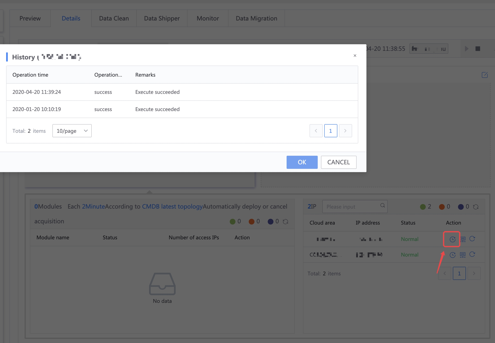

## Frequently Asked Questions about Log Collection

### Troubleshooting reasons for no data reporting

* Confirm that the log file has data updates
* Confirm that log rollback is not cleared directly
* The end of the log needs a newline

### Report HDFS files

> Currently, the data integration collection method does not directly connect to HDFS. HDFS can be reported in the form of files through **Log Collection**.

By default, HDFS downloads files by first creating a temporary file and then renaming the file to the target file name, which is the system's MOVE event.

For MOVE events, the collector does not collect existing data by default.

It is recommended that after downloading the file, cp copy it to the target collection path.

### Nginx uses logrotate log segmentation

When Nginx uses logrotate to split logs, the configuration needs to use create, and copytruncate is not supported.

### Troubleshooting causes of access exceptions

Click Abnormal IP Execution History to view recent execution history information.

