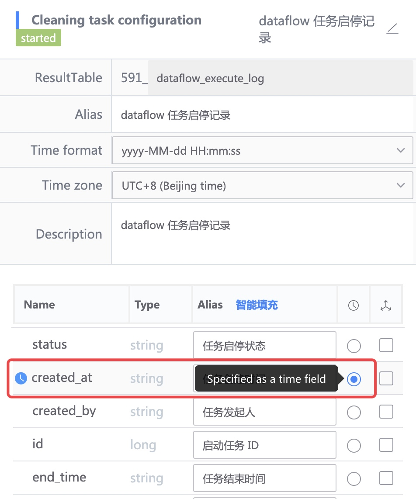

## LocalTime and dtEventTime

- localTime: processing time, time processed by the platform
     - Cleaning scenario: the time it takes for the cleaning task to process this data
     - Calculation scenario: the time it takes for the calculation module to process this data
- dtEventTime: data time, the time when this data is marked in the platform
     - Cleaning scenario: Clean the time field selected in the configuration

     
    
     - Computing scenario: the time window during which the computing module records data.