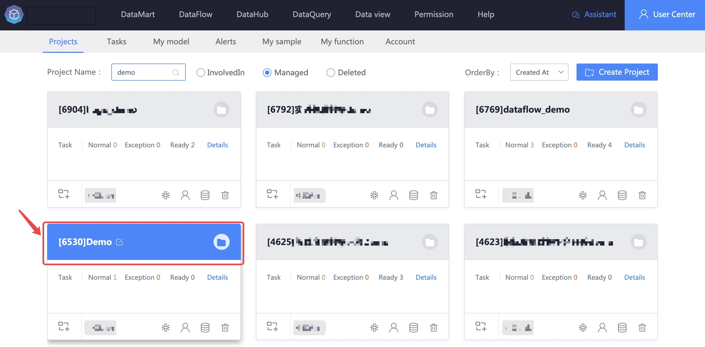
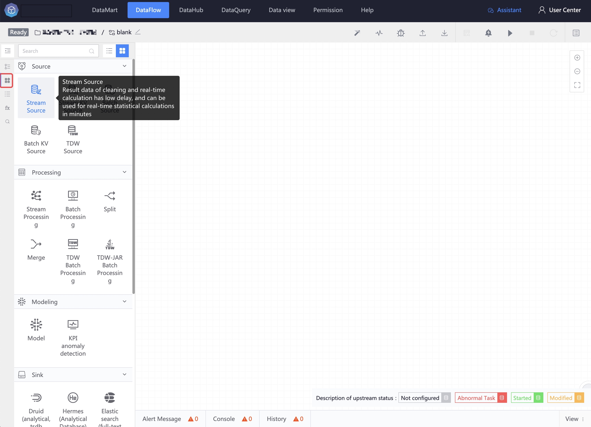
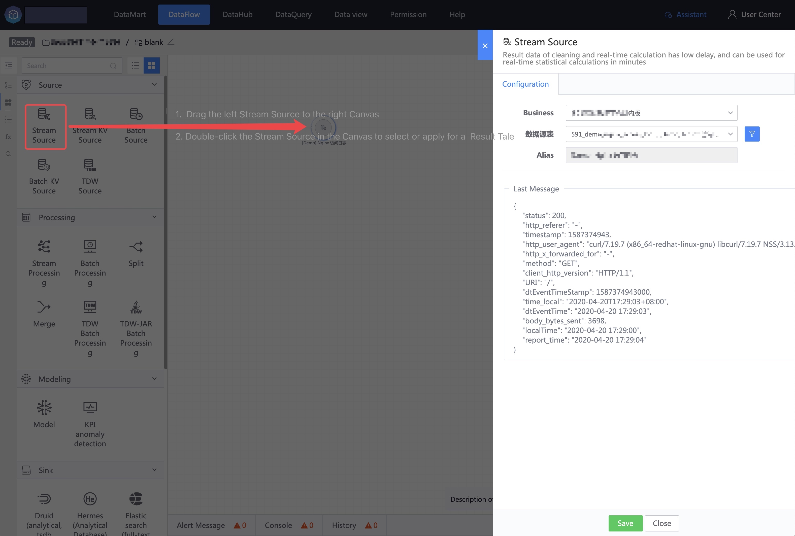
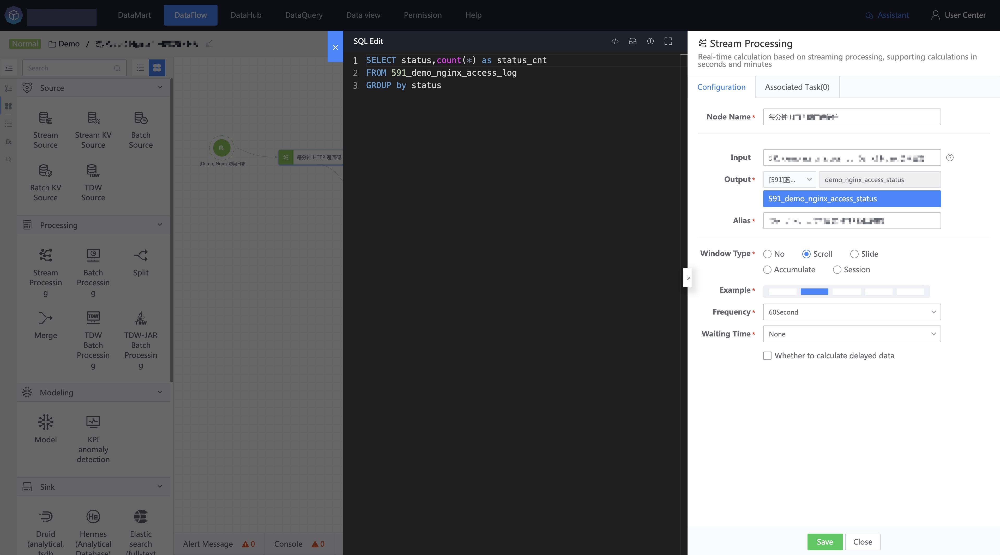
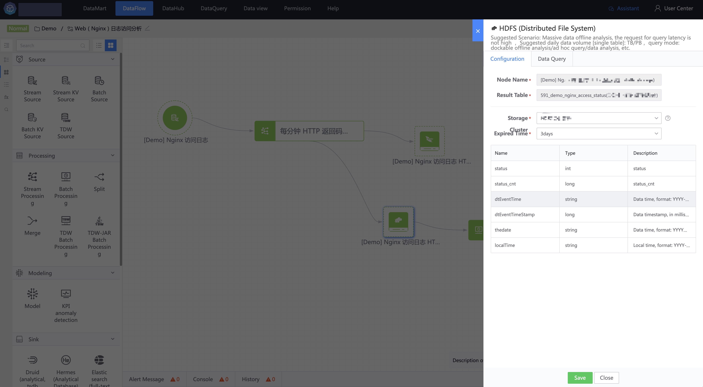
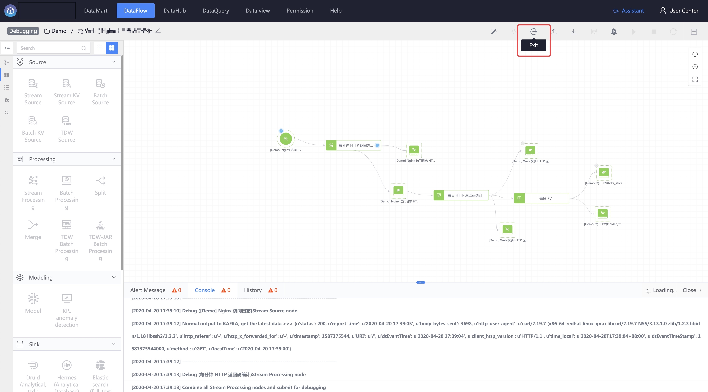
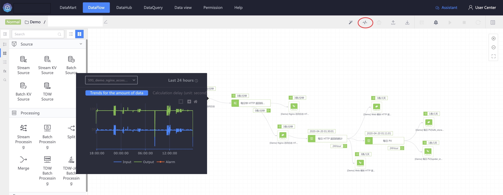
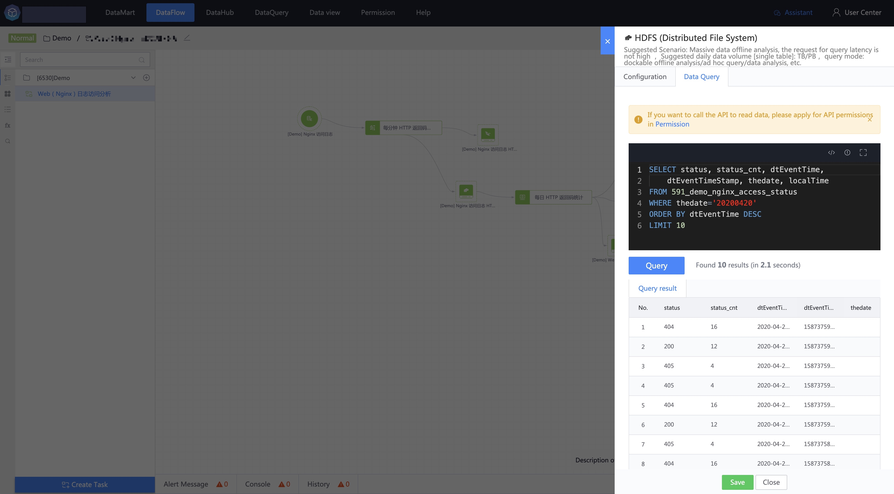

# 10 minutes to play with big data development

In 2003, Google released three papers: Google FS, MapReduce, and BigTable, leading everyone into the era of big data. After the emergence of big data computing frameworks such as Storm and Spark, there was a new solution for parallel computing of massive data, and new technologies accompanied it. To meet higher requirements, the big data computing framework itself only has some basic processing logic, requiring data users to build custom processing functions themselves. Furthermore, the programming model supported by the computing framework has limited support for different high-level languages such as Java and Scala. Data forms also require processing by different computing frameworks. For non-big data developers, the learning cost is very high. How to quickly master big data development?

This section will explain a complete data development case from [Create Project] -> [Create Task] -> [Select Data Source] -> [Data Processing] -> [Data Storage] -> [Data Query].

### Step 1: Create a project

In the platform, all complex data development is completed within the project. "Project" is a concept in the platform. Its main function is to apply for business data, do data development and mining, and manage multiple data development tasks. Currently There are two classes of roles in the version project: project administrator and data developer (project member.

Project Administrator: Has all operating permissions for the project, including project information management, personnel management, resource management, and data development.
Data Developer: Has task management authority within the project, including real-time calculations, offline calculations, data views, and model development and debugging.

### Step 2: Create tasks

After creating the project, you can create a task in the project. There are currently two ways to create a task. One is to create a task in the user center, [My Tasks].

The other is to create tasks in the task list on the left side of [Data Development].

After creating the task, to enter data development, you can build your own data processing process in the data development IDE canvas according to the component library on the left.

### Step 3: Select data source

The component libraries required for big data development are divided into three categories: data sources, data processing and data storage.

There are three types of data sources in data sources:

> Real-time data source: Cleaned and real-time calculated result data, with low data latency, can be used for real-time statistical calculations at the minute level.

> Offline data source: Data landed in HDFS (distributed file system) can be used for offline statistical calculations at hour or above levels.

> Associated data sources: status data stored in KV can be used as dimension tables to join real-time data.

In the case of this section, select a real-time data source as the starting point for data development. Click [Real-time Data] and select a business and real-time data table within the data permission range. At the same time, the latest data content is obtained.

### Step 4: Data processing

After the data source is selected, data processing begins. There are currently a variety of open source computing frameworks for big data processing, such as Spark, Flink, etc. They are powerful and can process massive amounts of data, but each framework has its own programming model and support. Programming languages, such as Java, Scala and other high-level languages, for users who are in urgent need of data processing capabilities, implementing a simple data processing program has high learning costs and usage thresholds.

The platform provides a programming model based on SQL syntax, which can shield the complex models of various frameworks. Users only need to focus on the expression of specific processing logic, so that people who know SQL can play with big data processing.

The platform currently supports a variety of big data processing methods:

> Real-time calculation SQL: real-time calculation based on streaming_supports second-level and minute-level calculations

> Offline calculation SQL: batch-based offline calculation_supports hour-level and day-level calculations

> Convergence calculation: supports multiple data source nodes with the same table structure to be merged into one result data table

> Offload calculation: supports splitting a data source into several result data tables with the same data structure based on business dimensions.

> AI model: a custom-built algorithm model based on machine learning and other algorithms

After the real-time data source, choose to link a real-time calculation SQL node. The node configuration includes two parts: SQL calculation logic editing area and node information configuration. The SQL editing area on the left supports commonly used SQL functions, nesting, association and other SQL syntax. , please refer to the BKSQL function introduction for specific SQL syntax.

Node information configuration, mainly input data and output data, as well as calculation window type, currently supports rolling window, sliding window and cumulative window. Each window also has statistical frequency and delayed statistical time (which can try to avoid data loss caused by data disorder) )

### Step 5: Data Storage

After the data source and data processing are configured, the processed result data needs to be designated as a storage medium. The platform currently supports a variety of data storage systems:

> Relational database: MySQL

> Time series database: VictoriaMetrics

> Analytical storage: ElasticSearch

> Full text search: ElasticSearch

> Distributed file system: HDFS

> Message queue: Kafka, Redis

In the case of this section, relational storage HDFS is selected as the final data storage node.

### Step 6: Debugging and startup

After the data source, data processing and data storage are configured, a basic data development pipeline (DataFlow) is completed. Next, you need to verify whether the configured calculation logic in the pipeline meets expectations. Click [Debug] in the upper right corner, [Run Information] 】The task information of this debugging will be displayed. **Note: Currently only debugging of real-time computing tasks is supported. **

If the debugging can pass smoothly, you can click [Start] to run the entire task in the next step. DataFlow is a task that always runs. If the task execution fails, a red warning will be displayed ⚠️.

After the task is started, the running task can be queried for real-time data flow monitoring, including the scheduling status information in the offline computing node and the data processing trend information, delay information and data loss of the real-time computing node.

### Step 7: Data Query

After the data development task is started, the user needs to verify whether the result data meets expectations. The data query function can achieve this purpose by filtering the result data table through the business and selecting the storage where the data is saved.

Concluding remarks, congratulations on completing a simple process of big data development. If your data volume is large, it is recommended that you apply to the platform for independent computing clusters and storage computing for your own project. If you want to know the detailed function introduction of the platform, please read Detailed explanation of platform functions chapter.