# No need to log in to the server to collect all logs

For traditional data collection, operation and maintenance requires logging into the server, downloading and installing the collector, and then writing the collection configuration. Such a simple process is within the scope of hundreds of services and is still within the scope of human control. However, in the era of big data, data has the "3V" "Characteristics: Volume (massivity), Velocity (real-time), and Variety (diversity) are the three main problems that the platform must solve. This is especially true in the data collection phase. How can we collect the full volume without logging in to the server? What about data?

This section will explain the full-process data collection and storage case from [Add Data Source] -> [Data Cleaning] -> [Data Storage] -> [Data Query].

### Step 1: Add a new data source

1. Click [Data Integration] in the platform navigation, and the existing data sources that the user has permissions in the platform will be displayed. Users can filter and select data sources based on different dimensions, such as business, data source, and data source classification.

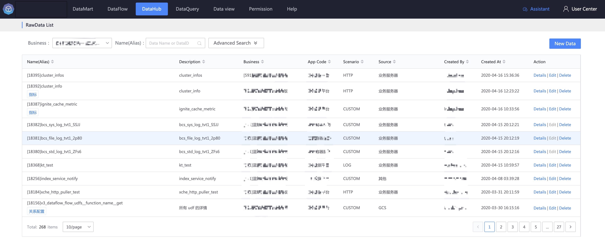

If there is no data source that the user wants in the data source list, click [New Access Data Source] to add a new data source.

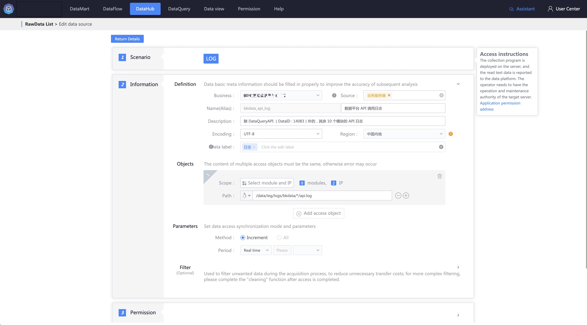

2. Select the access type. Since this case is to collect the log data of the server, select [Log File] and click on different access types. There will be different data information that the user needs to fill in, as shown in the figure. First, you need to fill in the "Data definition" mainly refers to the meta-information of data, including: business attribution, data source, data source classification, access channel, data source name (English name and Chinese name), data source description and character set encoding.

3. Fill in the access object. Different access types correspond to different access objects. In the [Log File] scenario, there are two types of access objects: IP and module (the module concept of the BlueKing configuration platform). IP refers to Directly fill in the IP of the service, as shown in the figure.

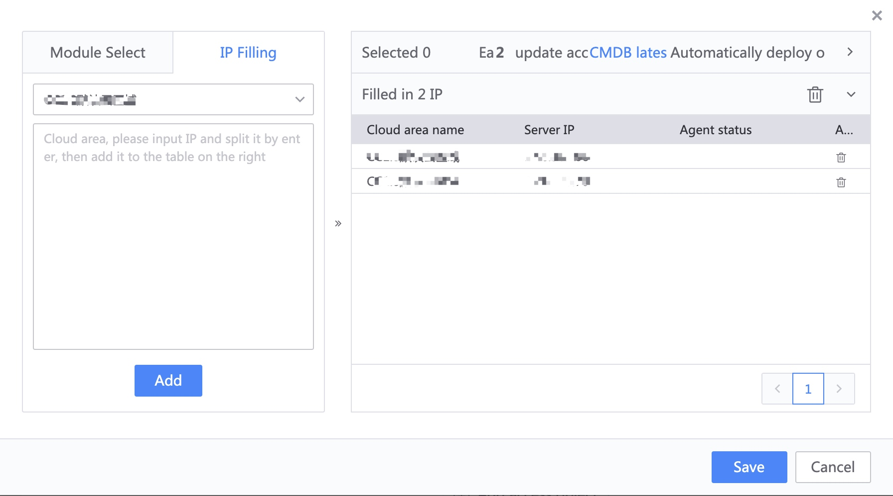

When selecting a module, you do not need to fill in the specific IP. The platform will deliver the collector according to the IP list under the module in the BlueKing configuration platform. At the same time, the latest IP list under the module will be updated every 2 minutes. New IPs will be automatically deployed. If The deleted IP will cancel the collection.

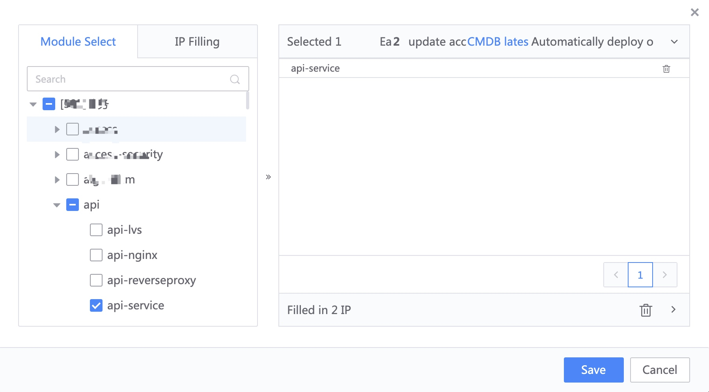

4. Fill in the access method. There are currently two access methods for log collection. For flow logs generated in real time, it is recommended to use incremental collection.

5. Set filter conditions (optional). During the process of collecting log data, you can filter row log data according to delimiters (vertical bars, commas, backtick marks, and newlines), and indicate the filter conditions. Note: It is recommended not to fill in More complex filtering conditions will, on the one hand, affect the real-time performance of the collection, and on the other hand, affect the server performance.

6. Set data permissions. For a detailed introduction to data permissions, please refer to [Permission Management]. When adding a new data source, you need to designate a data administrator (the default is to synchronize the operation and maintenance and operation planning of the business). The main responsibility is the approval of data permissions ( Including the result data table generated by this data source); the other is the need to specify data sensitivity. The platform has planned four levels of data sensitivity. What is currently open is business private data, that is, the business personnel do not need to apply for the data to use it. Outsiders need to apply to the data administrator to query data.

7. Submit the data source access configuration. You can see the data access status and access object list in the data details. As shown in the figure, different colors represent different states (green is successful, red is abnormal, and blue is running. ), or the latest raw data content, including minute trends and day-level trends

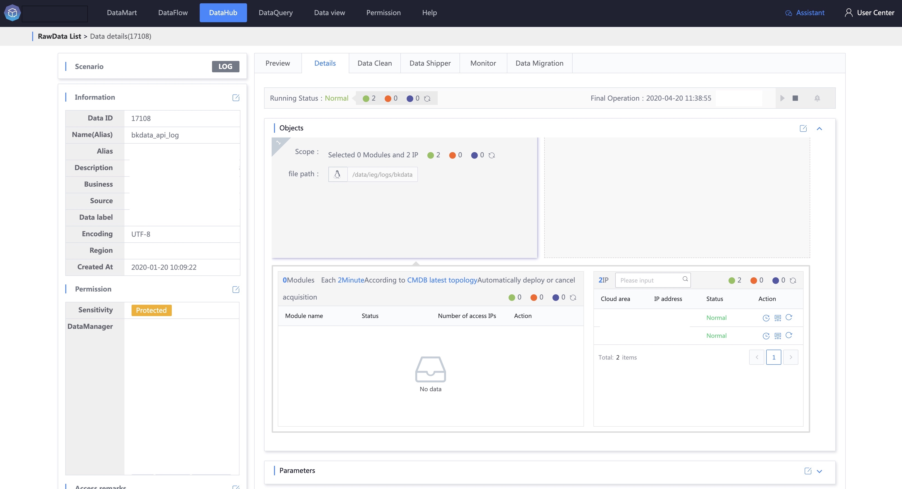

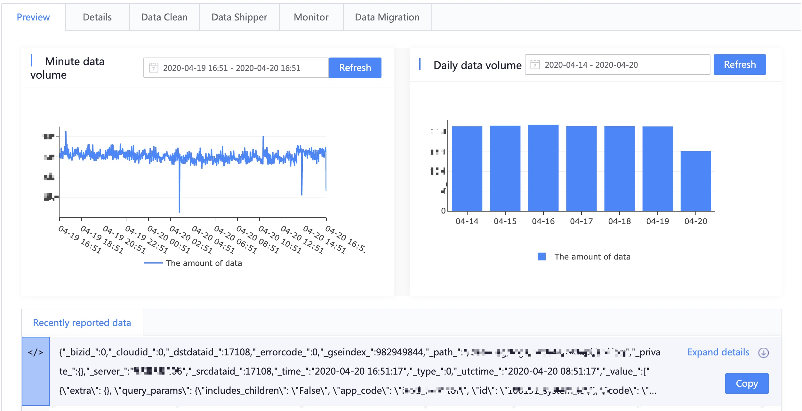

### Step 2: Data source cleaning

Why is data cleaning needed? Because most of the original log data is unstructured or semi-structured, if subsequent statistical calculations or storage in relational storage is required, it needs to be structured. Data source cleaning is roughly divided into four parts:

1. Provide original data content. By default, if the access status is normal, the system will automatically extract the latest original data content. If the data is not generated immediately, the user can fill in a piece of original data by himself.

2. Cleaning logic configuration, configure the cleaning operator step by step on the original data, and assign the required content in the original data to the specified fields. For how to use the cleaning operator, please refer to the [Cleaning Operator Guide]. Each cleaning operation All can be debugged in a single step.

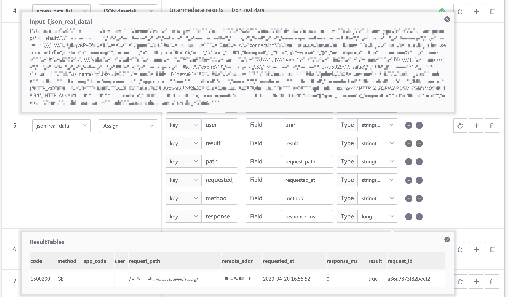

3. Global debugging. After writing all the cleaning operator configurations, you can click [Global Debugging]. In the result preview, you can see the result data (structured data) after the original data has been processed by all cleaning operators.

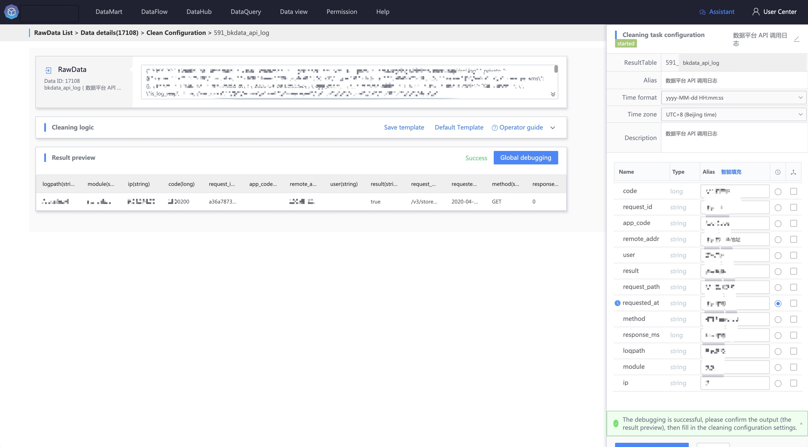

4. After the global debugging is successful, you need to define structured result data, including cleaning result names, field names after cleaning, etc. **Note: Select a time field in the field to facilitate subsequent statistical analysis**.

After data cleaning is started, you can view the cleaning details in the cleaning list. You can also see the cleaning trend and the loss of cleaning data, as well as the associated computing tasks (generally real-time computing tasks) after cleaning the data.

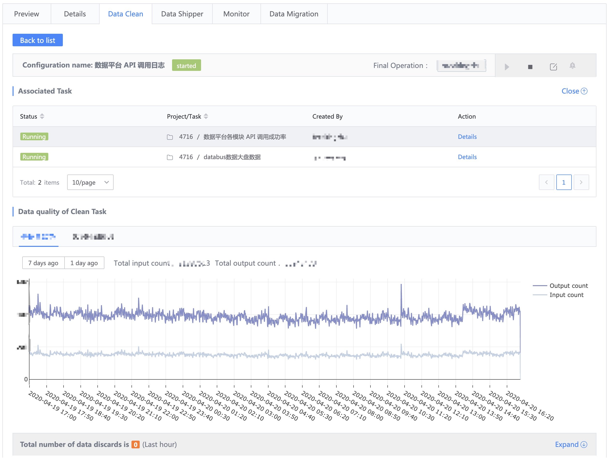

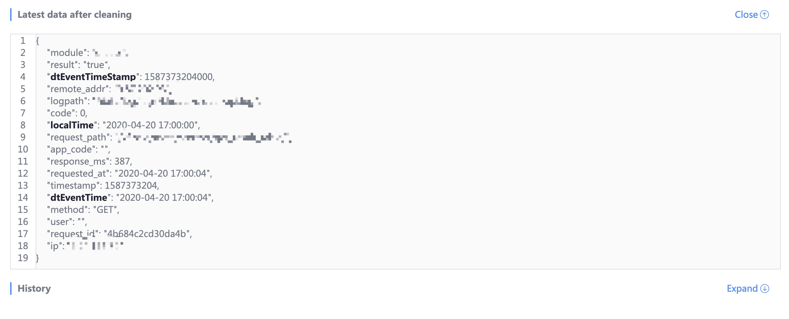

### Step 3: Data storage in database

After data source logs are accessed and cleaned, they can already be used for calculation and analysis. However, they cannot be retrieved and queried before the data is implemented. Therefore, the collected logs must be stored in a database to facilitate subsequent applications. Generally, Logs all require keyword retrieval, so they will be saved in ElasticSearch. At the same time, you can also specify whether the field is word segmented, etc.

### Step 4: Log keyword search

The logs have been collected in ElasticSearch. If you need to retrieve relevant content, you need to click [Data Query], select the business, search for the result data table name to be retrieved, enter keywords, and select the time range for retrieval (last 7 days, Last 30 days, etc.), please refer to [Search Rules] for the rules required for retrieval.

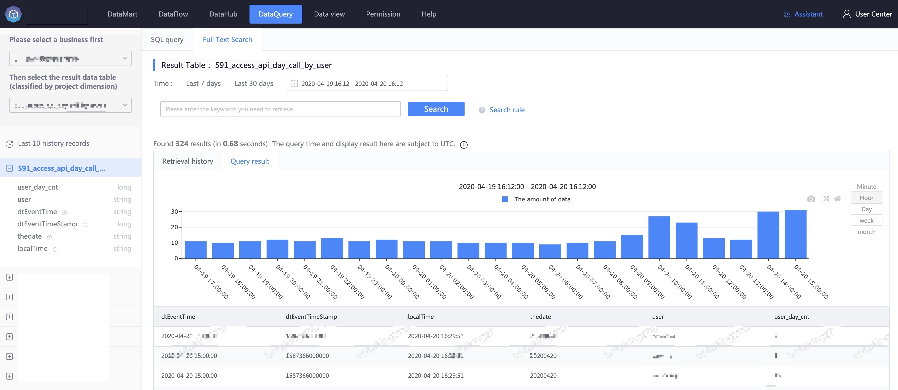

Conclusion: At this point, all logs on the server have been collected. Users do not need to log in to the server to write scripts, manage collection status, or update collection items. It is recommended to enter [10 Minutes to Play with Big Data Development](./dataflow.md).