# Sample set

The sample set function needs to be used in scenario modeling. The complete process is as follows

1) Confirm the scenario: Confirm the modeling scenario according to the requirements;

2) Sample preparation: construct sample data and label it;

3) Feature engineering: During model construction and model application, different data streams will go through the same steps;

4) Model training & evaluation: Select an algorithm for training, and adjust hyperparameters based on the evaluation results;

5) Release model: including the release and management of model records;

6) Apply model: apply business data to the published model;

7) Sample closed loop: In scenario modeling, model users will be provided with annotation feedback function of application data. The model detection results after manual confirmation and modification will be fed back to the sample set as labeled sample data for subsequent optimization and upgrading of the model, forming a closed loop. In the single-index anomaly detection scenario, from the construction of the sample set to the use of the sample set (model construction), the flow chart is shown as follows, in which the red box part depends on sample set management:

# manual

## Create sample set

Users can create sample sets under their own projects, and the entrance is in the user center. Currently, only sample set management of custom scenarios is supported.

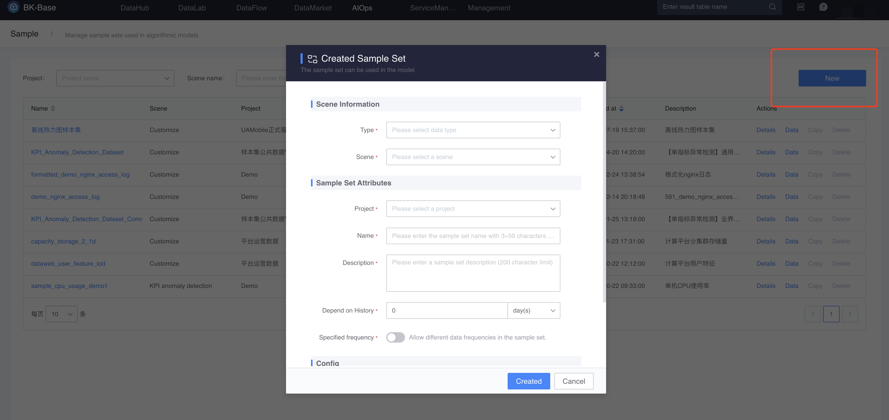

## Add sample data configuration

Sample data can be added in the sample data tab. First, select the result data where the sample to be added is located.

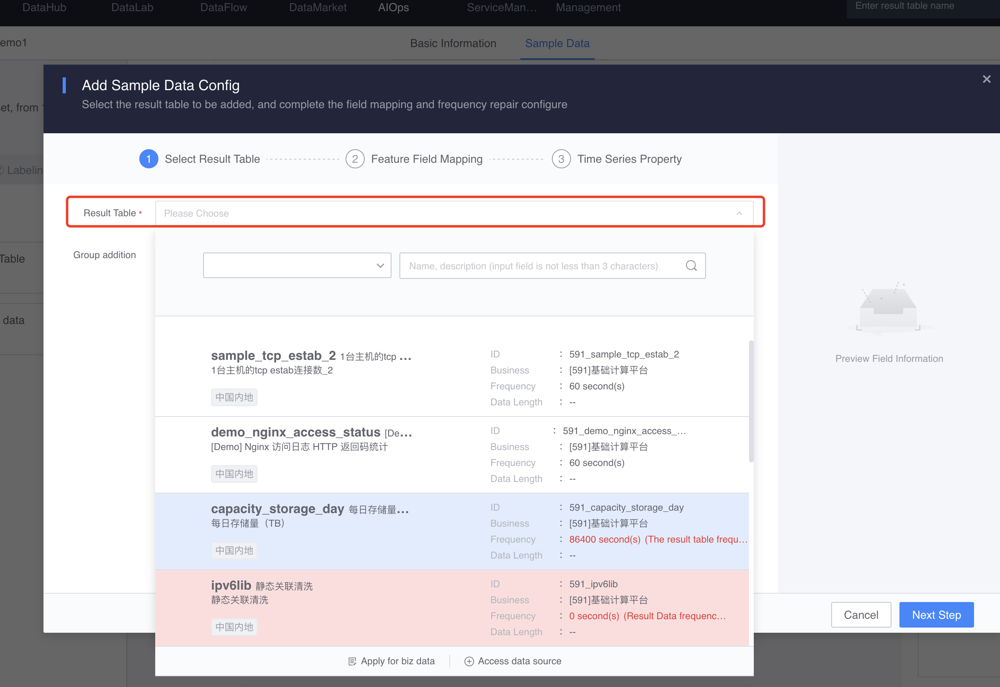

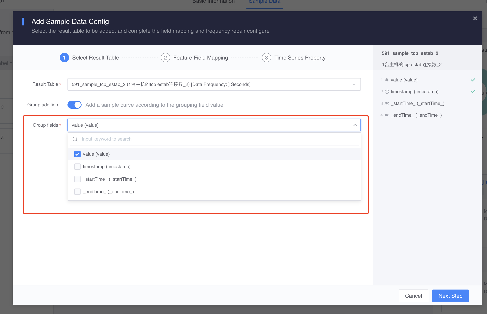

Result data can be grouped as needed.

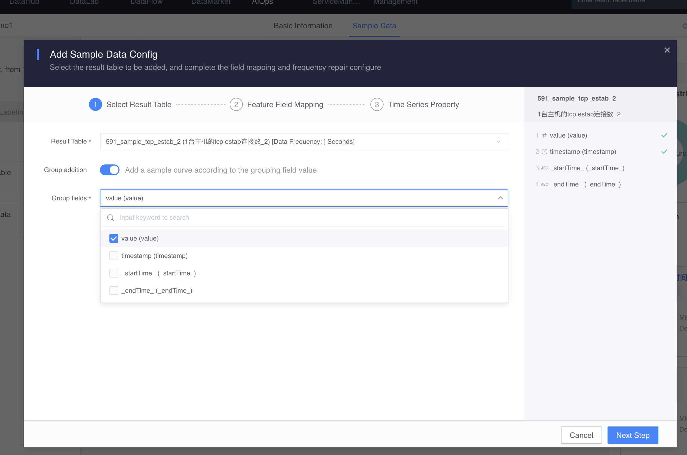

After selecting the result data, you can configure/map other characteristic fields of the result data. When sample data is added for the first time, the fields and data frequencies of the result data will be used as the original fields and data frequency standards of the sample set and cannot be modified. Other result data added subsequently must meet this standard.

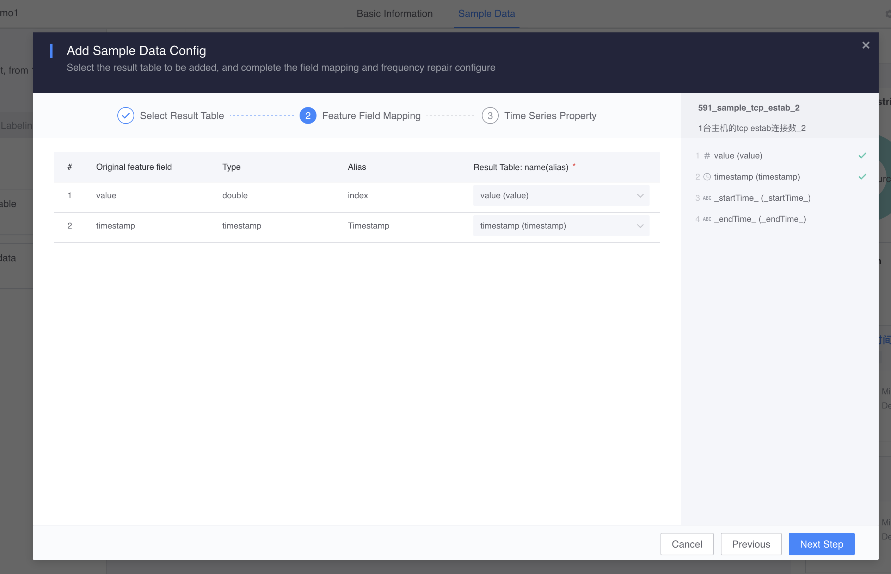

Confirm the time series attributes. If the frequency is inconsistent with the sample set data, aggregation is required.

## Add and delete sample data

Add an [Automatically add samples] policy to automatically import data into the sample set. Currently, three types of addition methods are supported: result data, application data, and API.

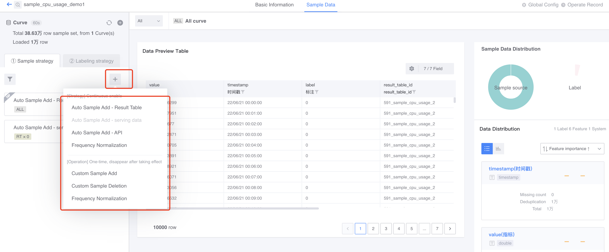

[Automatically add samples - result data], automatically add one or more result data in the current sample set

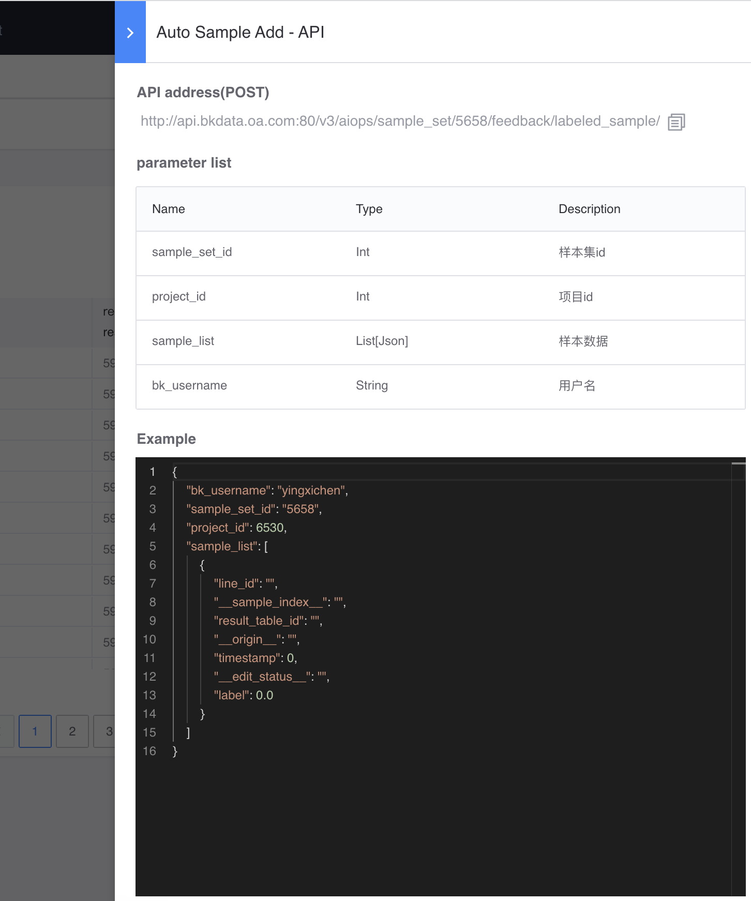

[Automatically add samples - Application data], you can view and manage the result data of application feedback enabled in the [Model Application] node of [Data Development] here.

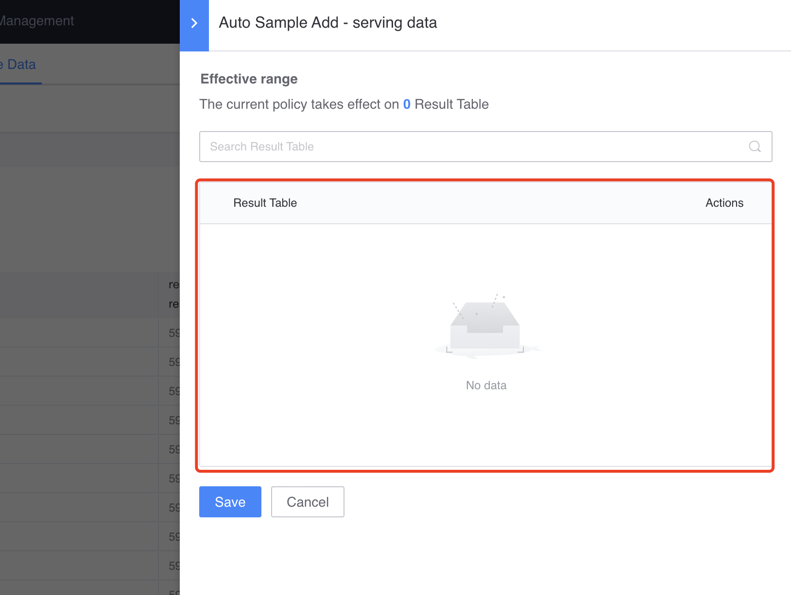

[Automatically add samples - API], you can write data to the sample set through the interface.

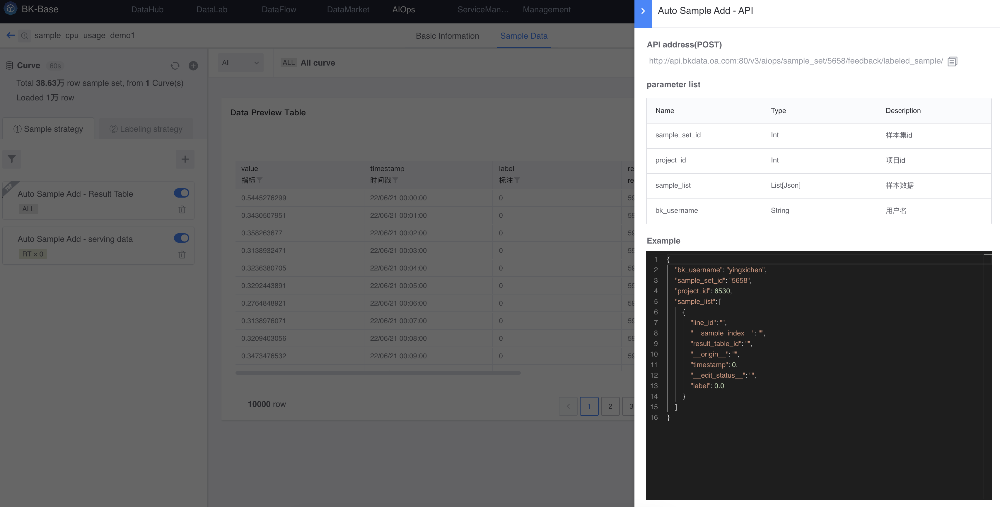

You can also add or delete a specific range of data through the [Customized Sample Add/Delete] policy.

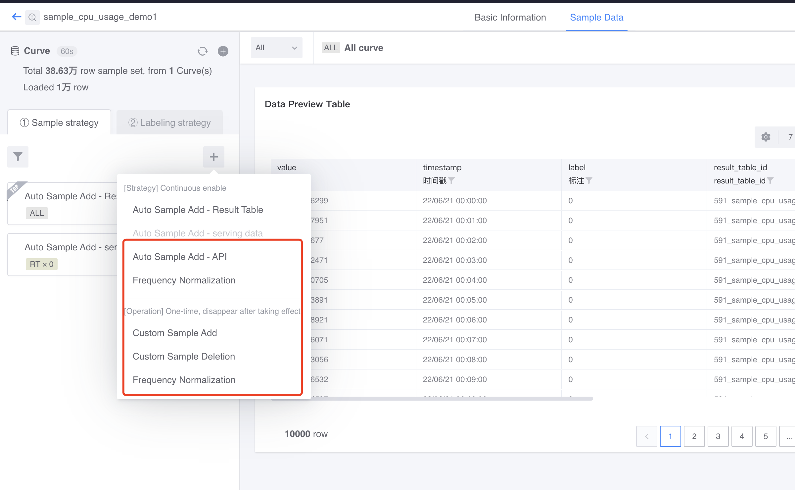

Through the [Frequency Normalization] strategy, data with non-sample set frequencies can be aggregated into sample set frequencies.

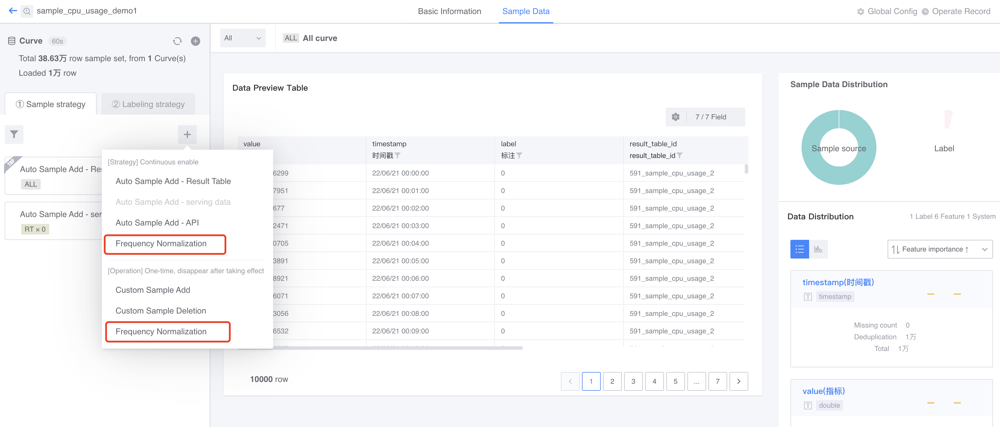

Aggregation functions can be configured uniformly or separately for each feature.

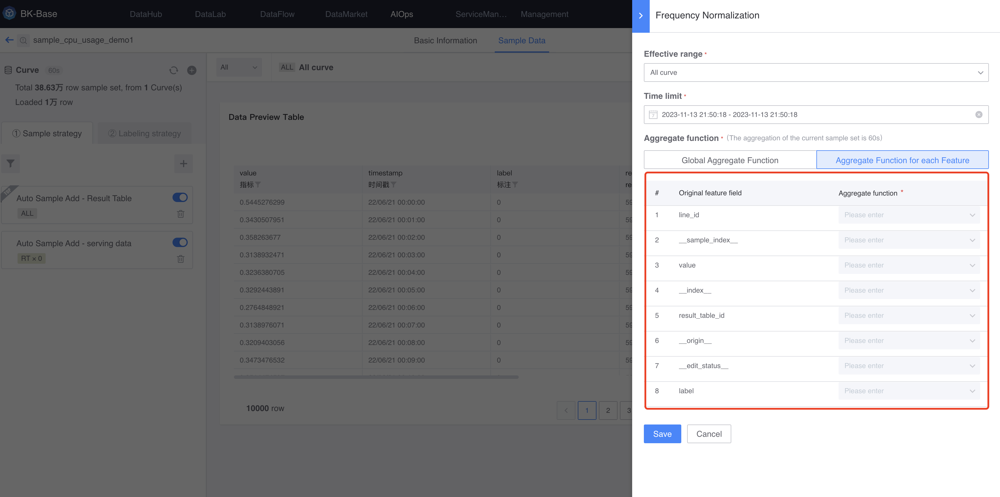

## Label sample data

First add the label definition.

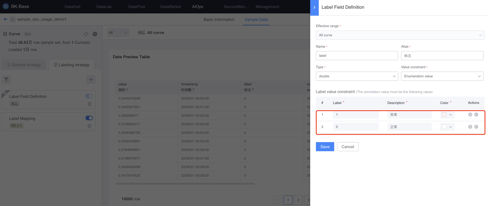

Then label the sample data. Currently, only sample data annotation is supported through the [Annotation Mapping] strategy. It can be done in two ways: [Value Mapping] and [Script Mapping].

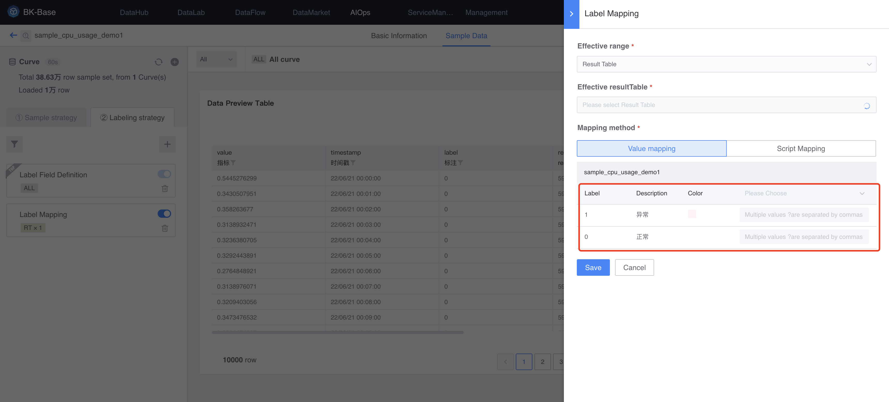

## Submit sample set

Once you have finished editing your sample set, you can submit it.

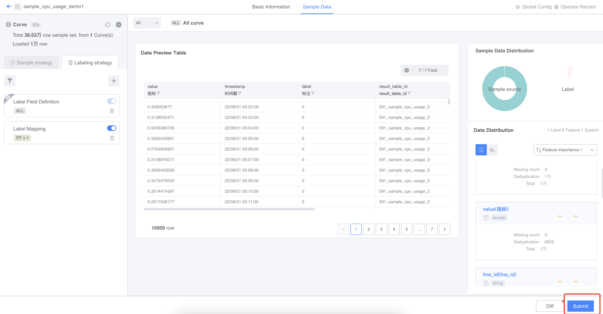

Wait for the calculation task to be completed before you can preview the data.

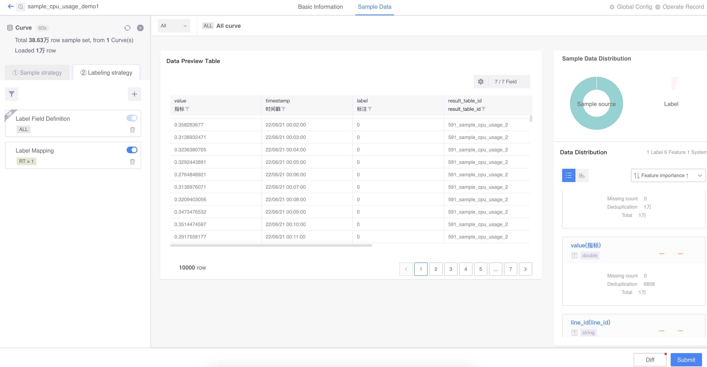

The Basic Information tab can also view various properties and overviews of the current sample set.

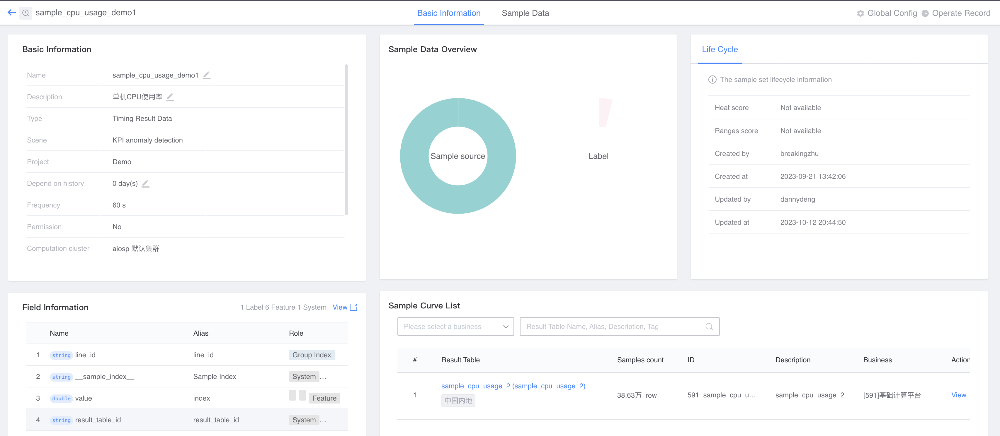