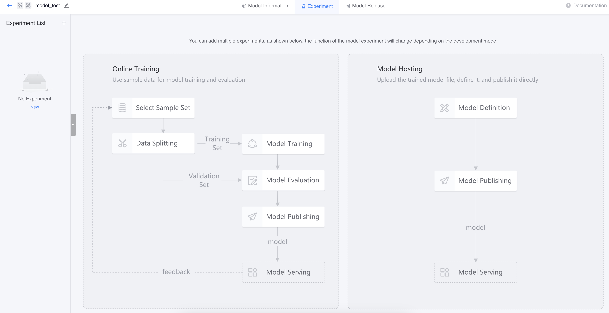
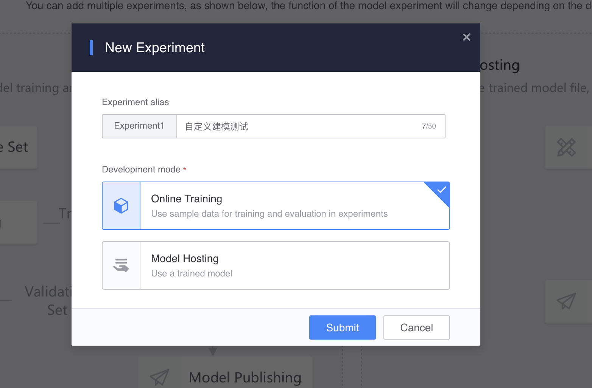

# Model hosting
The steps for model construction are slightly different depending on whether training is performed within an experiment. As shown below:


1) Online training: Enable training/evaluation within the experiment. It is necessary to prepare a sample set (training data) on the platform and select an algorithm for training and evaluation in order to get the model for release and application.

2) Model hosting: Close training/evaluation within the experiment. The model has been trained and packaged offline, uploaded to the experiment to define the model, and then the model can be published and applied.

# Features

## Create model

The entrance to create a model is the same as scene-based modeling. Select Custom in Select Scene of scene information and fill in the model information to complete the creation.



After creating the model, you will be shown two development methods for model experiments, namely, the above-mentioned: turning on or off training/evaluation within the experiment.

## Model experiment

Create a model experiment and select the development method (model hosting):



### Upload model file

After selecting the development method, you can upload the model file and select the corresponding algorithm.

Please upload the model file according to the model file specifications on the right side of the page and fill in the configuration.


### Selection algorithm

You can choose an algorithm provided by the platform or a custom algorithm, depending on the algorithm used in your model file. The official algorithm can be selected directly, while the custom algorithm must be defined before use.


Custom algorithms must fill in the following:

1) Basic information

2) Training/prediction input: required. The input field of the training/prediction function supports variable input (in addition to the configured input when using the algorithm, other inputs can be added)

3) Prediction output: required. Output fields of the prediction function

4) Training parameters: optional. Parameters of the training function

5) Prediction parameters: optional. Prediction function parameters


You can edit the roles of the input and output fields of the algorithm. The meaning of the roles in the entire modeling data flow is introduced as follows:

```
[Timestamp]: 'timestamp_column', a field used to identify sample time series attributes in time series data.
[Feature]: 'feature_columns', the data field used by the algorithm for training and prediction.
[Label]: 'label_column', the data field used by the algorithm for training.
[Index]: 'index_columns', including 2 types: __index__, system index, which is a random identifier automatically generated by the system; __id__, user index, which is based on the [group index] and [timestamp] selected by the user. In business sense, a row of independent time series samples is identified.
[Group index]: 'group_columns', __group_id__, a field used to identify a group.
[System]: 'system_columns', a field automatically generated by the system, cannot be deleted or modified.
[Business]: User-specified business field.
[Variable]: 'dynamic_columns', input field specified by the user during training or prediction.
[Passthrough]: 'passthrough_columns', input fields that need to be output as they are in the function logic.
[Prediction output]: 'predict_output', the field output by the prediction function.
[Group composition]: User-specified grouping fields.
```
Notice:

- You can specify a certain number of variable feature fields as needed for training or prediction
- Variable feature fields used during training can be inherited during prediction
- You can specify [reference data] input for training and prediction respectively, and directly use platform data other than the sample set through query in the code


After confirming that the model information is correct, you can submit the alternative model.


## Model release

The model release process of [Model Hosting] is consistent with [Online Training], please refer to the corresponding chapter.

## Model application

The model application process of [Model Hosting] is consistent with [Online Training], please refer to the corresponding chapter.