# Online training

The steps for custom modeling are slightly different depending on whether training is performed within the experiment. As shown in the figure below, online training is shown on the left:

1) Turn on training/evaluation within the experiment: You need to prepare a sample set (training data) on the platform, and select the algorithm for training and evaluation in order to get the model for release and application.

2) In-experiment Close Training/Evaluation: Model hosting. The model has been trained and packaged offline, uploaded to the experiment to define the model, and then the model can be published and applied.

# Features

## Create model

The entrance to create a model is the same as scene-based modeling. Select the custom scene in the scene information and fill in the model information to complete the creation.

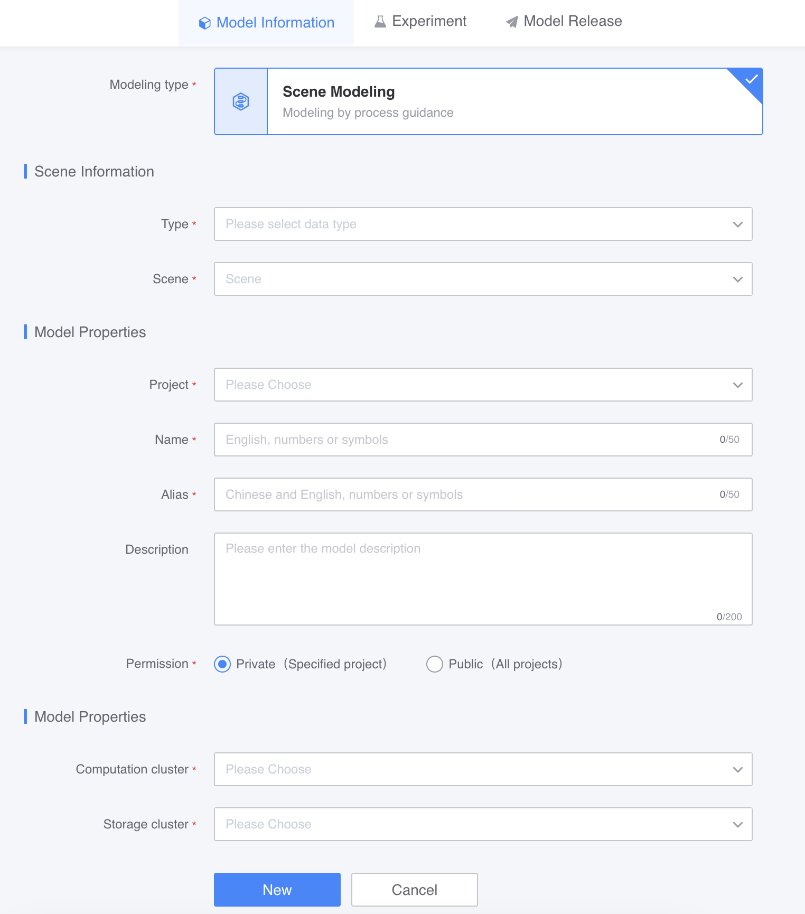

After creating the model, you will be shown two development methods for model experiments, namely, the above-mentioned: turning on or off training/evaluation within the experiment.

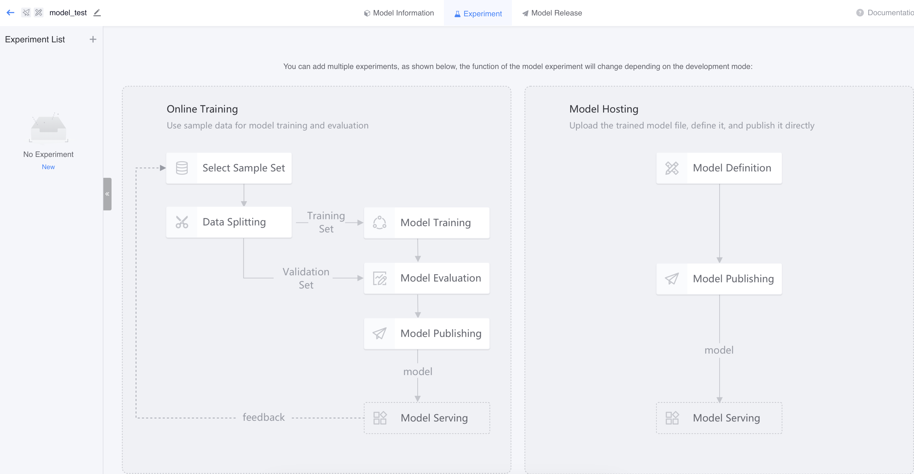

## Model experiment

Create a model experiment and select the development method (in-experiment training/evaluation):

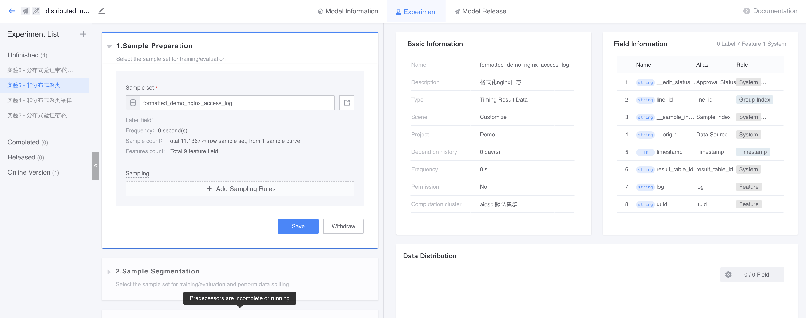

### Sample preparation

After selecting the development method, you can select the sample set and segment it. Here are some things to note:

1) Experiments that enable in-experiment training/evaluation will use the same set of sample preparation configurations.

2) If data segmentation is turned on, the sample set will be divided into two data slices, which are used for training and evaluating the model respectively; if data segmentation is turned off, the data of the entire sample set will be used for training and evaluating the model.

In addition to the officially provided slicing functions, you can also use custom slicing functions.

The custom segmentation function must fill in the following content:

1) Basic information

2) Segmentation parameters: optional. Split function parameters

After performing segmentation, you can view the segmentation results on the right.

### Model training

You can choose the algorithm provided by the platform or a custom algorithm. The official algorithm can be selected directly, but the custom algorithm must be defined before use.

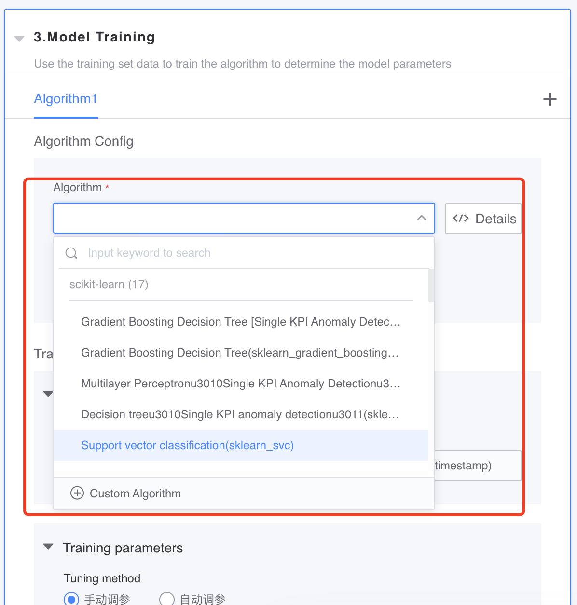

Custom algorithms must fill in the following:

1) Basic information

2) Training/prediction input: required. The input field of the training/prediction function supports variable input (in addition to the configured input when using the algorithm, other inputs can be added)

3) Prediction output: required. Output fields of the prediction function

4) Training parameters: optional. Parameters of the training function

5) Prediction parameters: optional. Prediction function parameters

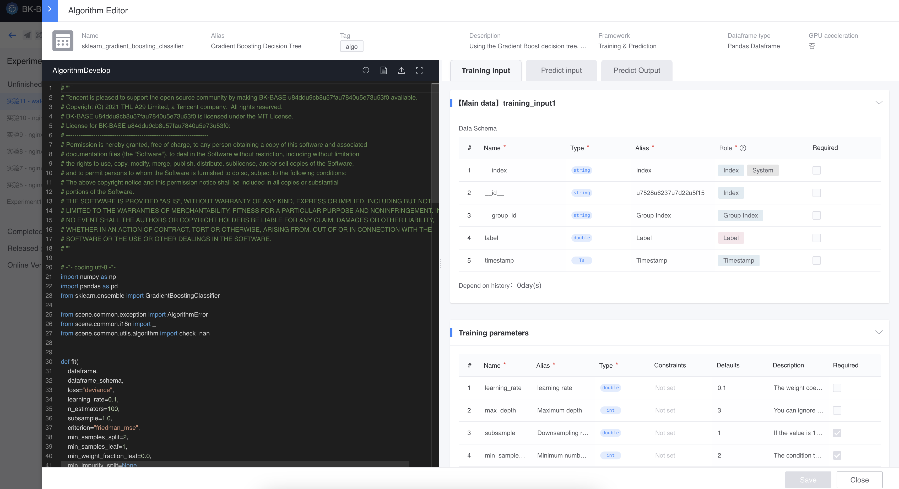

After selecting the algorithm, you need to configure the training input (features) of the algorithm.

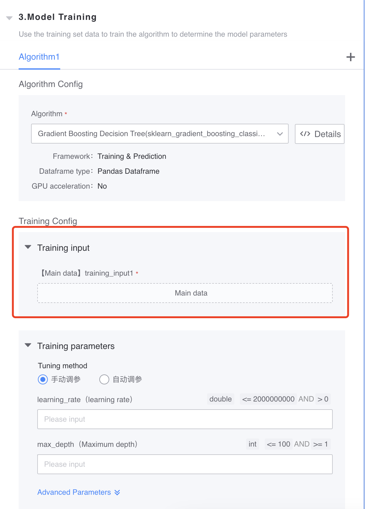

You can select the features used by the algorithm according to your needs. Feature importance and feature quality are currently provided for reference. If you are using an algorithm that already has training/prediction inputs specified, these fields are automatically added here and you just need to match features to them.

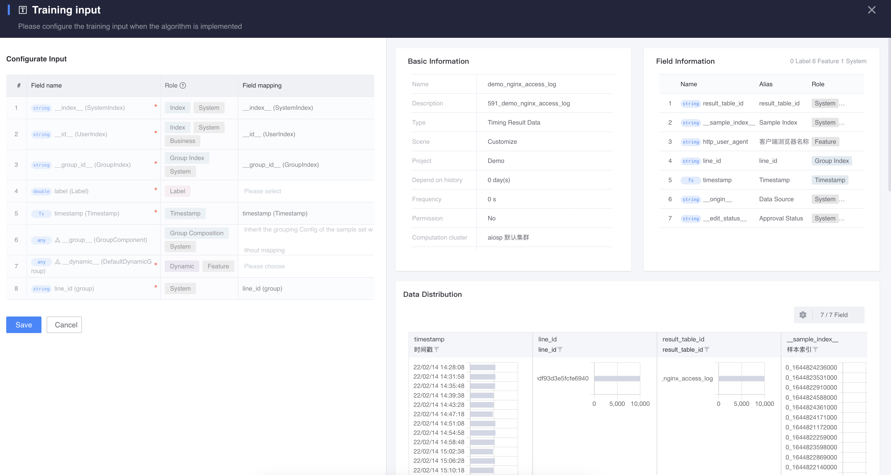

The original features corresponding to the features you selected will be used as the input standard for the current model project. Subsequent experiments can only perform feature selection on a subset of this original features.

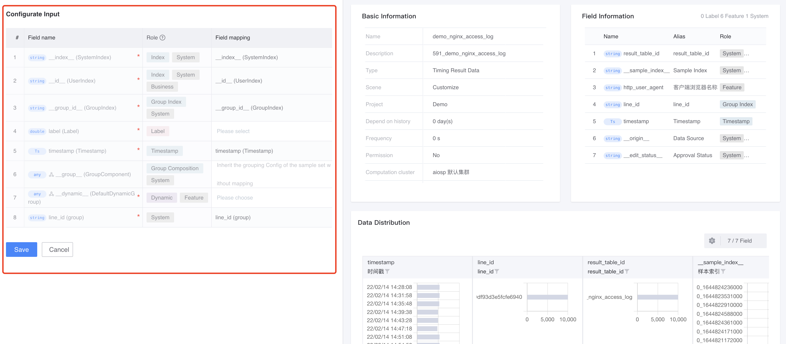

Currently, up to three algorithms are allowed to be added at the same time for comparative training.

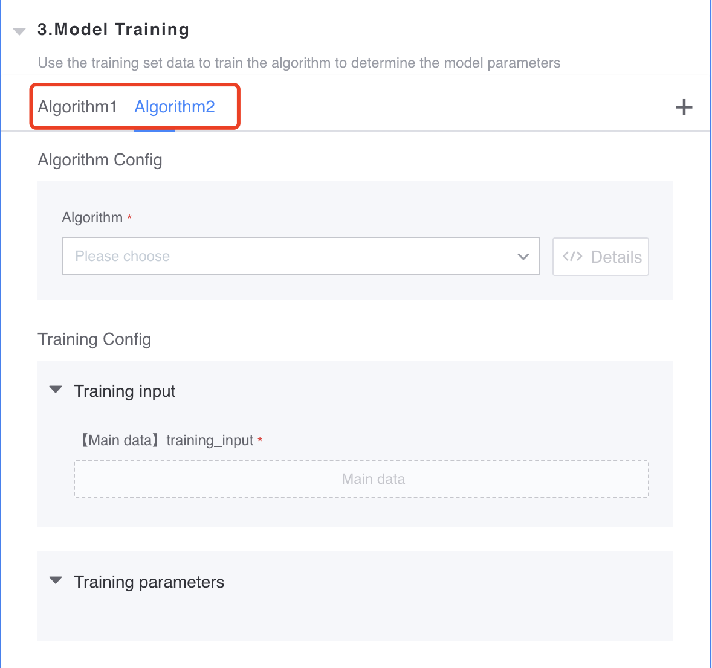

After the training is completed, you can view the training results and debugging logs of each algorithm on the right.

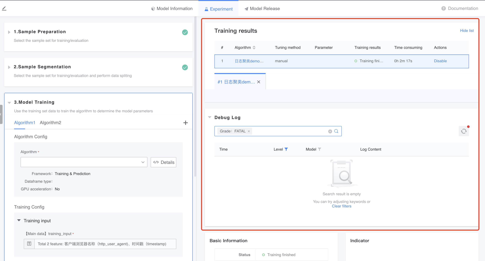

### Model evaluation

After completing model training, you can select a public evaluation function to evaluate each algorithm. The evaluation function also supports customization.

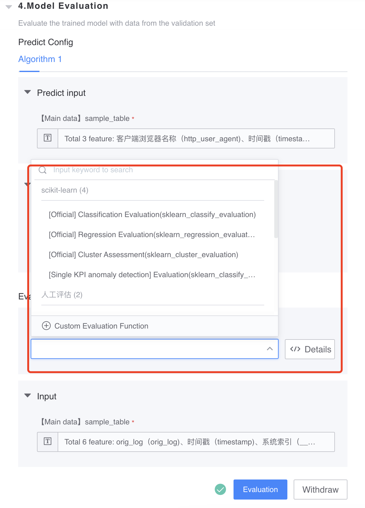

Custom evaluation functions must fill in the following:

1) Basic information

2) Evaluation input: required. Input fields for evaluation functions

3) Evaluation output: required. Output fields of the evaluation function

4) Evaluation parameters: optional. Evaluate the parameters of the function

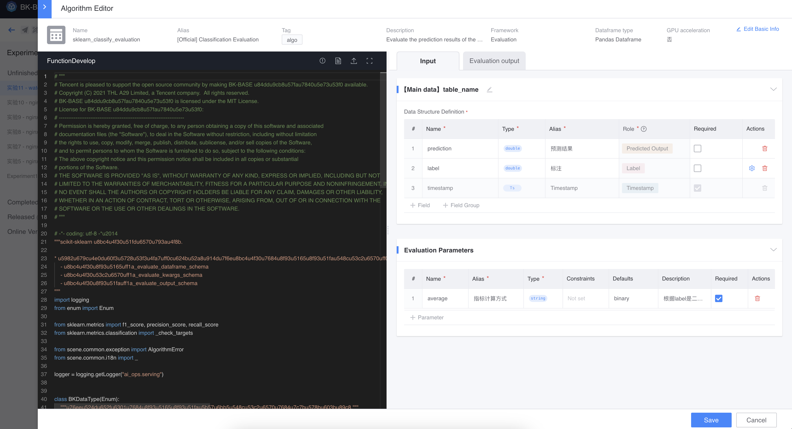

After the evaluation is completed, you can view the evaluation results and debugging logs of each algorithm on the right.

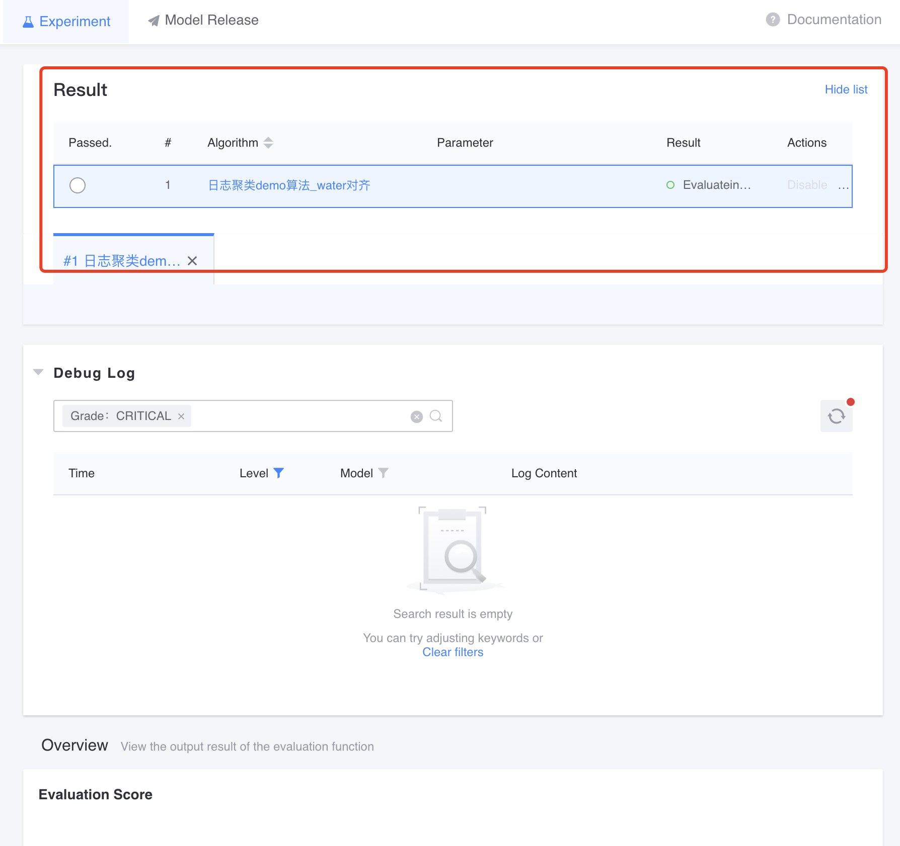

You can select one of the algorithms with the best evaluation results as a candidate model for subsequent release.

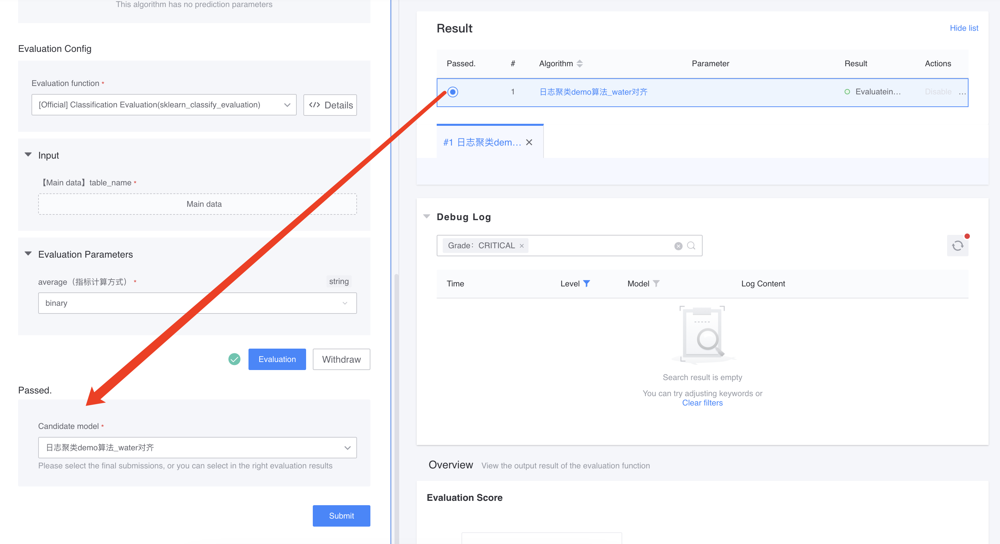

After confirming that the model information is correct, you can submit it.

## Model release

You can view alternative model evaluation results for all experiments in the Model Release tab.

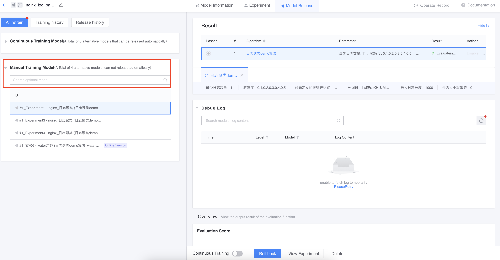

Select the alternative model to be published and click Prepare to publish.

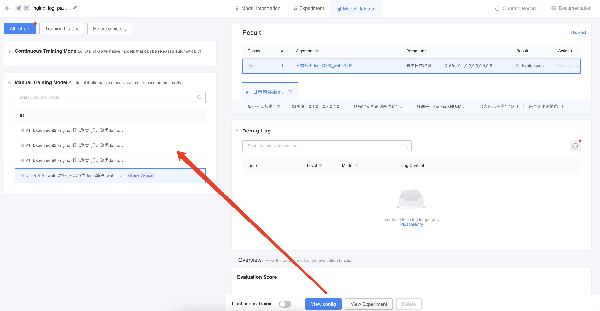

Fill in the publishing configuration and publish the model online.

## Model application

The steps for applying the model in the data development workbench are consistent with scenario modeling. For details, please refer to the introduction document of [Single Indicator Anomaly Detection].