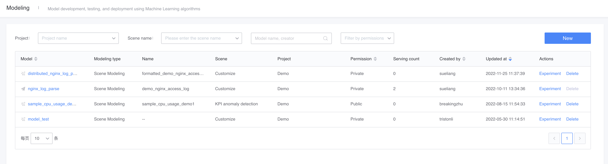
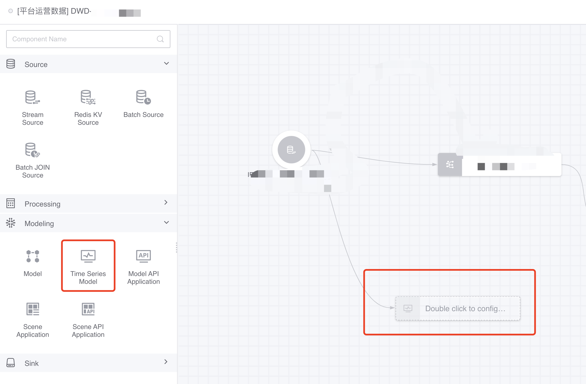
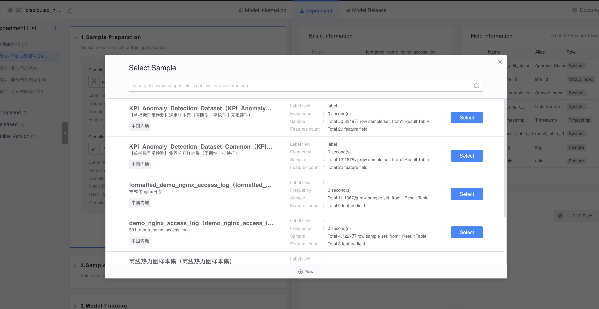
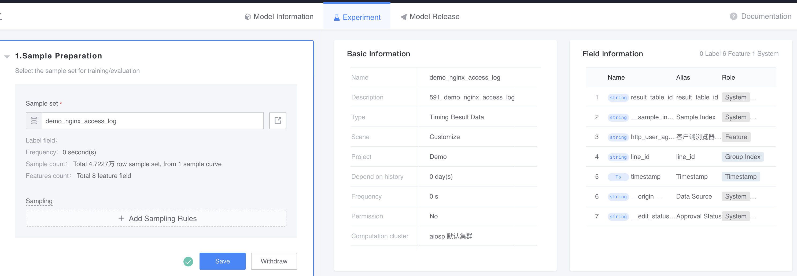
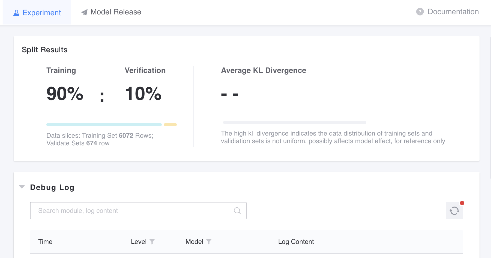
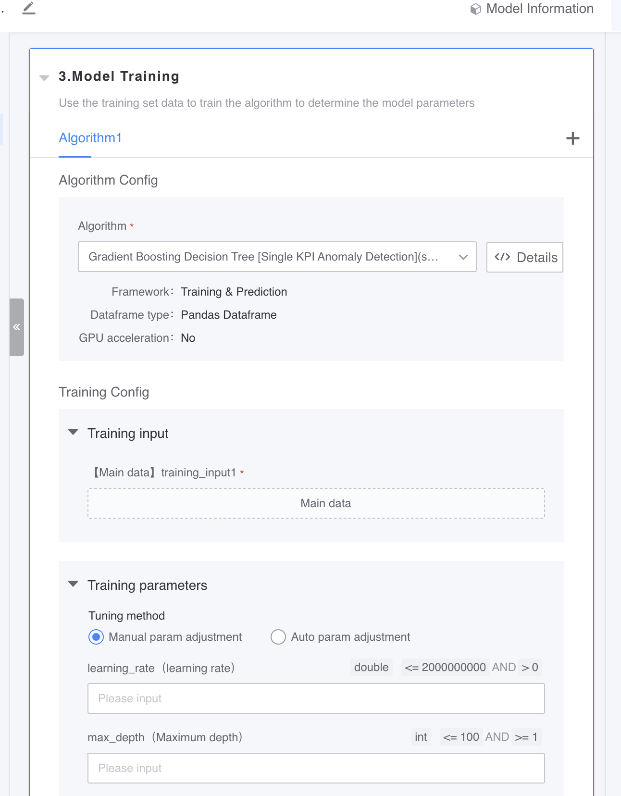

# Scenario modeling

The closed-loop steps of scene modeling are as shown in the figure below:

 

1) Confirm the scenario: Confirm the modeling scenario according to the requirements;

2) Sample preparation: construct sample data and label it;

3) Feature engineering: During model construction and model application, different data streams will go through the same steps;

4) Model training & evaluation: Select an algorithm for training, and adjust hyperparameters based on the evaluation results;

5) Release model: including the release and management of model records;

6) Apply model: apply business data to the published model;

7) Sample closed loop: In scenario modeling, model users will be provided with annotation feedback function of application data. The model detection results after manual confirmation and modification will be fed back to the sample set as labeled sample data for subsequent optimization and upgrading of the model, forming a closed loop. In the single-index anomaly detection scenario, the flow chart from the construction of the sample set to the use of the sample set (model construction) is as follows:

# Features

## Modeling entrance

Users can create models under their own projects. There are entrances to create models in the user center and data development workbench.

 

In the [Component Library - Machine Learning] directory of the data development workbench, find the time series model application and create the model.

## Create model

First, select the single-index anomaly detection scenario, fill in the basic information of the model, and click Create Model to enter the model building step.

 

## Model experiment

It includes three steps: sample preparation, model training, and model evaluation.

### Sample preparation

First, select a prepared sample set. If you need to create a new sample set, please click Create Sample Set in the pop-up box to enter the sample set creation page.

 

After selecting the sample set, you can preview the data on the right.

 

Once confirmed, the data can be segmented, and the samples can be divided into training sets and validation sets, which are used to train the model and test the model effect respectively. You can view the segmentation results on the right.

### Model training

Select one or more algorithms and specify hyperparameters. Use the training set data to train the algorithm, and you can view the training results on the right.

### Model evaluation

Evaluate the trained model on the validation set data. You can adjust the threshold to preview the assessment overview and determine whether the assessment passes based on the actual situation. After passing the evaluation, you can submit the experiment.

After confirming that the model information is correct, you can submit it.

## Model release

You can view the generated alternative models in the model release tab. The alternative models have two statuses: published and unpublished. Unpublished alternative models can be published by clicking the publish button on the right.

## Model application

To apply the model in the data development workbench, please select the [Time Series Model Application] node and configure the input. The configuration page is shown below:

