# Scene service

The usage process of scene service is as shown in the figure below:

 

1) Create a scene: The first solution developer submits the creation application form for the corresponding scene. After the platform manager reviews it, the scene creation can be completed.

2) Solution development: Create a solution in an existing scenario. After review by the platform manager, the development of the solution can begin.

- Select test data for debugging and evaluating the solution
- Arrange capability items and build input and output field mapping relationships of upstream and downstream nodes
- Configure evaluation indicators to evaluate the effectiveness and performance of the solution. Each solution can have independent evaluation indicators. When applying, users can select the evaluation indicators to view the results as needed.
- Publish the plan, and then select the plan in the [Scenario Application] node of [Data Development]

3) Scenario application

- Select a scenario, and then apply the data input by the user to filter the solutions that can be used in that scenario
- Select a plan, extract the common input of each plan, and configure the data mapping and parameters of each plan respectively.
- Select the best configuration and configure evaluation indicators for each solution of the application
- Application feedback, when output results that do not meet expectations occur, mark feedback can be provided

# Basic concepts

* Scenario: At present, it is mainly [Operation and Maintenance Scenario], which refers to some specific activity scenarios generated during the business operation and maintenance process in the field of operation and maintenance, including anomaly detection, root cause location, fault self-healing, intelligent change, and even some updates For complex composite operation and maintenance scenarios, etc.

   Examples of composite operation and maintenance scenarios:
   ① A timing anomaly detection model that outputs detection results at each timestamp granularity;
   ② The abnormal point events in the detection results will be deduplicated and filtered, and the alarm events will be obtained after convergence;
   ③ Alarm events can be drilled down into multiple dimensions to find more detailed abnormal dimensions;
   ④ Multiple types of alarm events are aggregated and correlated and turned into faults;
   ⑤ Conduct root cause analysis of faults based on topological data (calls, networks, resources);
   ⑥ Execute operation and maintenance operation recommendations or automated self-healing logic.

* Solution: A complete processing logic corresponding to a specific [scenario]. A [scheme] is the smallest unit that independently completes the processing logic of the [scenario]. A [scheme] is composed of multiple [capability items].

* Capability items: independent processing logic. In the platform, data model, algorithm model, UDF (custom function), real-time calculation, and offline calculation are all capability items.

# Features

## Scene service entrance

Users can create scenes under the [Scene Service] tab, or use already created scenes.

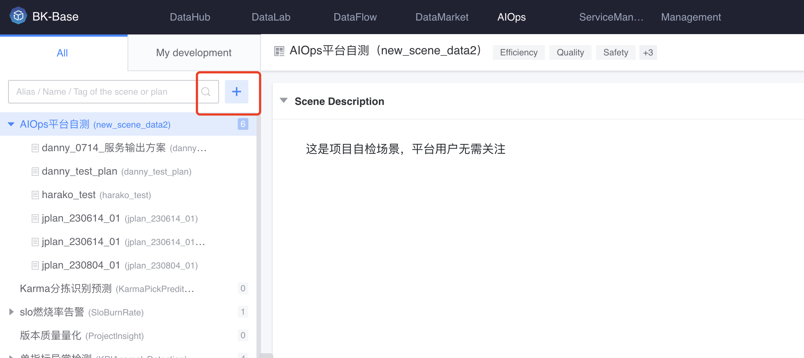

## Create scene

Click Create Scenario and fill in the basic information.

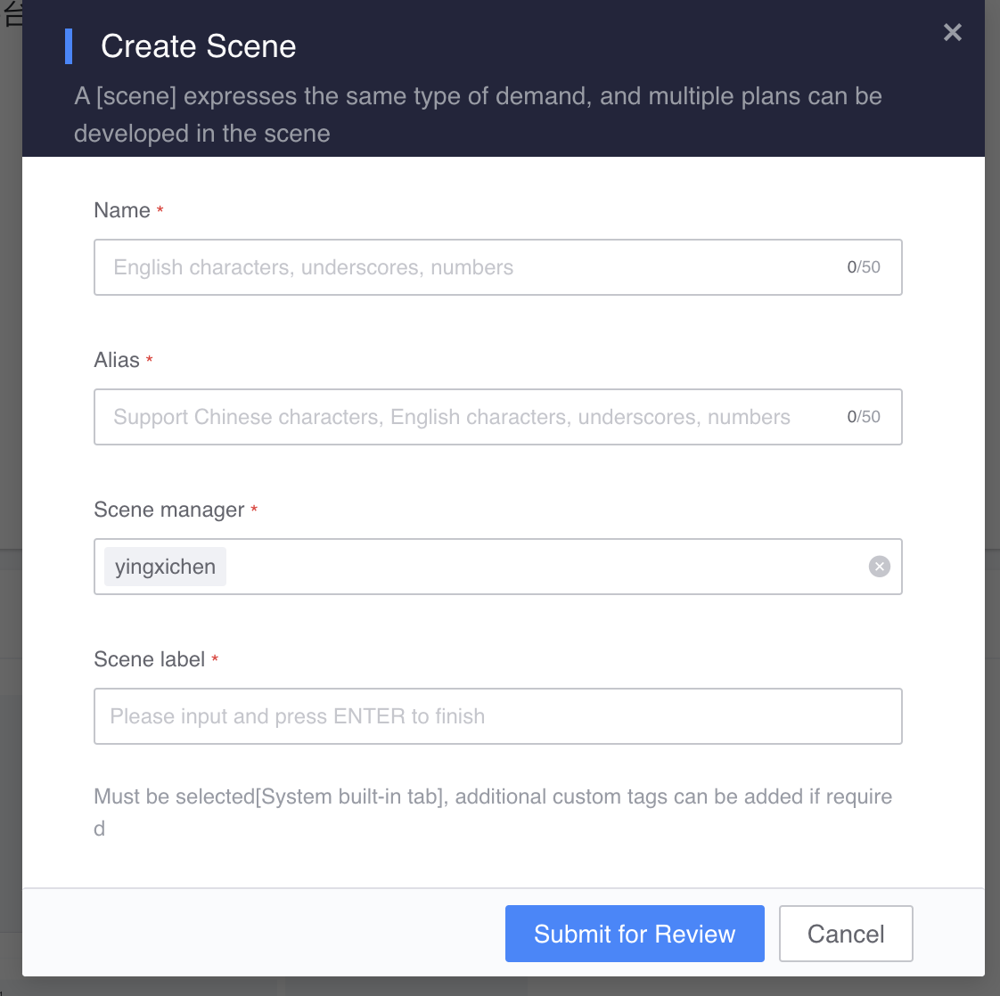

 

## Scene configuration

You can view the basic information and permission information of the scene. The scene just created needs to fill in the scene description document.

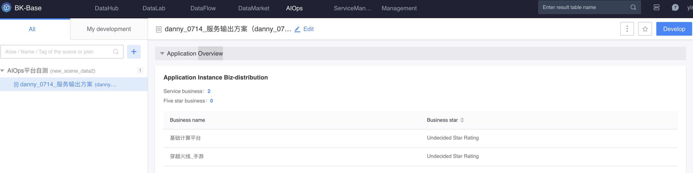

## Solution development

### Create a plan

Create a plan and fill in the basic information.

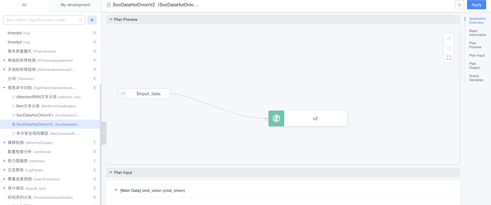

 

Fill out the project description document.

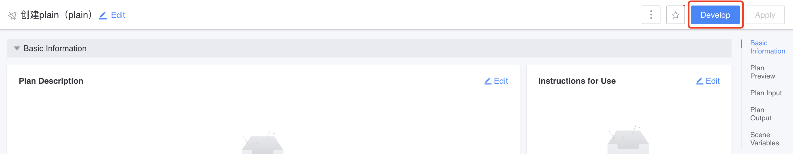

 

Click [Draft] to enter the editing state. Drag nodes from the component library on the left to the canvas to build various capability items of the solution. Currently, it supports: test data and scenario modeling.

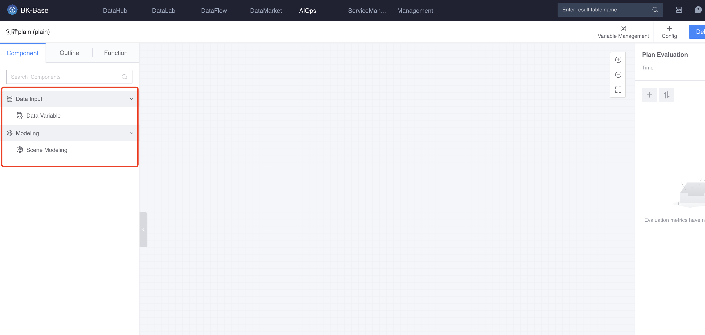

### Select test data

Configure the [Test Data] node and select a sample set or result data for testing.

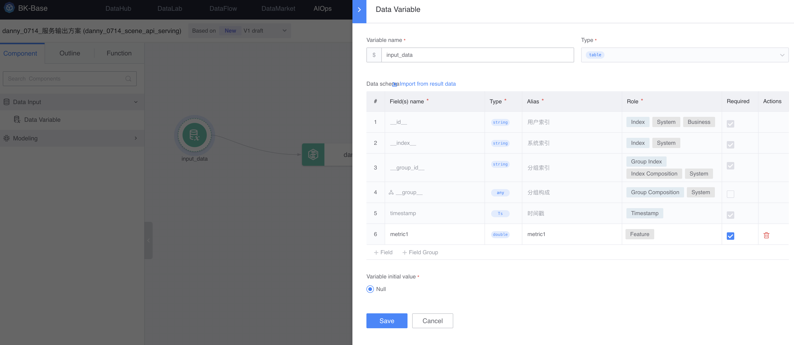

### Arrangement capability items

Configure the [Scenario Modeling] node, select a published model, map it with the test data, and fill in the model parameters and other configurations.

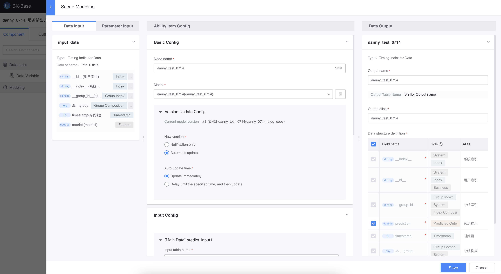

### Configure evaluation indicators

Add evaluation indicators in the right column, map them with test data, and fill in configurations such as evaluation indicator parameters.

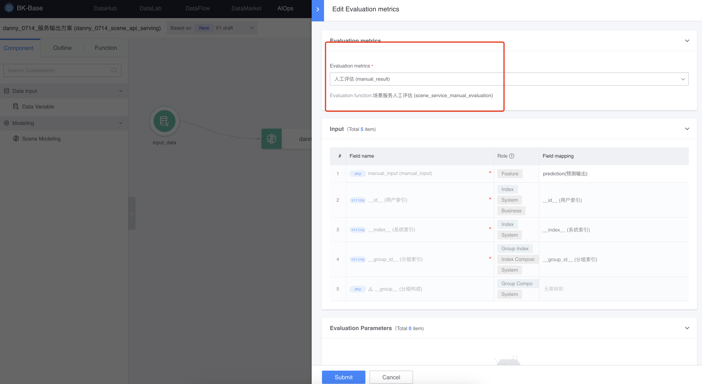

Variables used in the solution development process can be managed on the [Variable Management] page. For example, parameter variables open to users can be controlled.

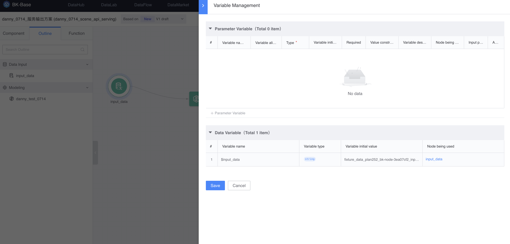

## Plan release

After debugging is completed, the program output is confirmed to be correct, and you are satisfied with the evaluation indicator results, you can publish the program and click [Publish] in the upper right corner.

After previewing and confirming that the arrangement logic, input, output, parameters, etc. of the plan are correct, you can fill in the release information and publish.

## Scenario application

To apply the scenario in the data development workbench, please select the [Scenario Application] node, connect to the upstream data, and configure it.

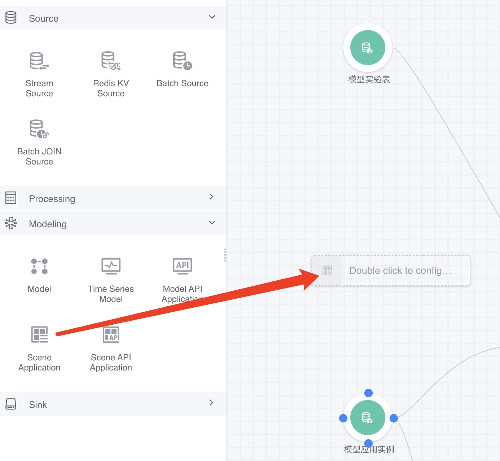

Select the desired scenario and scenario.

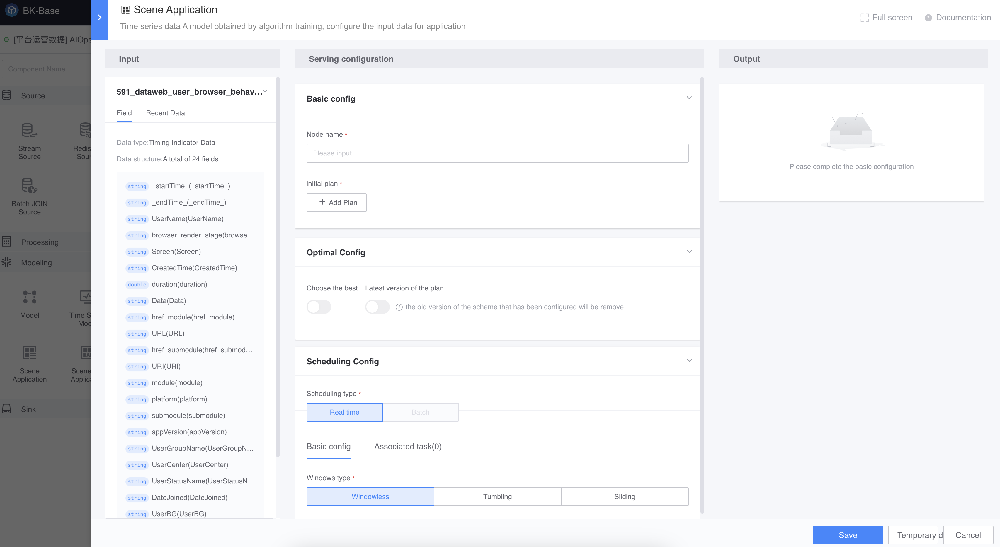

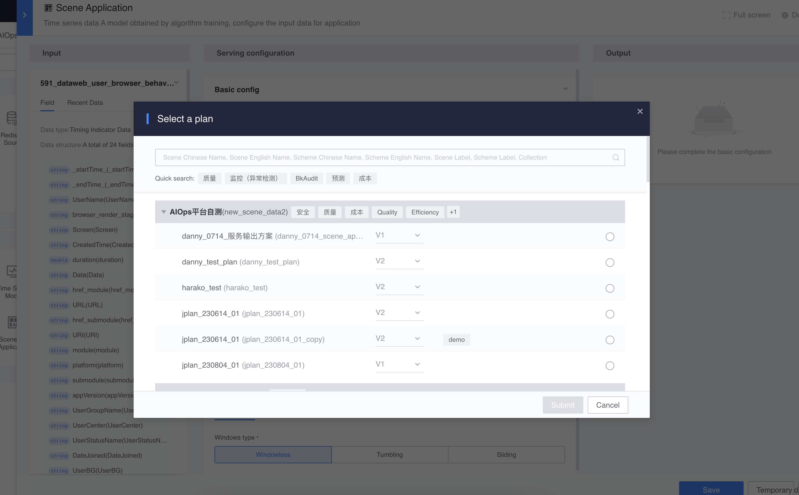

Configure the parameters required for input and scheme and save.

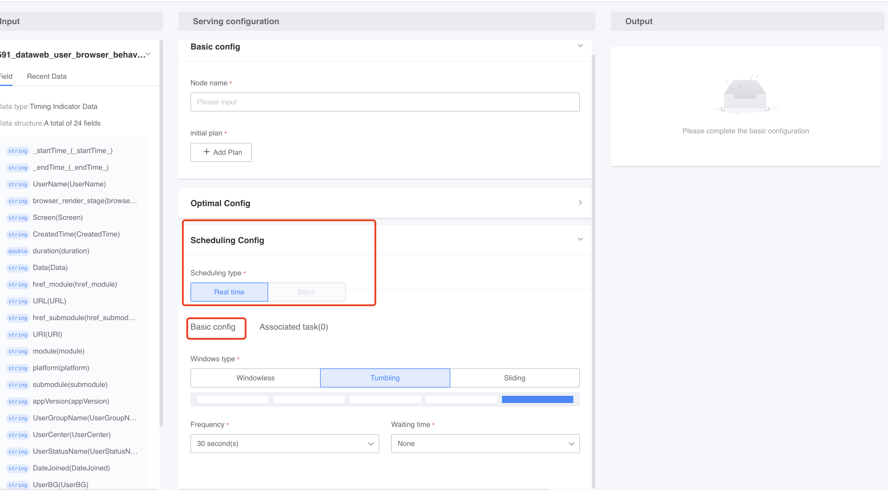