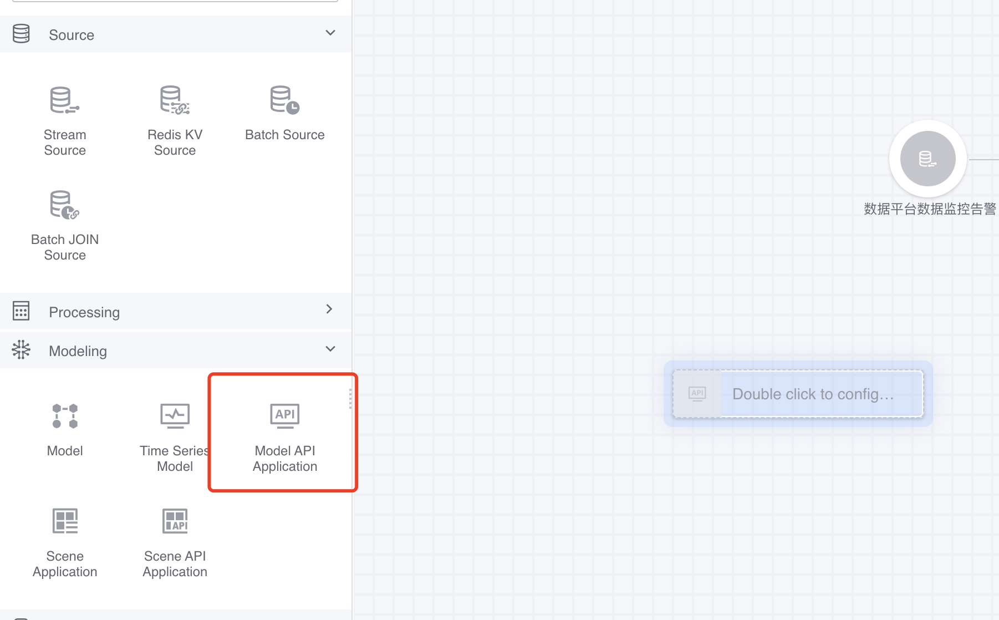
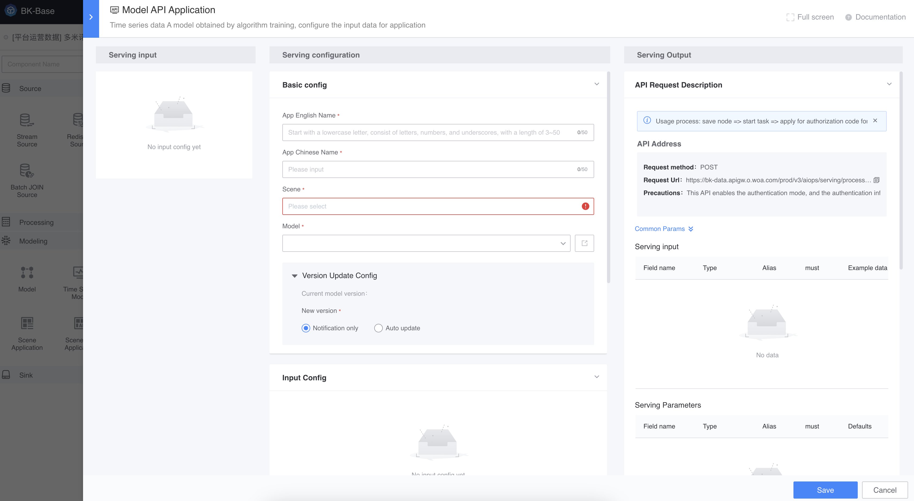
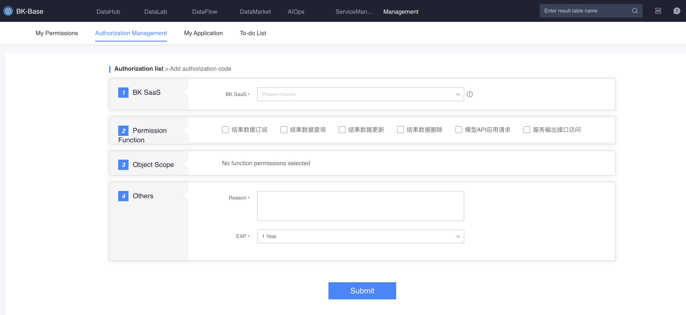
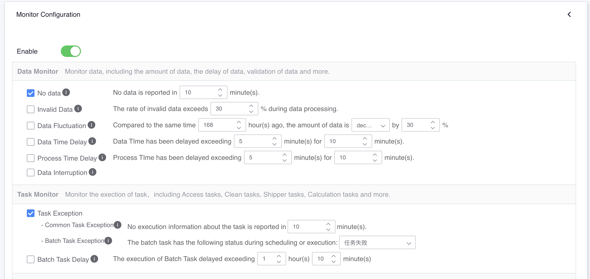

# Model API application
Provide model application services in **API mode**.

## scenes to be used
BlueKing applications interact directly with model services through APIs, such as in intelligent question and answer, real-time prediction and other scenarios.

## Preconditions
There is application permission for [Released Model](../release.md) in the project. If not, you can apply for model application permissions by project (./apply_permission.md).

## manual
Save the model API application node in data development -> Start the data development task -> Apply for an authorization code for the BlueKing application -> Initiate an API request. For more details, see the API documentation (gateway name: bk-data, API name: api_serving_processing_execute).


## Save model API application node in data development
Add **Model API Application Node** in [Data Development](../../dataflow/ide/concepts.md) and select the model with permissions under the project.

Fill in the English name and Chinese name of the model API application, which is used for identification and to facilitate subsequent application for authorization codes for the BlueKing application (the BlueKing application requests the credentials of the model API application).



In this node, you can see the prediction input, prediction parameters, and prediction output of the model API application. The sample data part is filled in during the [Model Experiment Submission Alternative Model Phase](../online_training.md).

The request example part can be used as the request body for subsequent requests.




## Start data development task
Start [data development task](../../dataflow/ide/concepts.md).

## Apply for authorization code for BlueKing application

On the [Authorization Management](../../auth-management/token.md) page, apply for a request credential for the BlueKing application: authorization code (bkdata_data_token).



Select the model API application to be requested in the pop-up window.


After approval by the project administrator of the running model API application, check the authorization details and obtain the authorization code (bkdata_data_token) for the next request.


## Initiate API request
The following is an example of requesting a model API application.

> Please replace the address in the request URL, which can be found in the model API application node.

```json
curl -s -XPOST https://xxxxx/aiops/serving/processing/xxxxx/execute/ -H 'Content-Type: application/json' -d '{"bkdata_authentication_method":"token","bkdata_data_token":"xxxxx ","bk_app_code":"xxxxx","bk_app_secret":"xxxxx","data": {"inputs": [
                 {
                     "timestamp": 1648180582000,
                     "question": "xxxxx"
                 }
             ]
         },
         "config": {"predict_args": {}
         }
     }'
```

Return example


```json
{
   "errors": null,
   "message": "ok",
   "code": "1500200",
   "data": {
     "result": true,
     "data": {
       "data": [
         {
           "output": [
             {
               "answer": "xxxxxxxxxxxxx",
               "timestamp": 1648180582000,
               "question": "IDIP"
             }
           ],
           "input": [
             {
               "timestamp": 1648180582000,
               "question": "XX"
             }
           ]
         }
       ],
       "status": "success"
     },
     "code": "","message":"APIServing execute success","errors": null
   },
   "result": true
}
```

See the API documentation for more details (gateway name: bk-data, API name: api_serving_processing_execute).

## Monitoring and Alerting

### Request volume and request latency
- Request volume


- Request takes time


> Note: After the model API application is started, the model will be loaded on the first request, and subsequent requests do not need to load it.


### Alarm configuration
In the data development task toolbar, you can configure alarm policies.



- General task exception: Model API application exception, such as Crash, **it is recommended to turn this on**.


- No data from data source: no requests for 10 minutes.

> If the application's requests are not continuous, it is recommended not to enable this option.


- Data fluctuation: the number of requests has decreased compared with the same period


> If the application's requests are not continuous, it is recommended not to enable this option.