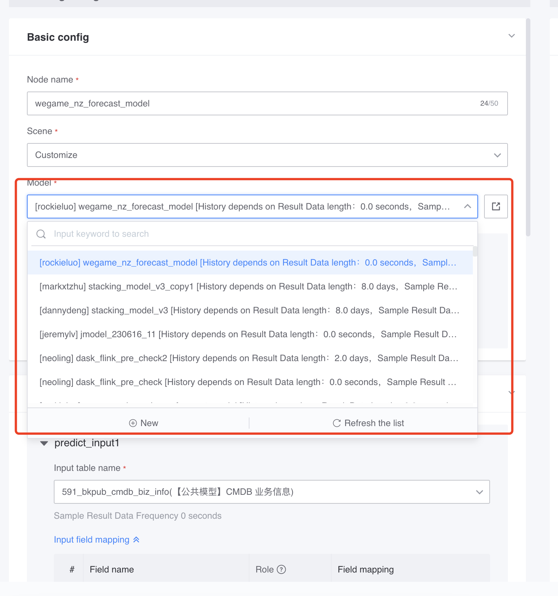
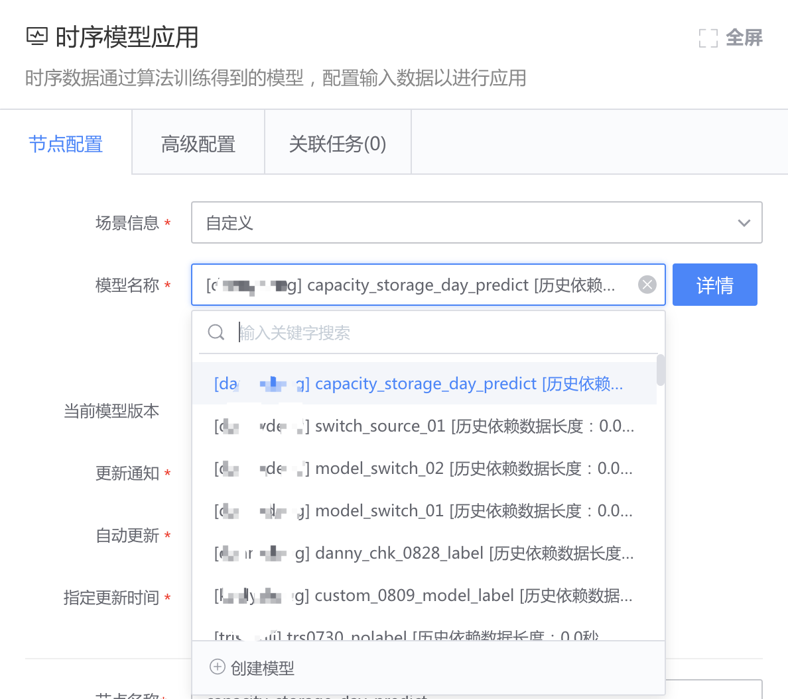

# Apply for model application permissions

## Introduction to model application permissions
Model application permissions: permissions to apply models in data development.

When creating a model, you can choose the application permissions of the model to be `Project Private` or `Public. `

- Project private: This model can only be applied under the current project. You need to apply for application permission before using it in other projects.

- Public: All projects can apply the model.

## Apply for model application permissions by project

Open the model name drop-down box of the model application node and search for the model. If the project does not have application permissions, it will be gray. Click to apply for permissions.

Fill in the reason for application.

Next, the model under application will be at the top. Click to jump to ITSM to follow the approval progress.
> Approver: Project administrator of the project where the model is located

After the approval is successful, you can click Refresh List to refresh the status.

Select the model you just applied for successfully and save the node.

