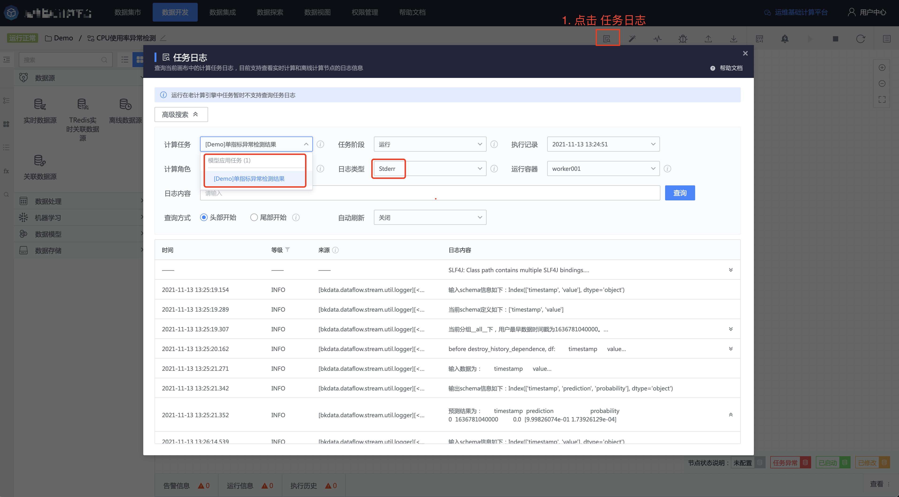
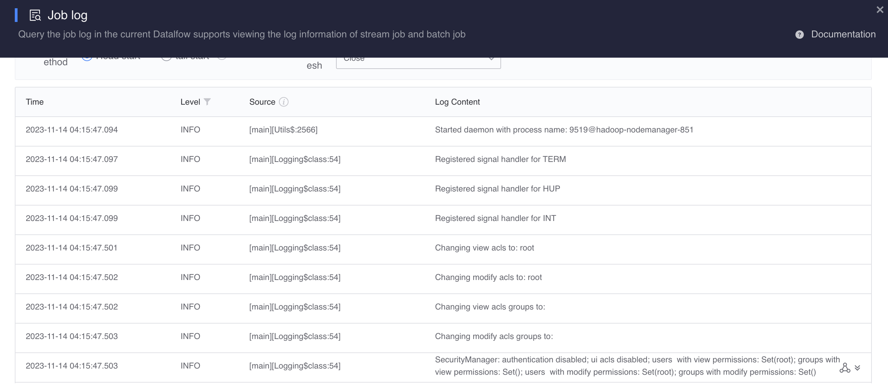

# View model application data and logs

## View model application scoring data

In the data development task of model application, click `Data flow monitoring` on the toolbar to view the management data of model application.


Move the cursor to the model application node to view the data volume trend of this node.


If it is a real-time model, you can view the calculation delay.


> In the example above, after the resource capacity of the model application node is expanded, the calculation delay drops from 20 minutes to 3 minutes.


If it is an offline model, you can view recent execution records.


## View model application log
In the data development task of the model application, click `Task Log` on the toolbar to view the running log of the model application.

Task log is a common capability for data development tasks. For detailed help, please refer to [View Computing Task Log](../../dataflow/tasklog.md). The following are the differences in the use of model application nodes:

- Execution records: `Real-time model` displays the startup time of the model application node, `Offline model` can select the most recent execution record
- Log type: Select Stderr (due to framework limitations)



The model application node will output the general log as shown above by default. If you want to actively output a custom log, you can print it through `log_in_serving` in the algorithm.


```python
# -*- coding:utf-8 -*-

import logging ## Experiment log
from aiops.logic.toolkit.logger import log_in_serving ## Model application log

# You can print the log within the experiment through this logger
logger = logging.getLogger('ai_ops.serving')

def fit(dataframe, dataframe_schema, **kwargs):
     ...
     ## Print in-experiment logs
     logger.info(f'fit log in the first line of experiment')
     ...
    
def predict(dataframe, dataframe_schema, model, **kwargs):
     ...
     ## Print in-experiment logs
     logger.info(f'predict log in the first line of experiment')
    
     ## Print model application log
     log_in_serving('First line of model application log', level=logging.INFO)
     ...
```

The following is the effect of printing logs through `log_in_serving`:

