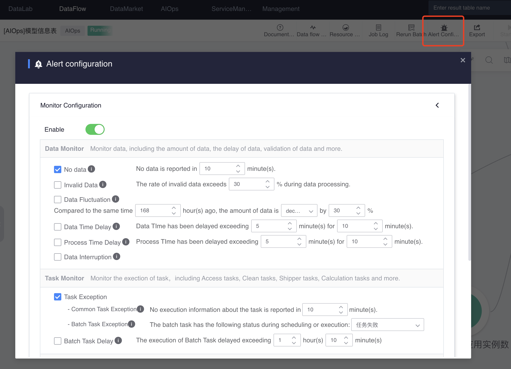

# Create an alarm policy for the model application node

In the data development task of the model application, click `Alarm Configuration` on the toolbar to open the alarm configuration page.

On the alarm configuration page, configure the corresponding alarm policy according to your needs.

For model application nodes, the following strategies are supported:

- Live models
     - Data monitoring: No data in the data source, data time delay, processing time delay
     - Task monitoring: general task exceptions

- Offline model
     - Task monitoring: Offline task exceptions

