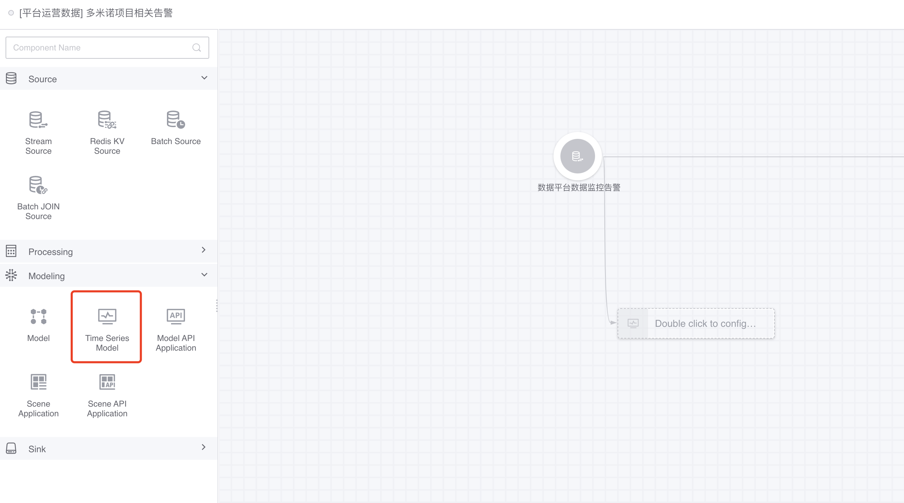
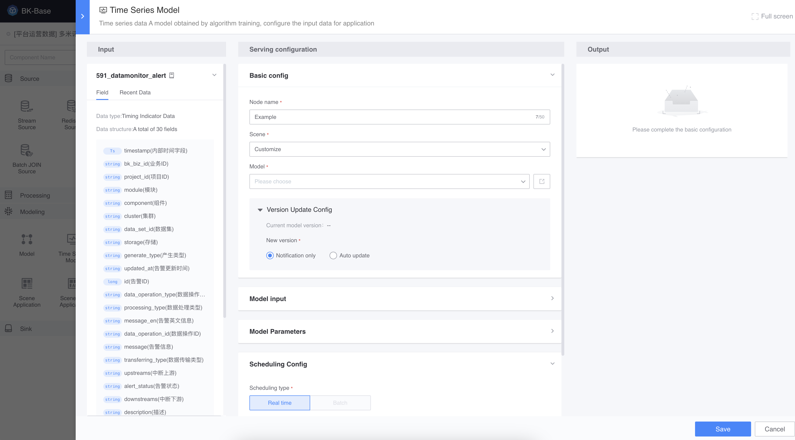
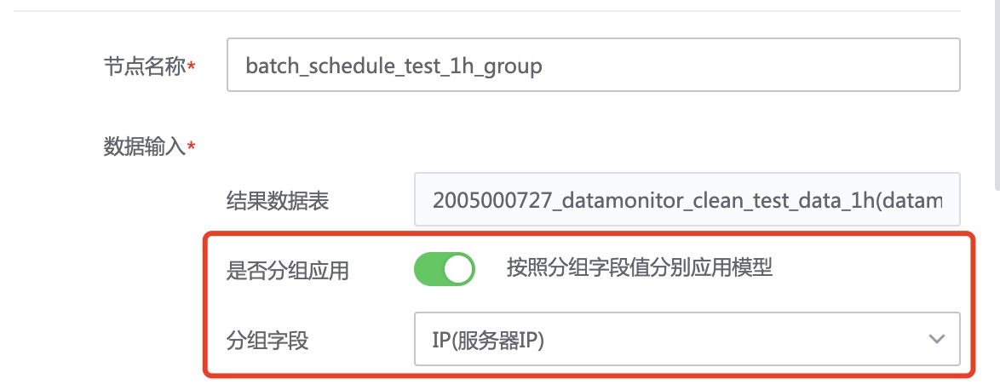

# Model application
Model application uses the published `online version` model as the `time series model application` node in the data development task to provide model prediction services.

The request input of this model application method is the result table. If you want the BlueKing application to directly use the API to request model services, please use [Model API Application](./api_serving.md)

## Add data source
In [Data Development Task](../../dataflow/ide/concepts.md), add a data source for the time series model application node, supporting [real-time data source](csource/stream-source.md), [offline data source](../../dataflow/components/source/batch-source.md).

## Add timing model application node
Next, add the `Time Series Model Application` node, connect the data source to the node, double-click the node, and select [Released Model](../release.md).
> Optional model range: The models and application permissions under this project are public. If not, you can apply for model application permissions by project (./apply_permission.md).

Next, complete the field mapping for data entry. Model input fields are automatically mapped if they are consistent with the data source.

Fill in the name of the output result table and save the node.

Connect a [data storage](../../dataflow/components/storage/tspider.md) after the model application node, and then start the data development task to complete the model application.

## Feature introduction
### Scheduling mode
The scheduling mode of the model application node depends on the type of connected data source.
- [Real-time data source](../../dataflow/components/source/stream-source.md): The model application node will be scheduled with `real-time calculation (no window)`.
- [Offline data source](../../dataflow/components/source/batch-source.md): The model application node will be scheduled with `offline calculation (fixed window)`.

### Update notification: When there is a new model version, you will be notified by email

If `Update Notification` is turned on for a model application, the model user will be notified by email when there are available updates to the model.

### Automatic update: When there is a new model version, automatically apply the latest model

If the model application turns on `Automatic update`, when a new model version is available, the latest version of the model will be automatically applied.

The update time defaults to `immediate update`, of course it can also be `delayed to a specified time` before applying the latest model.

### Group application: apply models separately according to group field values

#### Group training model group application
There is not one model behind the model that turns on [Partition Training](../experiment/partition_model.md), but a model is trained for each curve.

For the grouped model, open `Group Application` when applying, select the grouping field (the grouping field name is consistent with the grouping field name of the sample set used to train the grouping model) to complete the grouping model application.

After grouping application is enabled, each curve in the data source will match the corresponding grouping model through `result table name - grouping field name` when the model is applied.

> Note: For the result table of a new application (not participating in training), after turning on the `Feedback data: automatically add application data to the sample set` feature, the corresponding grouping model will be generated after continuous training, and predictions will be provided later. Serve;

For example, a business has a result table that contains the CPU usage of 100 servers, and the grouping field is the server IP. When the model is applied, each curve (the CPU usage of each IP in this result table) will find the same name. model.

#### Ungrouped training model group application
If [Group training] (../experiment/partition_model.md) is not enabled during model training, and the data source has a grouping field (such as server IP) when applying the model, grouping application can also be enabled.

For example, the data source is the CPU usage of 100 servers, and the grouping field is the server IP. When the model is applied, each curve (that is, the CPU usage of each IP) will be separately (that is, not affecting each other) as Data input for the same model.

### Feedback data: automatically add application data to the sample set
If the model application turns on `feedback data`, the data input by the model application will be automatically added to the sample set for training the model.

