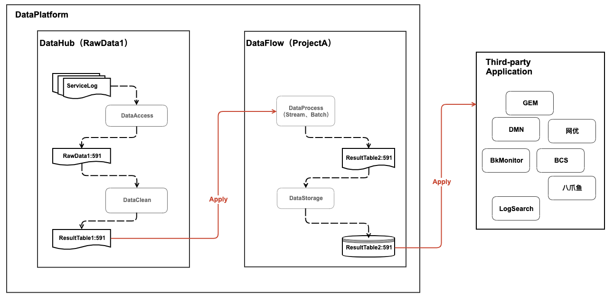
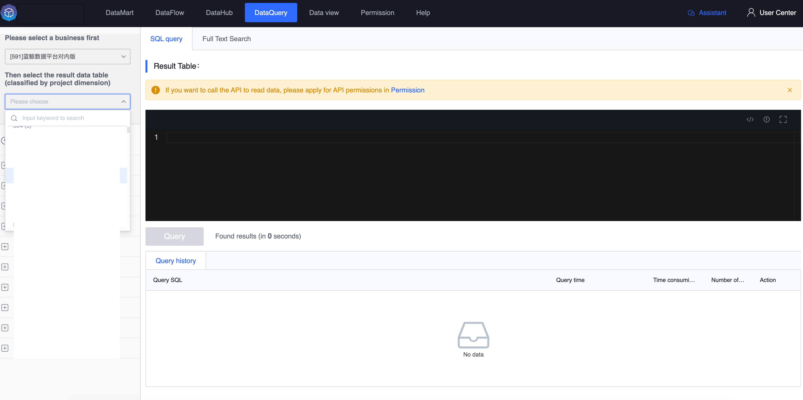
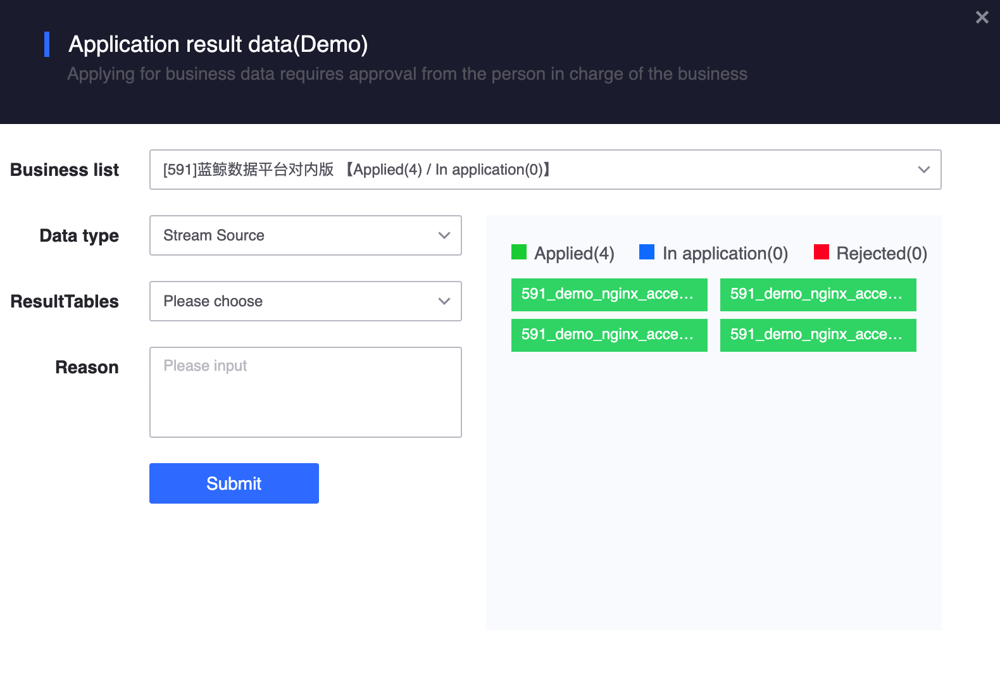

## How to use platform data

> Please choose the appropriate way to use platform data

The result data supports query and secondary calculation.

- The result data stored in "Data Integration" and "Data Development" supports query by users and third-party applications.
- Result data can be recalculated in the project. **When using result data not within the project, you need to apply for authorization from the perspective of the project. Once the application is successful, all members of the project can recalculate the applied data. deal with**

## User query data

In the "Data Mart", you can query the basic information and content of the data, as well as blood relationships. If you do not have permission, you will be prompted to apply for permission.

In "Data Query", if there is no expected result data table in the list, it means that you do not have the query permission for the result data table. Please follow [My Permissions] (./permission) on "How to View the Results for which You Have Permissions" Data" chapter guide to confirm or apply for the corresponding permissions.

## Data development and creation project, why can’t I see the data in the project?

**After the project is initialized, there will be no result data available for secondary calculation. Project members need to apply for the corresponding result data. **After the project applies for the result data, project members can view the data content within the project and perform secondary calculations on the data content to generate new result data.

On the "My Projects" page, click the small icon as shown in the figure to apply for the result data in the platform.

Click "Apply for Business Data" in the "Data Development" data source node to apply for the result data in the platform.

The application page will display the permissioned result data within the project. When applying, you can apply separately according to real-time, offline, related and other dimensions. The right side will display the result data in different states, including applied, applying and rejected. Click to query the specific document details.

**If the person of the bill of lading and the approver are the same, the document will be automatically issued. Under normal circumstances, business operation and maintenance will issue the order immediately after the bill of lading. **

## Third-party application query data

Go to [Authorization Management](./token.md), specify the result data table and application name, and generate an authorization code. The third party carries the APP account information and authorization code to call the platform interface for data query. **The authorization code will expand the scope of use of the data, please apply and approve carefully**

## Third-party application subscription data

Go to [Authorization Management](./token.md), specify the result data table and application name, and generate an authorization code. Third parties need to use the Kafka SDK provided by the platform to pass the APP account information and authorization code for data subscription. For more information, please refer to the [Data Subscription](../datahub/subscription/concepts.md) document guidelines.