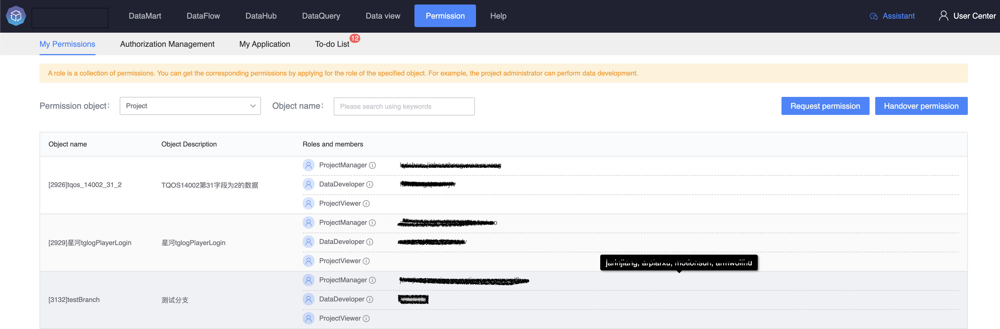
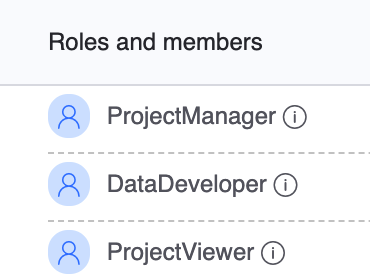
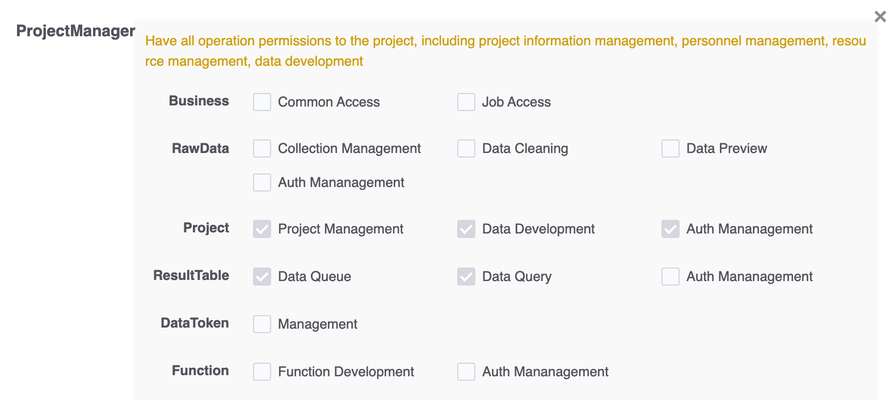
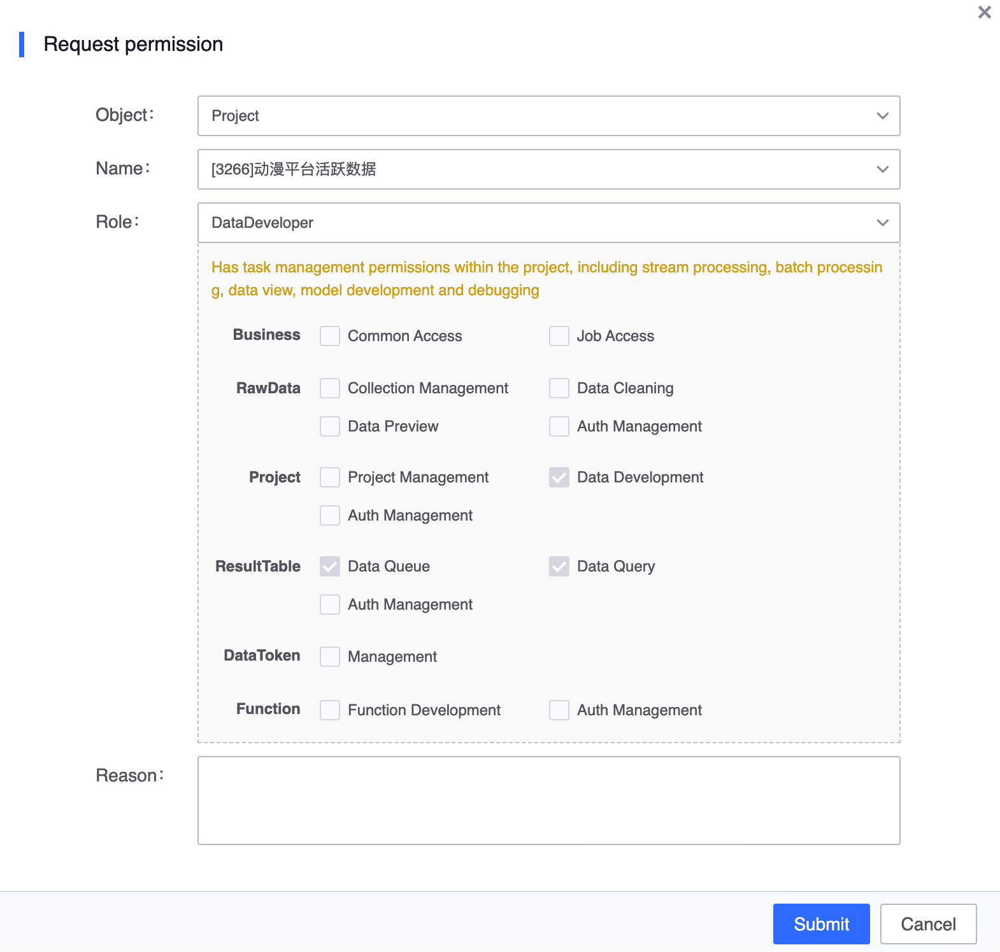
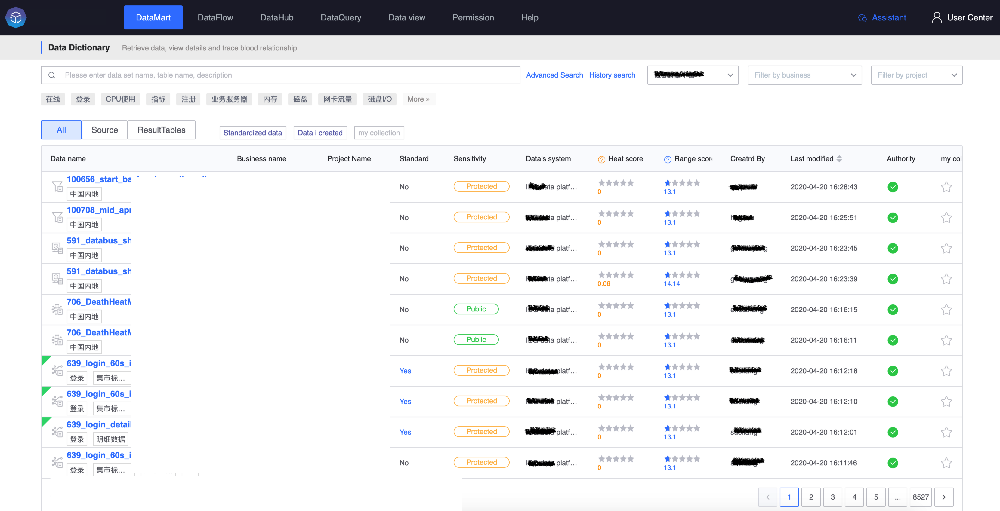
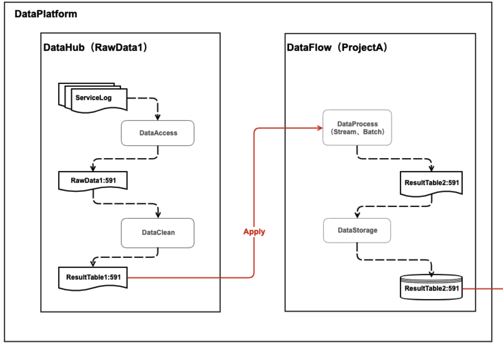
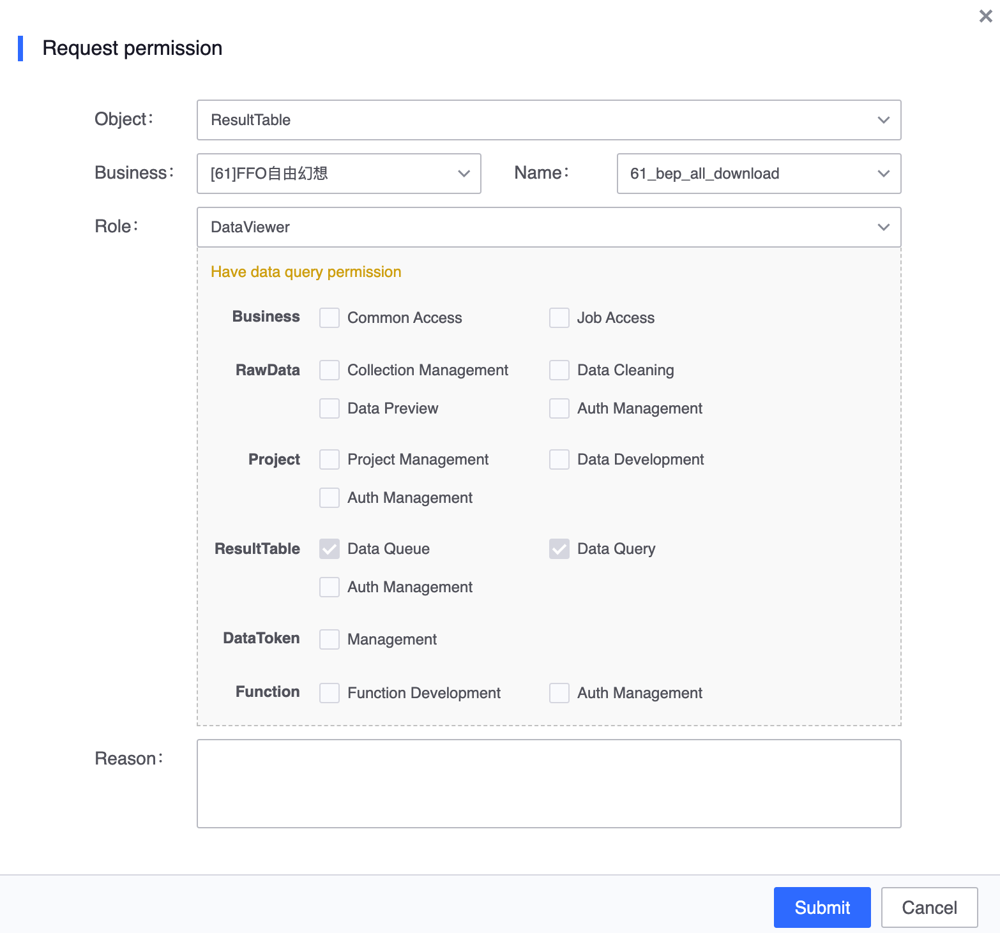
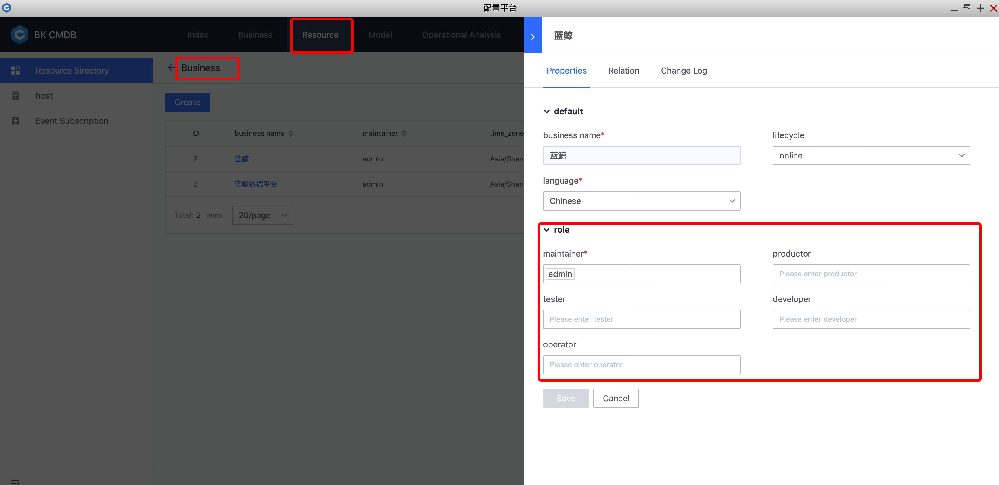

# My permissions

> View all my permissions on the platform

The platform strictly follows RBAC to authorize roles for platform users. If you need permissions, please add or apply for the corresponding role members. The platform divides roles according to operation objects. For example, project administrators and data developers are placed under "Project", and other role members related to the same object are displayed at the same time, making it easier for administrators to edit and update members.

The objects in the list below are the list of objects that the current user has permissions for, indicating that the current user has permissions for projects 2926, 2929, and 3132, and lists the list of project-related members.

## Check the specific permissions of the role

Click the small label next to the role to view the function permissions corresponding to the role.

As shown in the figure, the platform divides functions according to operation objects, and then defines the permission relationship between roles and functions. For example, the project administrator has permissions for "Project Management", "Data Development", and "Approval Authorization" under the project, and also has permissions for "Data Query" and "Data Subscription" for the result data under the project.

**Here is a brief introduction to the functions involved**

- "Project Management" includes the addition, deletion, modification and review of projects, as well as all operations under the project
- "Data Development" includes operations such as adding, deleting, modifying and checking computing tasks, debugging start and stop, etc.
- "Approval Authorization" includes the table update operation of project members and the third party's approval of project resource application documents
- "Data Query" can query the result data generated and applied for by the project through BKSql
- "Data Subscription" is a special function. It has no interface function and can only be operated through third-party tools. At the same time, you need to apply for an authorization code.

## How to apply for permission

Click the "Apply Permissions" button to apply for the corresponding role permissions.

**Take data developer application as an example to demonstrate the application process**

1. Enter "My Permissions" and click "Apply Permissions"
2. Select permission object
3. Select specific objects
4. Select the role to apply for. When selecting the role, the corresponding permission relationship table will appear for user reference.
5. Fill in the reasons for the application as the basis for the approver’s judgment.
6. If the submission is successful, you will be redirected to "My Application" to view the approval progress. The document type is "Application for Role"

## How to view the result data that you have permission to

Go to the data mart to query the result data list, and support filtering conditions of various dimensions. The permission field column will indicate whether the current user has permission to the result table, and it also supports quick application for permission.

### Default project members can query project data

Project data includes the result data table applied for by the project and the result data table generated by the calculation tasks under the project. For example, members of project A can query (ResultTable1, ResultTable2).

### Data administrators can query data

The data administrator has data query authority and is responsible for the approval of data authorization (the business leader also participates in the approval). The data manager is configured during data access, and the result data generated from the original data will inherit the data manager list of the original data.

### Data observers can query data

If general users only query data and do not perform data processing or involve large-scale data authorization, they can apply for permissions on a single result table in the most detailed manner and add or apply directly on the "My Permissions" page.

## How to apply for business data access permissions

The user's use of the platform starts with data access. When performing data access, business data access permissions are required, and the platform administrator needs to configure it. [Click to view the configuration method] (./system.md)

## How to apply for business data approval authority

Platform data belongs to the business, and the business leader has the approval authority. The business leader cannot apply directly on the platform for the time being. Please configure it on the configuration platform. The platform will periodically synchronize role members from [BlueKing Configuration Platform](../../../../Configuration Platform/Product White Paper/Product Functions/BusinessManagement.md). Currently, only operation and maintenance personnel are synchronized, and the synchronization delay is the largest. is 1 minute.

### Approval issues for data applications

**For the security of business data, all data authorizations are strictly applied in accordance with the most detailed requirements**, that is, authorization is performed in units of the result table. Data authorization will expand the scope of data use and requires the approval of the data administrator or business leader.