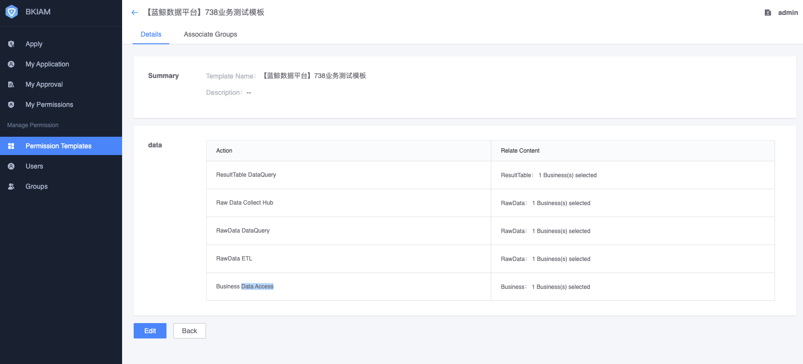
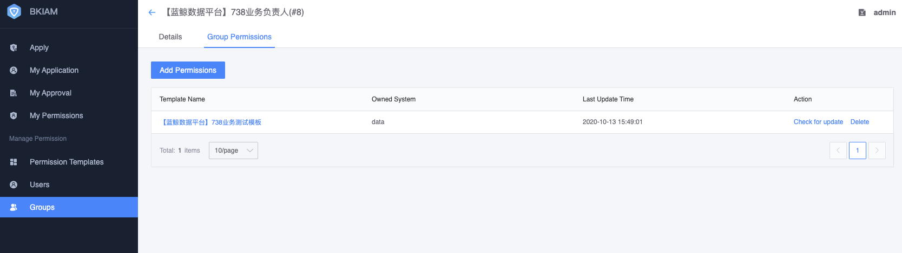

# Permission policy configuration

Currently, the BlueKing Permission Center uniformly configures permission policies for products within the BlueKing system. While retaining its own role policies, the platform also supports platform administrators to configure additional permission policies in the BlueKing Permission Center through user groups. *For the time being, Users are not supported to "Application for Custom Permissions"* in the BlueKing Permission Center.

Before the platform is open for use, the platform administrator needs to initialize the permission policy in the BlueKing Permission Center.

## Business permission configuration

Currently, the platform recommends using business dimensions for permission control. Then authorize based on business scope.

Create a permission template in the BlueKing Permission Center. It is recommended to name it with a business name, add permissions such as business data access, data source collection management, data source cleaning configuration management, data source data query, and result data query, and associate it with the corresponding business. In general, it is recommended to combine business data access and query to make it easier for users to use.

Create a user group in the BlueKing Permission Center. It is recommended to name it with a business name and bind it to the business permission template created above. Administrators can proactively add business-related personnel (business operation and maintenance) to this user group.

## How do ordinary users obtain permission to access business data?

1. Contact the platform administrator to add the user to the corresponding business user group
2. The user applies to join the user group on the "Permission Application" page of the BlueKing Permission Center and selects the corresponding user group.