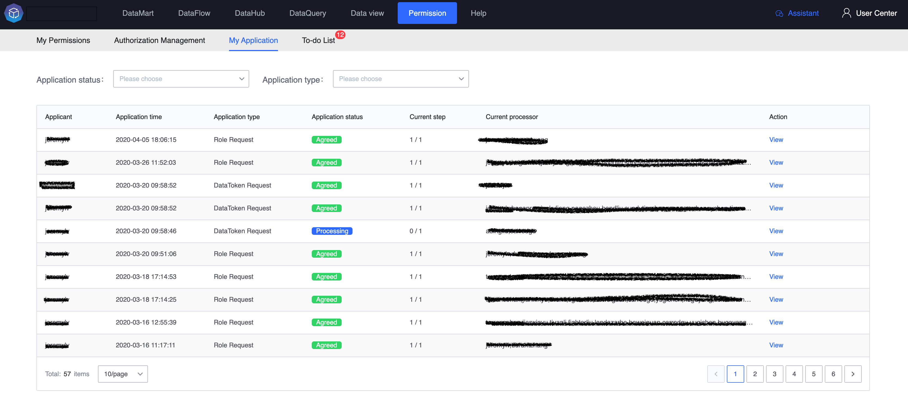
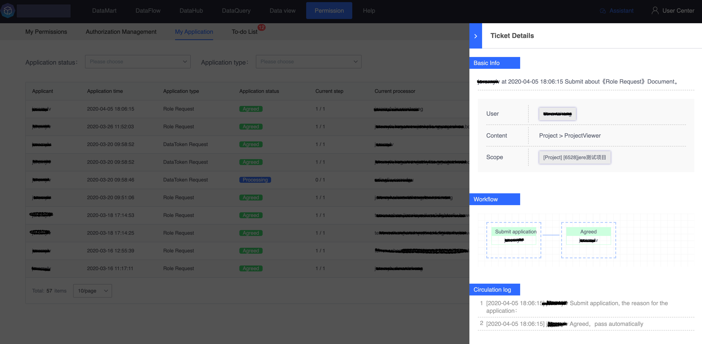
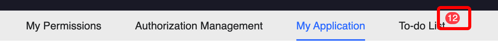

# Document Center

## My application

My application list displays a list of all documents for which the currently logged-in user is an applicant. Quick filtering can be performed based on application status (processing, approved, rejected), and quick filtering based on application type is also provided.

Click [View] during the operation to view the document details. The picture below shows a simple document details. In [Document Details], you can view the summary of the current document application. The approver in the picture coincides with the applicant of the document. In order to save users Own the bill of lading - approve this pointless and cumbersome process yourself, so the document goes through automatically.

## To-do items

My to-do list displays a list of all documents for which the currently logged in user is the approver.

In permission management, the number of documents that require your approval will be displayed in the upper right corner of the to-do item in the form of a subscript number. When you see a number, please process it in time to avoid making the applicant wait too long.

After clicking to enter the to-do list, the system will help you filter the documents whose application status is "Processing" by default so that you can process the documents quickly. Of course, you can also adjust the query conditions to quickly filter out the documents you expect to see. Historical documents.

For each document being processed, you can perform three operations: view, agree, and reject.

* View: View the details of the document, which are consistent with the document details in [My Application], as shown below, and will not be repeated here.
* Agree: Please confirm that the content of the document submitted by the applicant is correct before agreeing to the document. After agreeing and completing the steps, the applicant can use the corresponding permissions and the document will also be marked as "Agreed"

* Rejection: As long as any approver thinks that there is a problem with the application document, he can reject it. After rejection, the approval process will be terminated and the document will be marked as "rejected". The approver needs to give a reasonable reason for rejection.