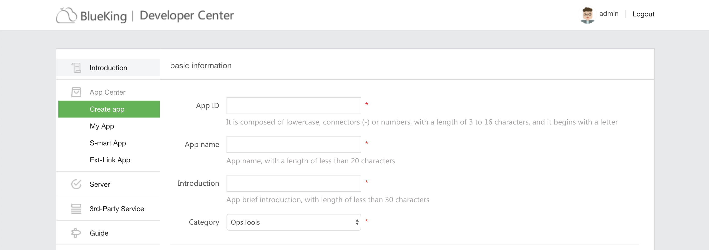
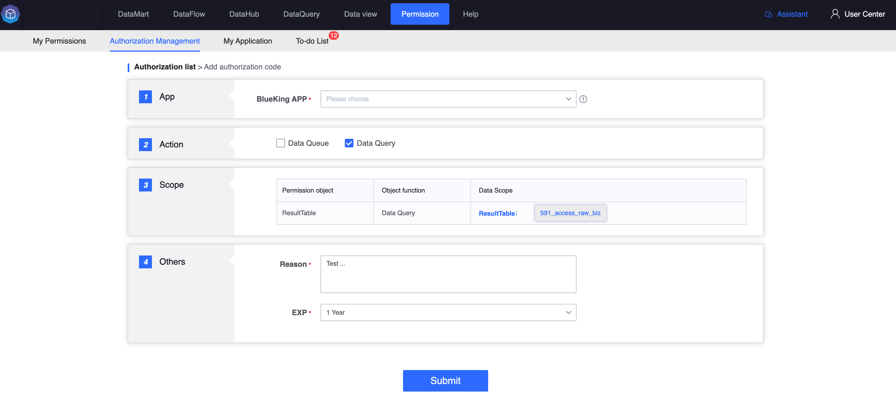
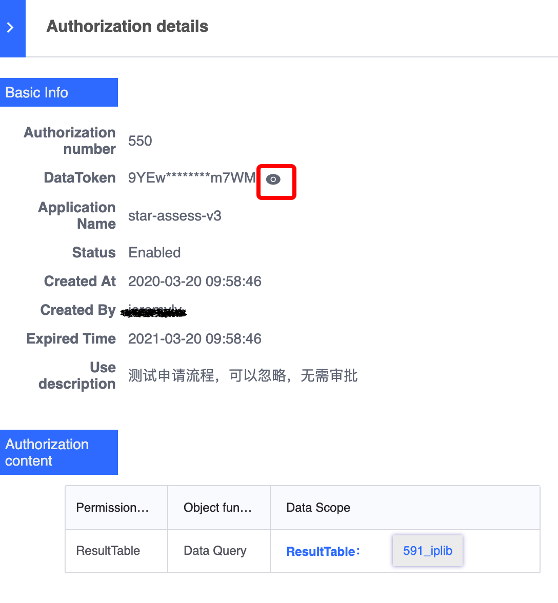

# Authorization management

Authorization code is an important credential for building platform API requests. Data can be queried using the platform API. For the security of objects and data, please keep the authorization code properly and replace it regularly.


## Generate authorization code query result data
### Prerequisite: Create a BlueKing application

1. Create a BlueKing application
For credentials used to access the data query interface, please go to [BlueKing Developer Center](../../../../PaaS平台/产品白皮书/产品功能/开发者服务/DevServicesBaseEE.md) to create a new Applications.

   


### Add authorization code




1. Select the BlueKing application. In the unified development environment of BlueKing, accessing the interfaces exposed by the platform requires the access credentials of the BlueKing application.

2. Select function permissions and select "Data Query"

3. Select the data range. Here you need to specify the access range and select the result table to be queried. Multiple selection is supported.

4. Indicate the reason for the application and the expiration time. Expired authorization codes can be applied for renewal. After successful submission, you can view it on the list page of authorization management. Click on the details to authorize the content (** Please note that if the authorized content does not have the result table you just applied for, then It has not been approved yet, please go to the "My Application" page to check**)

### Call API to read data

1. To view the complete authorization code, click on the authorization code details, and then click on the small eye to view the complete authorization code



2. Enter parameter description

| Parameter name | Parameter type | Required | Parameter description |
| ------------ | ------------ | ------ | ---------------- |
| bkdata_authentication_method | string | Yes | Platform authentication method, indicate token |
| bkdata_data_token | string | Yes | Authorization code generated by the platform |
| bk_app_code | string | Yes | BlueKing application code |
| bk_app_secret | string | Yes | BlueKing application private key |
| sql | string | yes | query SQL |
| prefer_storage | string | no | Optional query engine, such as es |

3. API call examples

```python
# Install the Python Requests library:
# `pip install requests`

import requests
import json


def send_request():
     # Request Duplicate (2)
     # POST http://<BK_PAAS_HOST>/api/c/compapi/data/v3/dataquery/query/

     try:
         response = requests.post(
             url="http://<BK_PAAS_HOST>/api/c/compapi/data/v3/dataquery/query/",
             headers={
                 "Content-Type": "application/json; charset=utf-8",
             },
             data=json.dumps({
                 "bkdata_authentication_method": "token",
                 "bkdata_data_token":"your_data_token",
                 "bk_app_code": "your_app_code",
                 "bk_app_secret": "your_app_secret",
                 "sql": "select dteventtimestamp as ts,count from 477_ja_set_login where thedate=20160920 AND cc_set='4005' AND biz_id='477' limit 1",
                 "prefer_storage": ""
             })
         )
         print('Response HTTP Status Code: {status_code}'.format(
             status_code=response.status_code))
         print('Response HTTP Response Body: {content}'.format(
             content=response.content))
     except requests.exceptions.RequestException:
         print('HTTP Request failed')
```


## Generate authorization code subscription result data

For the basic application process, please refer to "Generating Authorization Code Query Result Data". After successful application, it is recommended to use the SDK provided by the platform for data subscription. For specific usage guidelines, please refer to [Data Subscription](../datahub/subscription/concepts.md).

###
