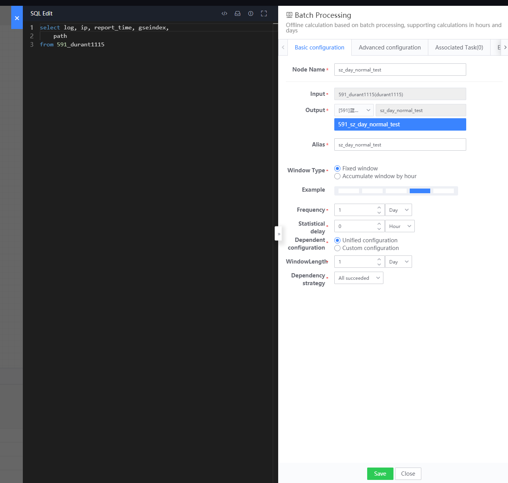
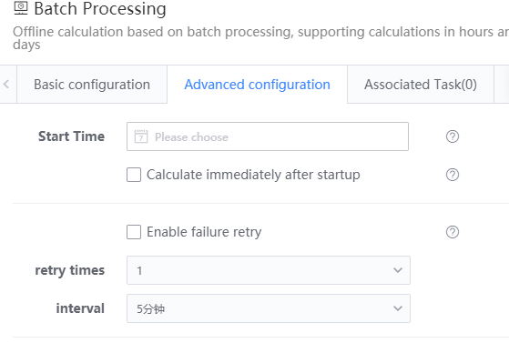
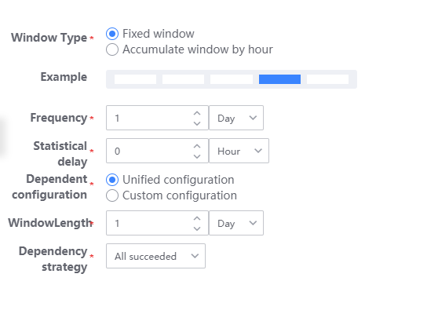
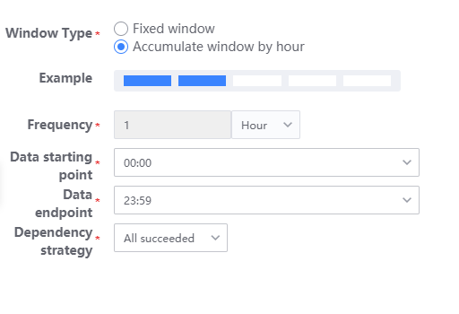
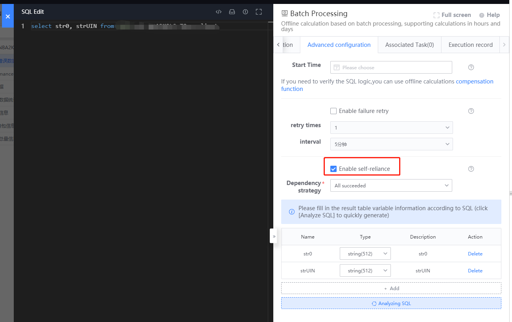

## User Guide

### Parent node types that support connections

* Offline calculation
* Real-time calculation
* Real-time data source
*Offline data source
* HDFS

### Supported child node types for connections

* Offline calculation
* HDFS
* Elasticsearch
* Druid
* Tspider
*Queue
* Hermes
* Tredis
*TSDB

### How to configure offline computing

#### Basic configuration



Node name: Give the current offline computing node a Chinese name and roughly describe the calculation content. The Chinese name will be displayed on DataFlow;

Data input: Displays the table name output by the parent node. The current node uses the table name as the from object and calculates it through SQL;

Data output: The calculation output result data requires a table name. After successful saving, the system will automatically generate a result table (offline result table), and use the business id + table name to generate a unique identification result table id, such as: 120\_v4\_battle\ _total, once the table name is successfully saved, it cannot be modified, and the corresponding result table id will be used as the basis for data query;

Data Chinese name: displays the Chinese name of the calculation output table;

Window type: The platform currently supports two types, fixed window and hourly cumulative window. Please refer to the specific window type configuration options (Point 4 Window Type)

#### Advanced configuration



Start time: the start time of offline computing task scheduling (the start time should be greater than the current time)

Calculate immediately after startup: When selected, after the offline computing task is started, the computing task at the next scheduled time will be executed immediately.

Scheduling failure retry: When selected, the task will be retried if it fails.

Number of retries: the number of recalculations after the offline calculation task fails.

Retry interval: The interval between retries after a task fails

### Window type

#### Fixed window (periodic scheduling, loading fixed-length data each time)

Statistics frequency: how often it is executed, the unit can be "hours" or "days"

Delay time: whether the task needs to be delayed and waited, the unit is fixed in "hours"

Window length: The length of the loaded data, the unit can be "hours" or "days" (for the configuration of the parent table)

for example

```plain
A (real time) -> B (offline)

set up
     Statistics frequency = 1 hour
     Delay time = 1 hour
     Window length = 1 hour

The calculation task is executed every hour, for example, at 3:00, and the data in the range of node A (1:00 ~ 2:00) is calculated.
```

Custom configuration: When the node data comes from multiple computing (real-time, offline) nodes, custom configuration can be started. The main difference is the window length and window delay of the parent table.



Window delay: Note that the window delay here is different from the delay time mentioned above. It refers to the delay of data and the time for the window to move forward (for the configuration of the parent table)

for example

```plain
A (real time) -> C (offline)
            ^
            |
            B (real time)

set up
     Statistics frequency = 1 day, delay time = 1 hour
     A node: window length=1 day, window delay=2 days
     Node B: window length=1 day, window delay=6 days

The calculation task is executed once every day, for example, it is executed at 01:00 on the 18th. The data in the interval of node A (15th) and the data in the interval of node B (11th) are calculated.
```

Dependency strategy:

All tasks are executed successfully: all upstream tasks are executed successfully, and this task can be executed.

All tasks are executed successfully, but the data is incomplete: The upstream task is executed successfully or there is no data, and this task can be executed.

The task execution is successful at least once: The upstream task execution is successful at least once, and this task can be executed.

#### Accumulate windows by hour (periodic scheduling, loading data from the starting point of the window to the end of the window each time)



Statistics frequency: Statistics are fixed once every hour and cannot be changed.

Delay time: whether the task needs to be delayed and waited, the unit is fixed in "hours"

Data starting point: the starting point of the accumulation window, minimum 00:00, maximum 23:00

Data end point: the end point of the accumulation window, minimum 00:59, maximum 23:59

for example

```plain
A (real time) -> B (offline)

set up
     Delay time = 1 hour
     Data starting point=00:00
     Data end point=06:59

The calculation task is executed once every hour. At 02:00, the data in the range of node A (00:00 ~ 00:59) is calculated. Each accumulation window calculates 7 pieces of data.
A node (00:00 ~ 00:59)
A node (01:00 ~ 01:59)
A node (02:00 ~ 02:59)
A node (03:00 ~ 03:59)
A node (04:00 ~ 04:59)
A node (05:00 ~ 05:59)
A node (06:00 ~ 06:59)
```

#### Offline calculation of self-dependence

The offline computing self-dependence function means that the current node not only uses the upstream node as the data source, but also uses the output data of the current node in the previous period as input to calculate the data of the next period.



Enable self-dependence: Activate self-dependence functionality.

Analyze SQL: Click Analyze SQL to generate the fields generated by the current SQL. Users need to specify the field types themselves.

For example (591_current_table is the current node, 591_input_table is the data source):
```
select ip_v6, ip, gseindex, path, time, ts, ip_r
from 591_input_table
union all
select ip_v6, ip, gseindex, path, time, ts, ip_r
from 591_current_table
limit 100000
```
The above SQL means merging the output data of the previous period of the current node 591_current_table and the input data source 591_input_table, and taking the first 100000 data

Note: Since the self-dependent node relies on the data of the current node in the previous cycle, it requires data in each cycle. Once the data is interrupted, subsequent calculations will not be possible.

### Computing usage scenarios

3.1 Multi-level offline calculation

3.2 Real-time multi-source JOIN calculation

3.3 Offline multi-source JOIN calculation

3.4 Real-time offline multi-source JOIN calculation

### BKSQL calculation syntax

For BKSQL calculation syntax, please refer to the link [BKSQL offline calculation syntax](../bksql-function/batch-processing.md)