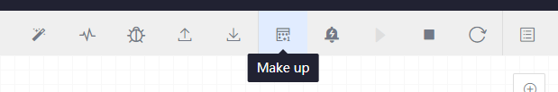
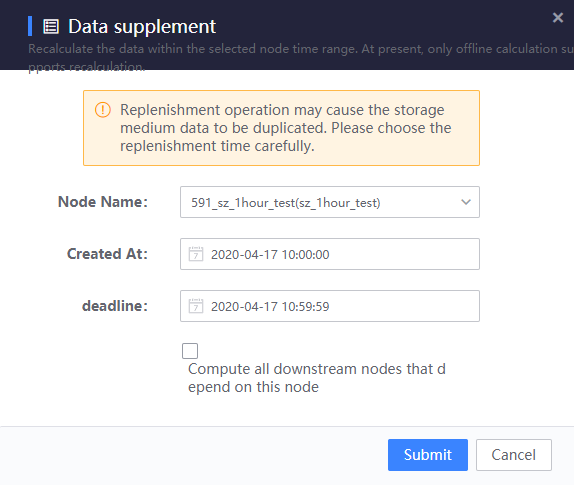
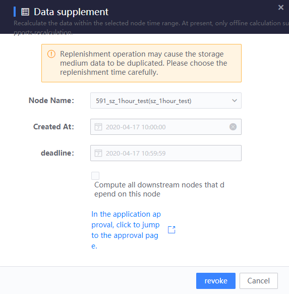
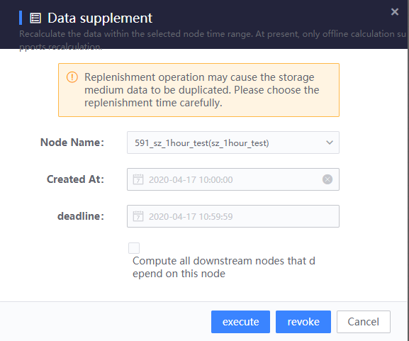
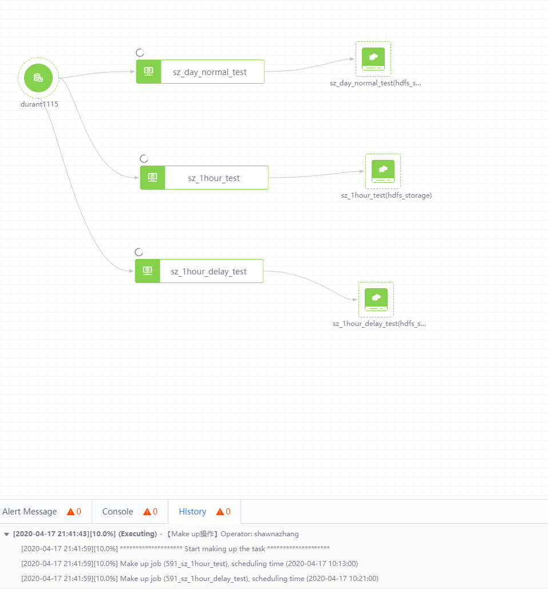

## About supplementary calculation

### How to perform additional calculations

* Click the compensation function on the canvas workbench

     

* Configure computation tasks

     

     Node name: The offline computing node that needs to be compensated in the current task. Multiple nodes can be selected at the same time.

     Start time: the scheduled start time of the computation task

     Deadline: the scheduling deadline of the computation task

     Compute all downstream nodes that depend on this node: When selected, the calculation tasks that depend on the data within the selected time of this node will be compensated together.

* Submit and wait for administrator approval.

     

* After approval, click Execute to start the recalculation task

     

* After the task is executed, you can check the progress of this supplementary calculation in the upper right corner of the page. You can also check the results of the task running in the running information.

     

### Notes on additional calculations

* Only the past time can be selected for computation time

* If the task of compensating the time is running, the computation task cannot be submitted. Please wait for the task to be executed before trying to submit again.

* If the task of the node on which the computation depends does not exist, the execution of the computation task will be skipped

* If the task of computation has been executed before and succeeded, it will cause data duplication. Please choose the computation time carefully.

* If "Compensate all downstream nodes that depend on this node" is checked, the selected compensation time range will only take effect on the current node. The downstream node's compensation time range will be based on the selected time range of the current node and the time range between nodes. Automatic calculation of data dependencies