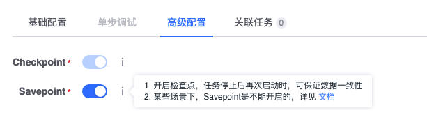

# Flink Streaming Code function introduction
In order to satisfy users' complex business logic data processing, we have added the Code function based on the currently popular computing engine framework in the industry. This article mainly introduces the use of the Flink Streaming Code function.

## manual
- Flink Streaming Code node input currently supports multiple real-time data sources and real-time computing nodes, and can be configured with a result table output.
- Since Flink Streaming is a real-time calculation, first drag a real-time data source, and then drag the Flink Streaming Code node to connect it behind the data source.

   

- Double-click the code node to enter the configuration page, select a familiar programming language, and write data processing code. It supports passing parameters into the code, and the parameters are separated by spaces.

   
    
- Configure data output. Configure the output table name, Chinese name, and output field information in order. One field needs to be specified in the field as the data time field (event time), and it must be a 13-digit timestamp. If not specified, The current time is used as the data time.

   
  
- The advanced configuration includes two parameters: Checkpoint and Savepoint. Checkpoint is enabled by default and is used for automatic recovery of task failures. Savepoint is optional and is used to ensure data consistency when the task is stopped and started again. However, some scenarios cannot be used. For details, see: https://ci.apache.org/projects/flink/flink-docs-release-1.10/ops/state/savepoints.html

   

## Development instructions
In order to allow users to focus on data logic development, the platform encapsulates the functions of data input and data output, and users only need to implement data logic in the code. The code function supports development language <font color="#dd0000">**Java 8 or above**</font>

### Java Development Notes

##### Built-in functions

To facilitate users to use Flink functions, we provide several built-in functions defined in the base class `FlinkBasicRuntime`:

```java
/**
    * Get the index of the field in the dataStream data table based on the field name, dtEventTimeStamp, localTime, dtEventTime can be used
    * @param dataStream
    * @param fieldName
    * @return
    */
   public int getFieldIndexByName(DataStream<Row> dataStream, String fieldName)
```

```java
/**
    * Get the Flink StreamExecutionEnvironment running environment object
    * @return
    */
   public StreamExecutionEnvironment getEnv()
```

```java
/**
    * Get the Flink StreamTableEnvironment running environment object
    * @return
    */
   public StreamTableEnvironment getTableEnv()
```

#### Sample code

- The data processing code template is to select the ip field and parameters of one of the data sources and then splice them together to output. The data processing class CodeTransform inherits the FlinkBasicRuntime class to implement. The example is as follows:

```java
import com.tencent.blueking.dataflow.common.api.FlinkBasicTransform;
import org.apache.flink.streaming.api.datastream.DataStream;
import org.apache.flink.types.Row;
import java.util.HashMap;
import java.util.Map;
import org.apache.flink.api.common.functions.MapFunction;
import org.apache.flink.api.common.typeinfo.BasicTypeInfo;
import org.apache.flink.api.common.typeinfo.TypeInformation;
import org.apache.flink.api.java.typeutils.RowTypeInfo;

/**
  * Please note the following points in case the developed Code node is unavailable
  * 1.jdk version is 1.8
  * 2.Flink version is 1.10.1
  * 2. Please do not modify the data processing class name CodeTransform
  */
public class CodeTransform extends FlinkBasicTransform {

     /**
      * Data processing, an example is to select all fields of a data and output
      *
      * @param input Map to store the data source, key is the data source table name id, value is the data structure of Flink streaming corresponding to the data source DataStream<Row>
      * @return Returns the Map that stores the result data. The key is the output table name, and the value is the data structure DataStream<Row> corresponding to the output table. The output fields must be the same as the node output configuration.
      */
     @Override
     public Map<String, DataStream<Row>> transform(Map<String, DataStream<Row>> input) {
        
         // data input
         DataStream<Row> inputDataStream0 = input.get("591_f1658_s_01");
        
         // data processing
         //Output table field name configuration
         String[] fieldNames = new String[] {
             "ip"
         };
        
         // Output table field type configuration
         TypeInformation<?>[] rowType = new TypeInformation<?>[]{
             BasicTypeInfo.STRING_TYPE_INFO
         };
        
         // Get the index of the data source field
         int index0 = this.getFieldIndexByName(inputDataStream0, "ip");
        
         //Assign all fields of the first data source to the output table
         DataStream<Row> newOutput = inputDataStream1.map(new MapFunction<Row, Row>() {
             @Override
             public Row map(Row row) {
                 Row ret = new Row(1);
                 // Splice the ip field value with the first parameter and the second parameter; args.get(0) directly obtains the first parameter, and the parameter types obtained are all String by default
                 ret.setField(0, row.getField(index0) + " " + args.get(0) + " " + args.get(1));
                 return ret;
             }
         }).returns(new RowTypeInfo(rowType, fieldNames));
        
         // data output
         Map<String, DataStream<Row>> output = new HashMap<>();
         output.put("591_demo1", newOutput);
         return output;
     }
}

```

#### Sample configuration

In the example, the task is configured with two parameters. The first parameter is obtained by args.get(0), and the second parameter is obtained by args.get(1). The parameter types are all String. The parameter configuration is as follows:


The input table 591_f1658_s_01 has a field ip, and the output table 591_demo1 also has a field ip. The configuration is as follows:


#### Sample code, configuration display diagram


## Precautions
- The Flink version used by Flink streaming is 1.10.1
- The data input and data output information in the code must be consistent with the input and output information in the basic configuration of the code node
- The current development language version is Java 8