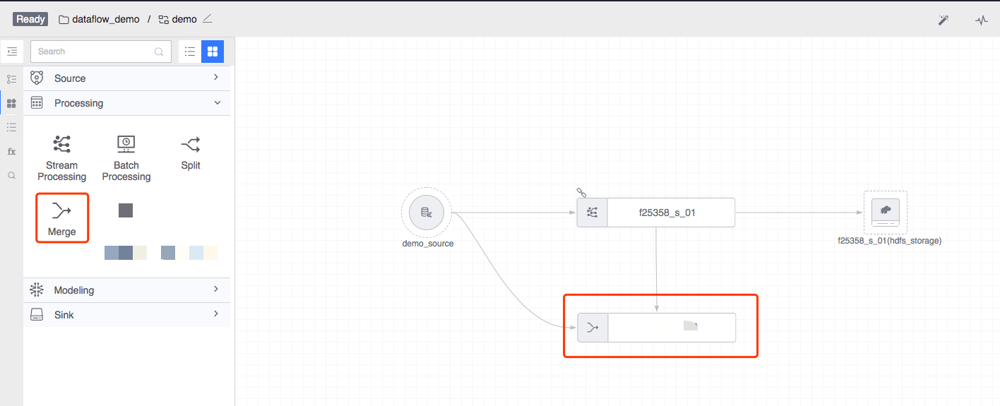
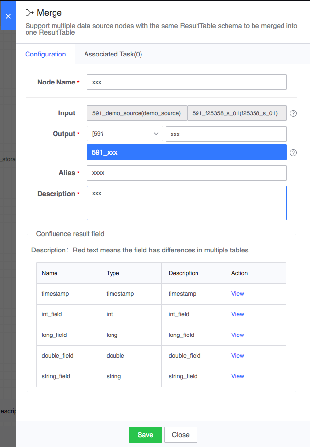

# Confluence calculation
Supports merging multiple data source nodes with the same table structure into one result data table.

Legend, confluence calculation

#### Node configuration
The confluence calculation node should be configured with multiple input data tables through connections, and the table name should be defined for the current data result table. The configuration example is as follows:

#### Types of downstream nodes that can be connected
Data development for all data storage nodes