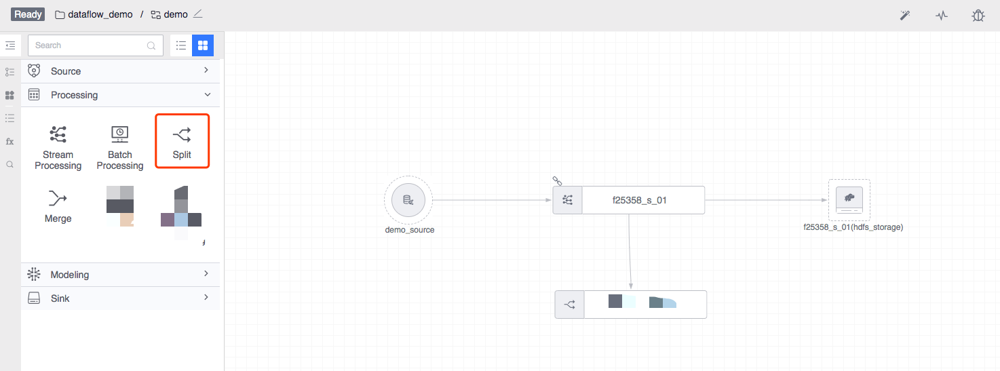
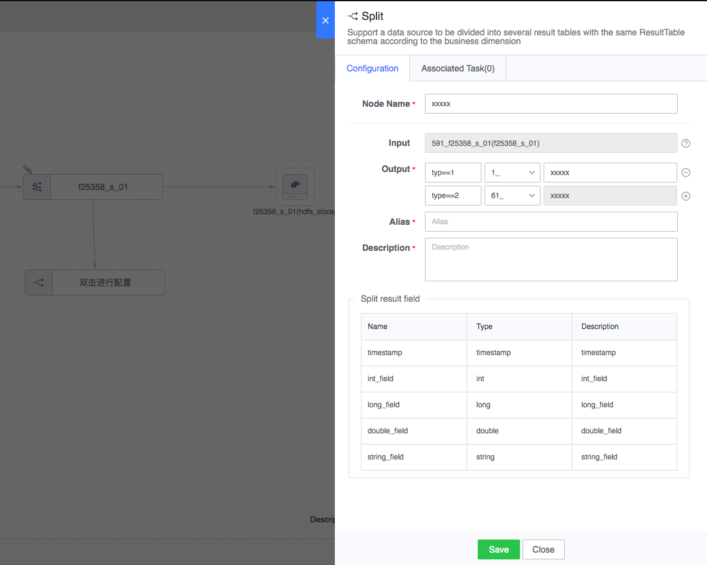
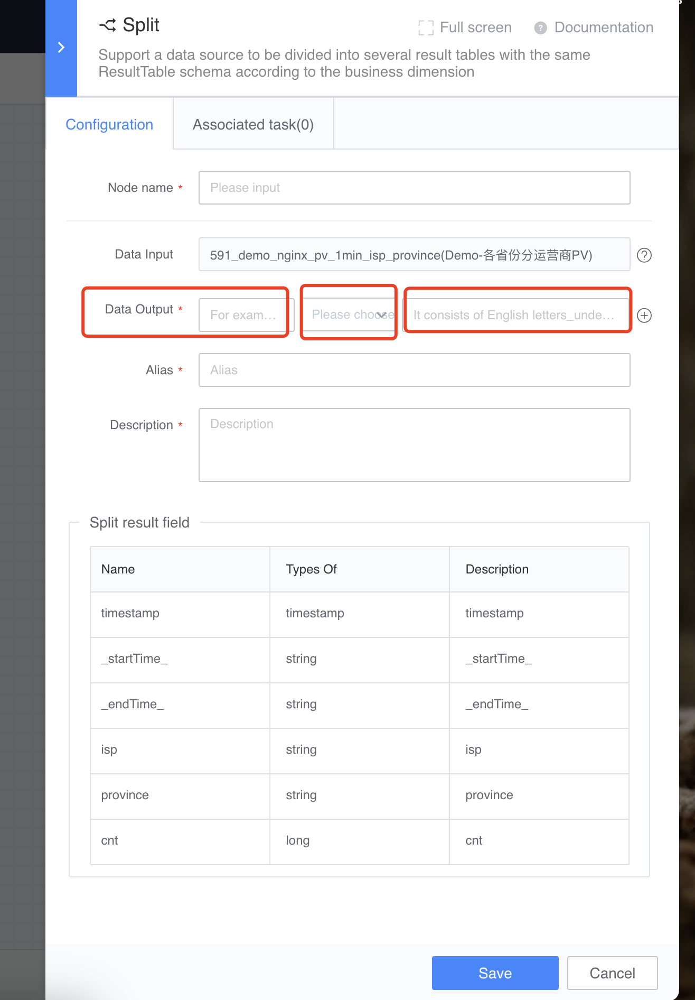

# Offload calculation
Supports splitting a data source into several result data tables with the same data structure based on business dimensions.

Legend, split calculation

#### Node configuration
Offload calculation usually consists of a real-time result data (real-time data source or real-time calculation), which is output to different business result tables with the same table name by configuring different segmentation logic. The configuration example is as follows:

Data output rules support relational operators in the Aviator expression engine, such as:

     method=="GET"
     nums=='100'
     true

Where `method` and `nums` are fields in the upstream table.

#### Types of downstream nodes that can be connected
Connecting to downstream nodes is not currently supported.