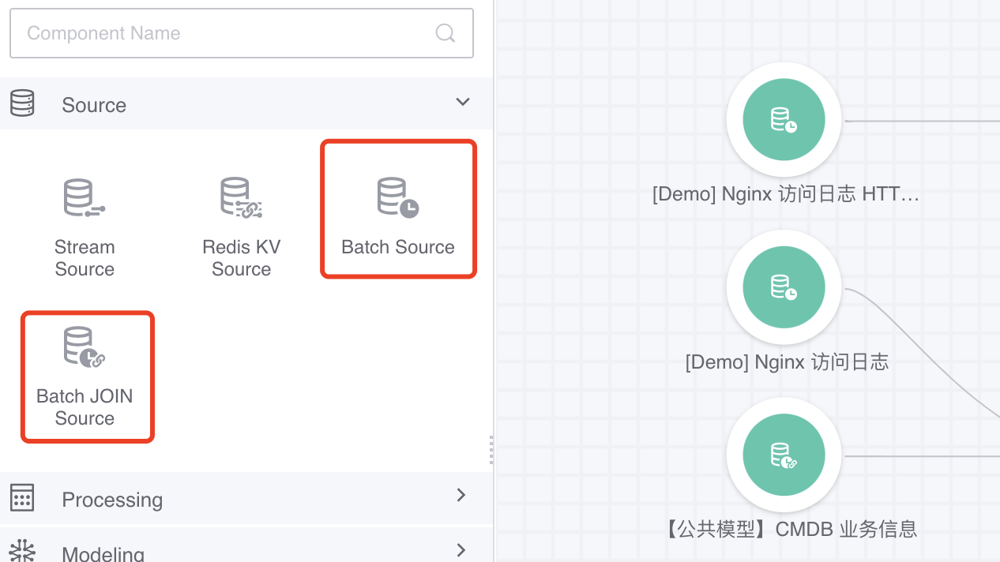
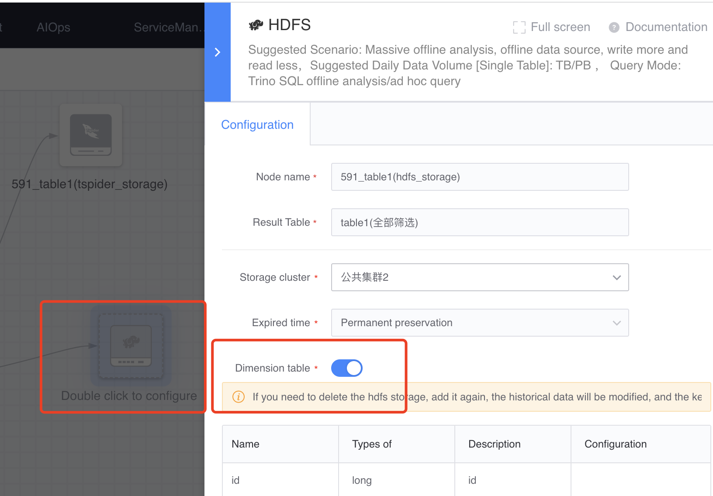
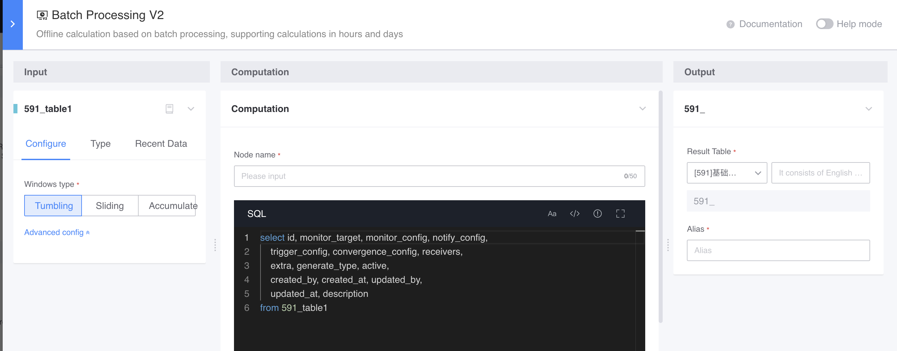

# Offline dimension table

The result table with the "offline dimension table" feature turned on when warehousing into HDFS can be used for associated calculations (such as LEFT JOIN) in offline calculations, where the data window of the offline dimension table is all data.

Scenario: Associate the business ID in the NGINX access log with the CMDB business information table every day to expand the business name.

### Source of offline dimension table
The result table of turning on the "offline dimension table" feature when storing into HDFS

### How to use

- Correlate calculations between offline dimension tables and offline flow tables

- Offline dimension tables are directly connected to downstream offline calculations

#### Types of downstream nodes that can be connected
- Offline calculation