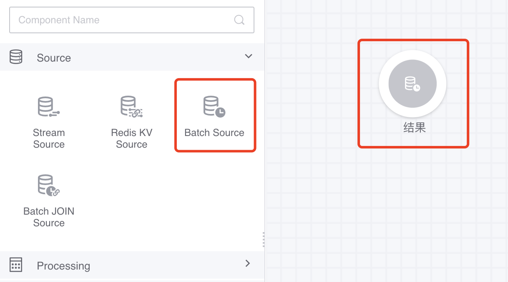
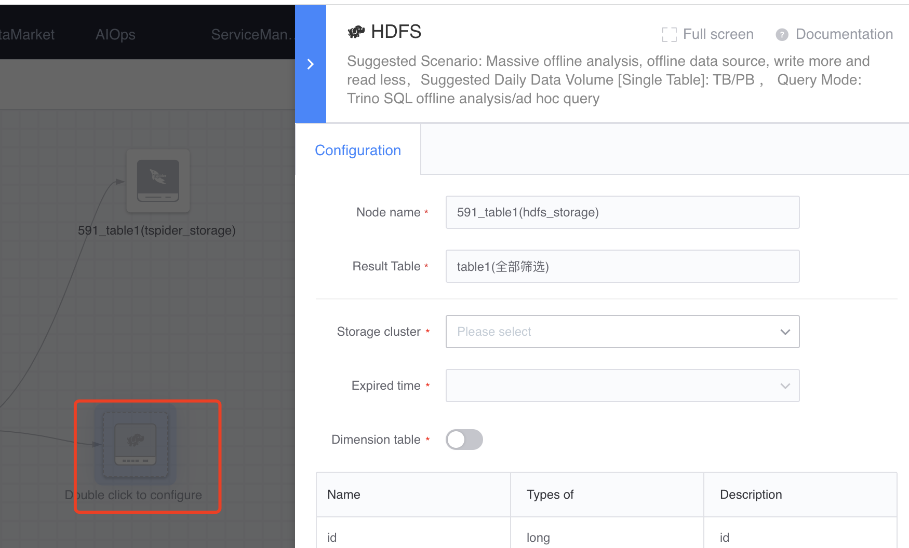
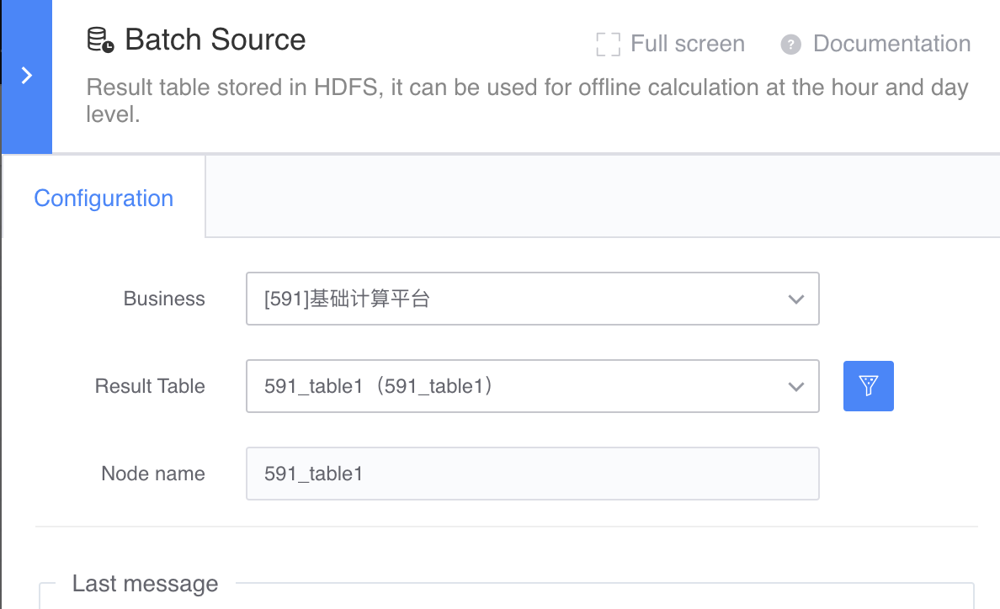
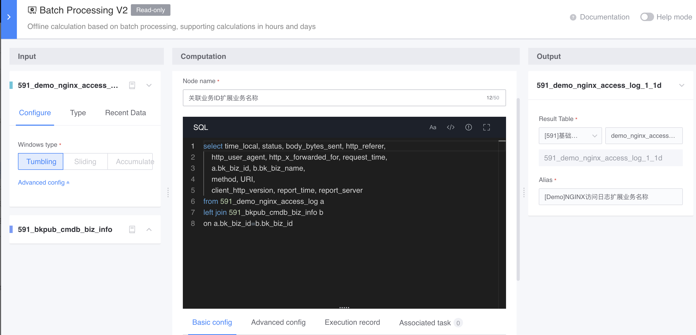

# Offline flow table

The result table stored in HDFS can be used for offline calculations at the hourly and daily levels.

Scenario: The data source is the distribution of return codes per minute, and it is expected to count the distribution of return codes every day.

The overall canvas effect is as follows:

#### Source of offline data
Results table stored in HDFS

#### How to use

- Select the corresponding offline flow meter.

- Reconfigure offline calculation

#### Types of downstream nodes that can be connected
- Offline calculation