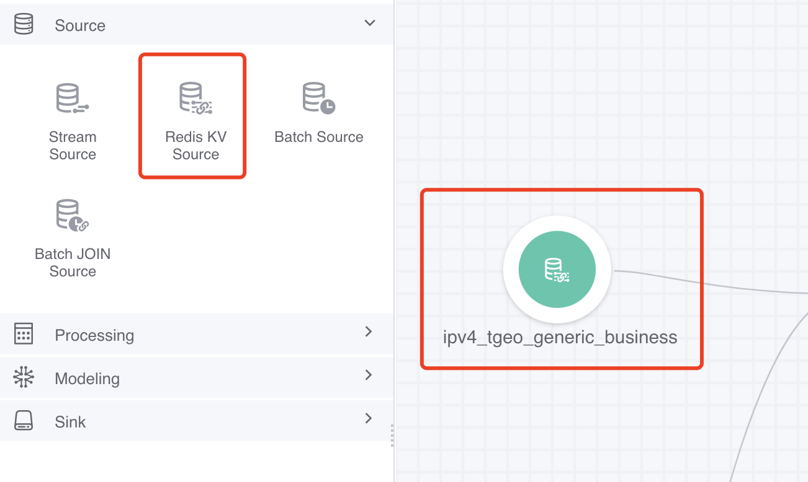
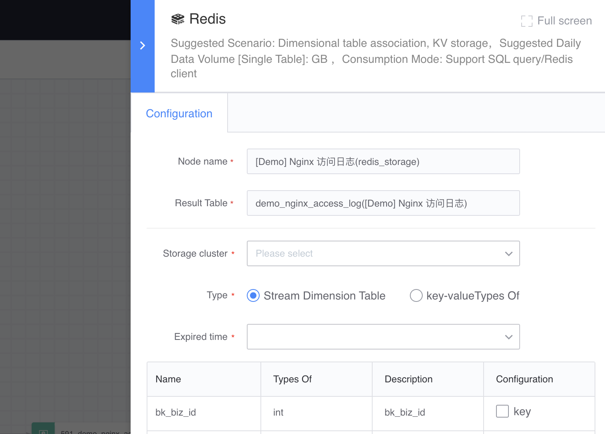
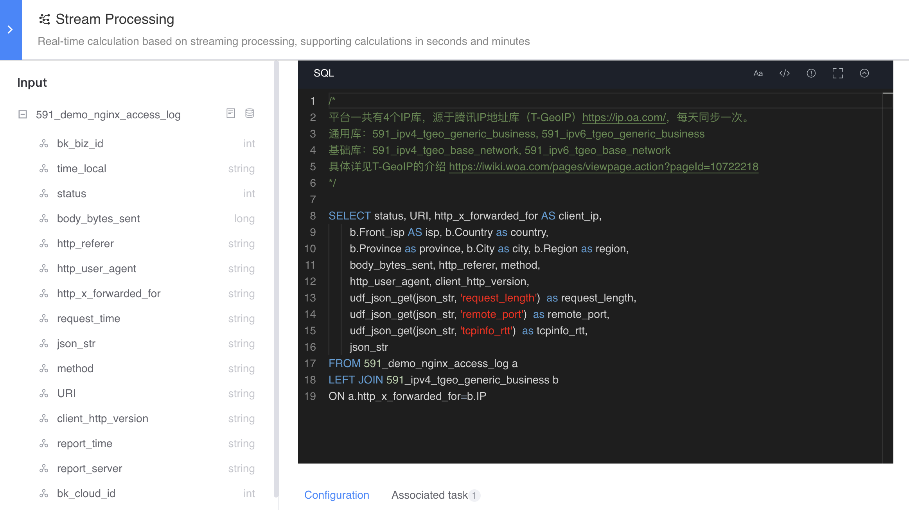

# Real-time dimension table

The result table with the "real-time dimension table" feature enabled when warehousing into Redis can be used for associated calculations (such as LEFT JOIN) in real-time calculations, where the data window of the real-time dimension table is all data.

#### Source of real-time dimension table
- Result table with "real-time dimension table" feature turned on when warehousing into Redis

- Public related data provided by the platform itself, such as: IP library, CMDB library

#### How to use
In the data development canvas, first select the real-time flow table, then select the required real-time dimension table node, and connect these two data sources to the real-time computing node. Rules for using real-time dimension tables:

- Real-time dimension tables need to be used in conjunction with real-time flow tables and real-time computing nodes
- A "real-time calculation" node can be associated with 1 or more "real-time dimension table" nodes

#### Types of downstream nodes that can be connected
- Real-time calculation