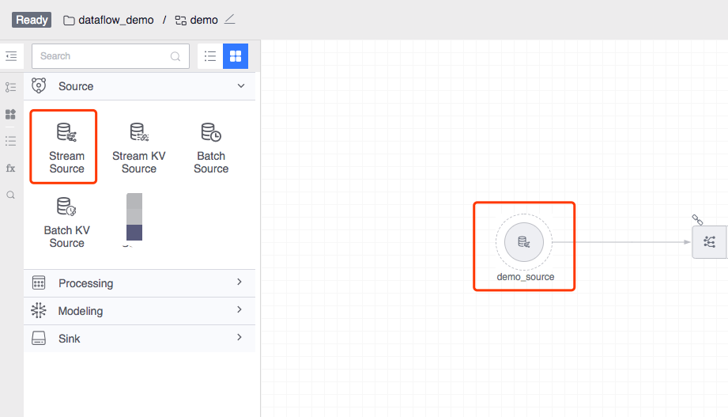
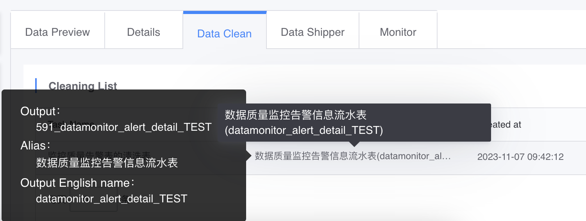
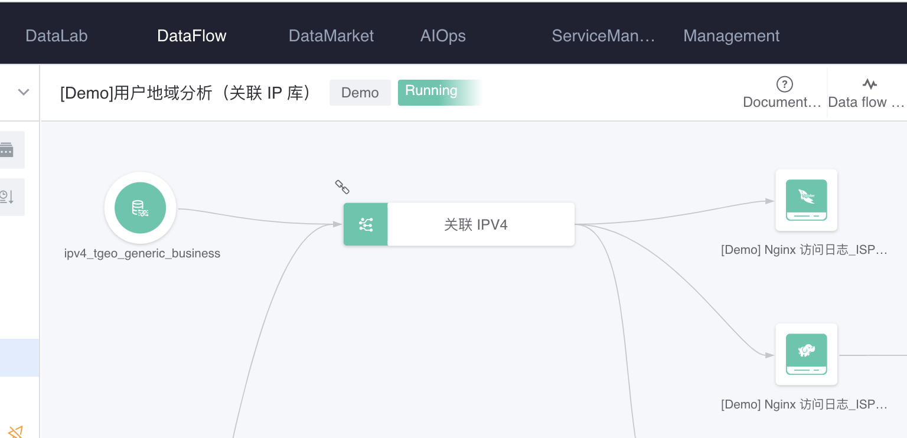
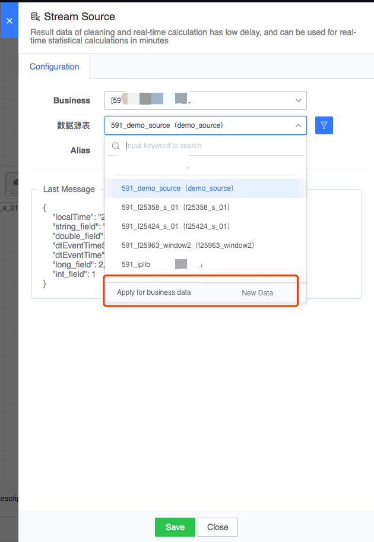

# Real-time flow meter

The result table generated by data cleaning or real-time calculation can be used for real-time calculation at the second or minute level.

#### Source of real-time flow meter
- Result table of data integration cleaning

- To calculate the result table generated in real time, the downstream must select a valid storage node

#### How to use
- Configure real-time flow meter nodes
   - Specify the business to which you belong
   - Select the real-time data table under the corresponding business to view the latest data on the interface
   - If there is no optional business or optional real-time data table, you can apply for business data or new access data sources

- Connect to real-time computing or other legal downstream nodes to calculate and process real-time data

#### Types of downstream nodes that can be connected
- Real-time calculation
- Most storage nodes (such as HDFS, etc.)