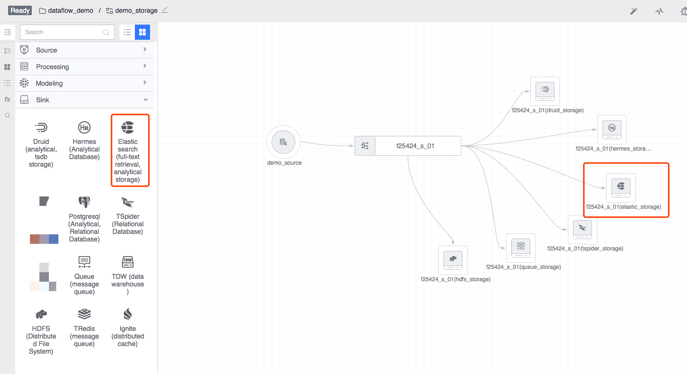
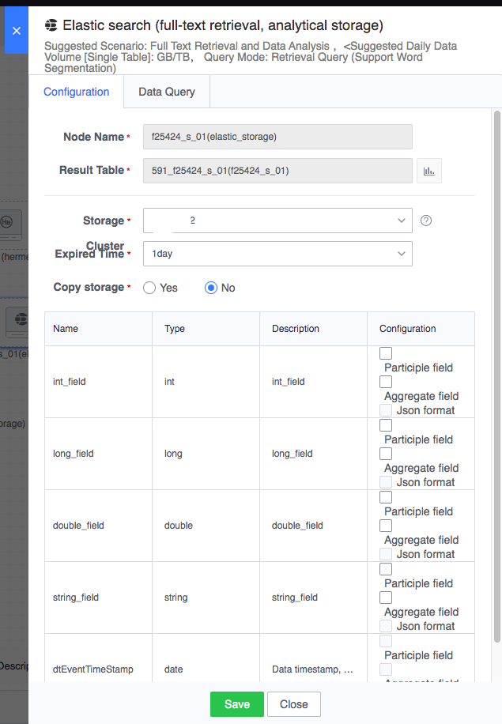
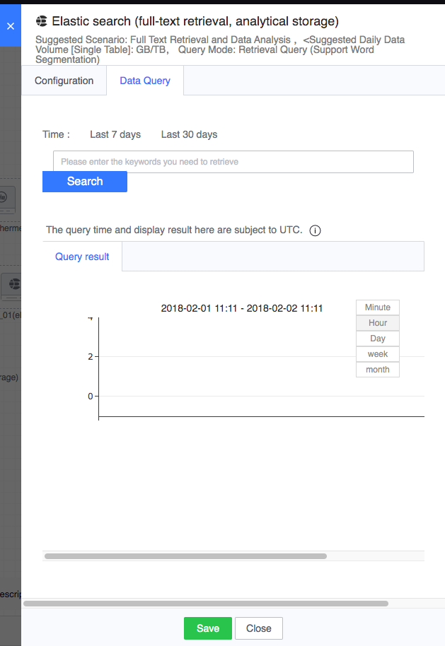

# Elasticsearch

The underlying layer of the Elasticsearch node is based on Elasticsearch and supports log storage, full-text retrieval and other functions.

Legend, Elasticsearch node

#### How to use
- Node name: automatically generated, consisting of the upstream result table and the current node type
- Result data table: inherited from the upstream node
- Storage cluster: Usually the default cluster group cluster is optional, and other optional clusters are related to the project to which the task belongs.
- Expiration time: the expiration time saved after the data is stored in the database
- Copy storage: whether the data is stored in a copy, the default is no

In addition, the Elasticsearch node can specify whether the field is a word segmentation field, an aggregation field, or a json format field based on the output of the upstream node result table.

Configuration example is as follows:

For running tasks, after double-clicking the node, you can query the data in Elasticsearch on the data query tab:
