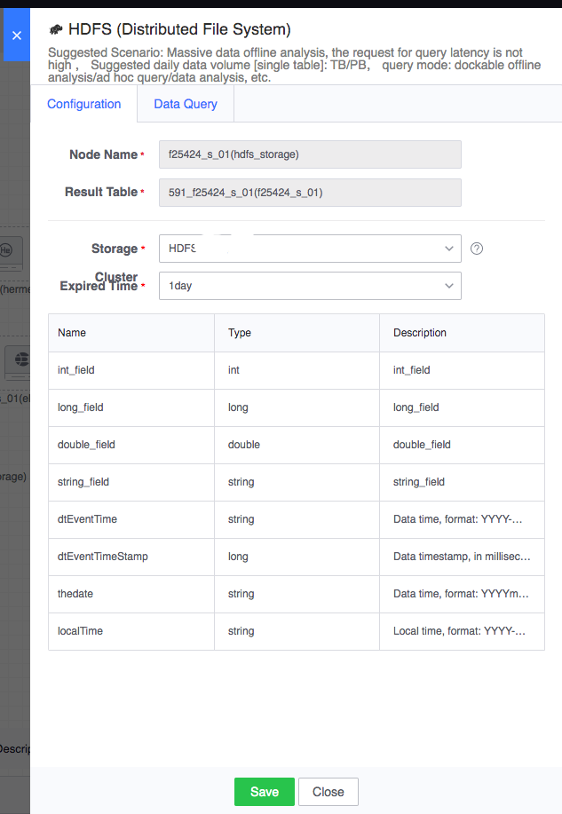
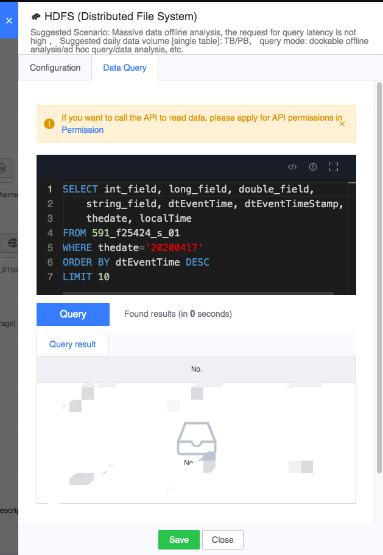

# HDFS

The data processing node can optionally add offline storage nodes to its downstream. If an HDFS storage node is selected, the result data of the calculation output will be stored on HDFS.

The delivery medium for offline calculation is HDFS. Therefore, other data processing types need to store the result data of the calculation output into HDFS. Only then can offline calculation take the data out of HDFS, perform periodic calculations and output the result data within the period.

Legend, HDFS node

#### Node configuration
- Node name: automatically generated, consisting of the upstream result table and the current node type
- Result data table: inherited from the upstream node
- Storage cluster: Usually the default cluster group cluster is optional, and other optional clusters are related to the project to which the task belongs.
- Expiration time: the expiration time saved after the data is stored in the database

Configuration example is as follows:

For running tasks, after double-clicking the node, you can query the data in HDFS on the data query tab:

