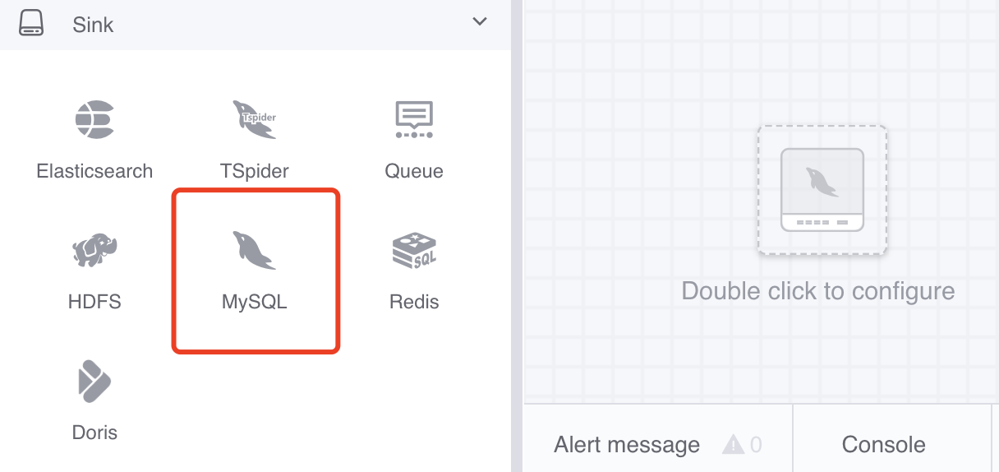
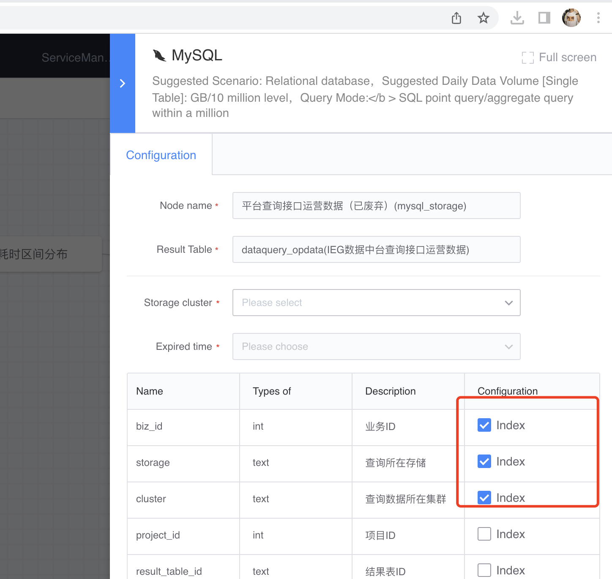
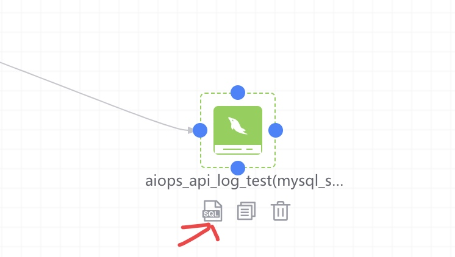
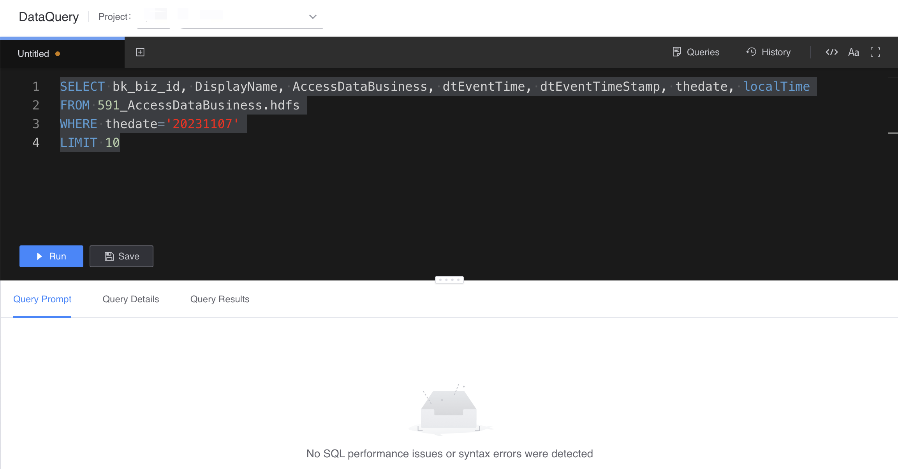

# MySQL
Legend, MySQL node

#### How to use
- Node name: automatically generated, consisting of the upstream result table and the current node type
- Result data table: inherited from the upstream node
- Storage cluster: Usually the default cluster group cluster is optional, and other optional clusters are related to the project to which the task belongs.
- Expiration time: the expiration time saved after the data is stored in the database

In addition, the MySQL node can specify whether the field is an index field or a unique key based on the output of the upstream node result table.

Configuration example is as follows:

For running tasks, hover the mouse over the storage node and click the SQL icon to query the data in MySQL:

