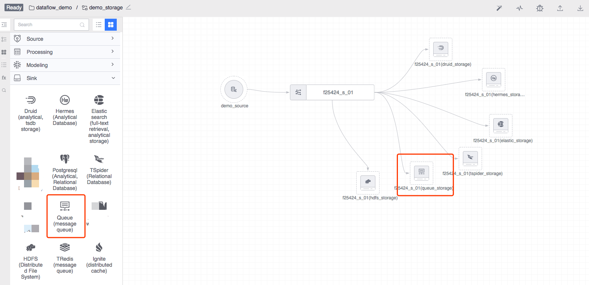
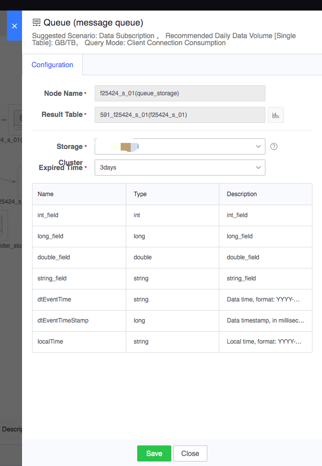

# Queue

The bottom layer of the Queue node is a message queue service based on Kafka, which supports real-time subscription to data.

Legend, Queue node

#### Node configuration
- Node name: automatically generated, consisting of the upstream result table and the current node type
- Result data table: inherited from the upstream node
- Storage cluster: Usually the default cluster group cluster is optional, and other optional clusters are related to the project to which the task belongs.
- Expiration time: the expiration time saved after the data is stored in the database

Configuration example is as follows:

