# Canvas workbench

The data development workbench creates an online IDE for developers. By dragging workflows in the canvas area, it provides data development functions for formatted result tables such as cleaning result tables and calculation result tables.

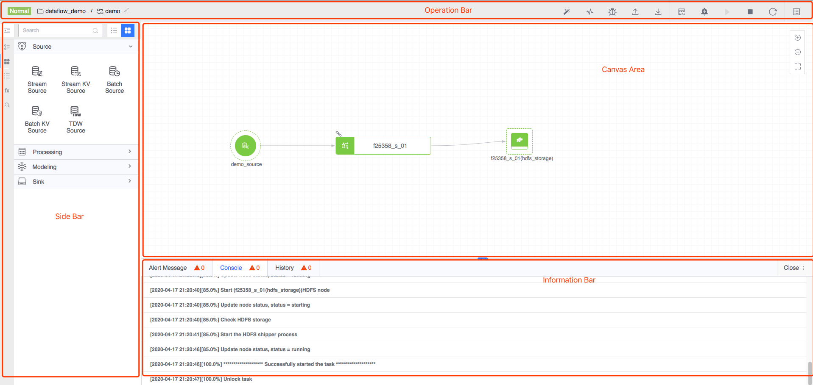

## Workbench Overview

#### Action bar

It collects all operations on tasks, mainly automatic layout, monitoring, debugging, start and stop, task details and novice introduction, etc.

#### Sidebar

- Project task list

     Contains a secondary list, you can select a specified project, view the task list under the current project, create tasks and view tasks. Among them, the task list is currently sorted by the latest modification time.

- Component library

     Contains nodes such as data sources, data processing, machine learning, and data storage, which can be dragged to the canvas to complete the task process.

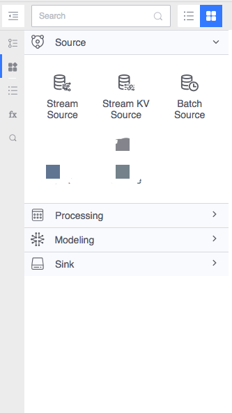

- node list

     The node list will display all nodes that have been dragged into the canvas.

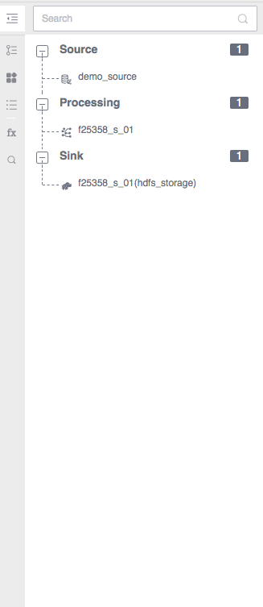

- Function library

     When you need to set up SQL for the computing node, you can refer to the introduction provided in the function library.

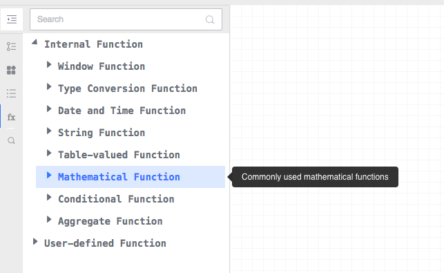

- search

   The result table generated by data development can be searched through this entrance and jumps are supported.

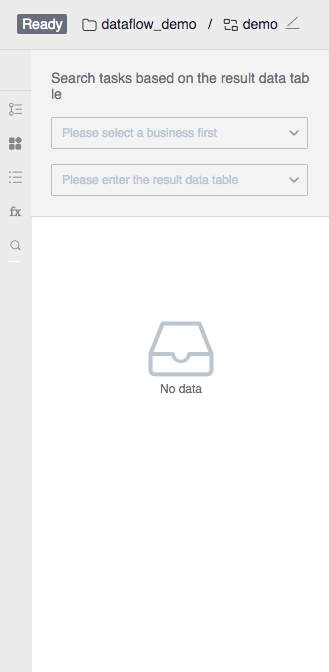

#### Information Bar

Relevant information will be displayed here when operating tasks.

- Alarm information

     Display all alarm information of the current task.

- Operational information

     Displays the running information of the current task deployment or debugging.

- Execution history

     Displays all deployment history information of the current task.

#### Canvas area

By dragging nodes in the component library to the canvas area and establishing connections between nodes, a directed acyclic data flow topology is formed. This topology associates data sources, data processing, and data storage into one data development task.

Nodes are connected in a directed manner through connection rules, expressing the relationship of data flows in tasks. Current data development provides the following node component types. For detailed node types, please refer to the introduction of the big data component library.

<table style="text-align: center;">
     <tr>
         <td>Node component type</td>
         <td>Function description</td>
    </tr>
    <tr>
         <td>Data source</td>
         <td>Configure result data as the source of data processing</td>
    </tr>
     <tr>
         <td>Data processing</td>
         <td>Provide data processing capabilities such as real-time computing and offline computing</td>
     </tr>
     <tr>
         <td>Machine Learning</td>
         <td>Provide machine learning capabilities</td>
     </tr>
     <tr>
         <td>Data Storage</td>
         <td>Configure the node to store data into the specified type of storage</td>
     </tr>
</table>

## Basic function usage

### Step 1. Create task

After selecting a specific project in the sidebar, click the Create Task button to create a new task.

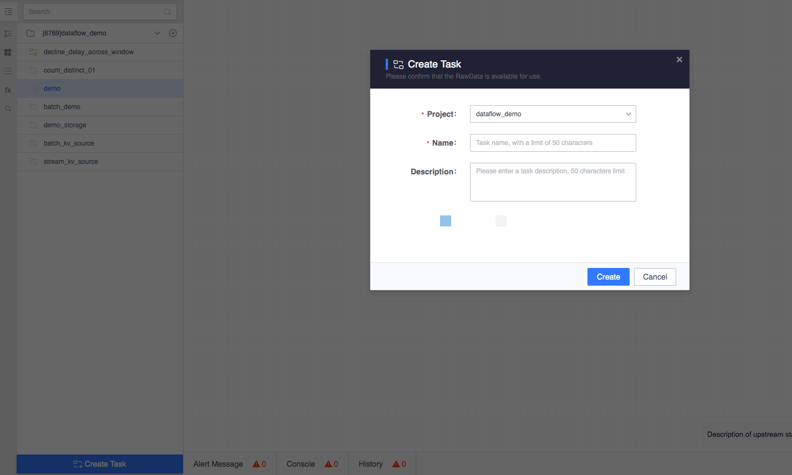

### Step 2. Create nodes and connections

Select nodes in the sidebar component library, such as data source nodes, and create real-time nodes, HDFS storage nodes, etc. according to the connection rules.

- Create real-time data source nodes

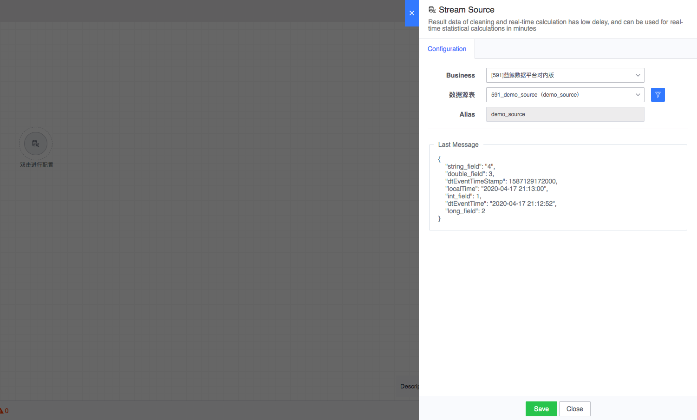

- Create real-time nodes

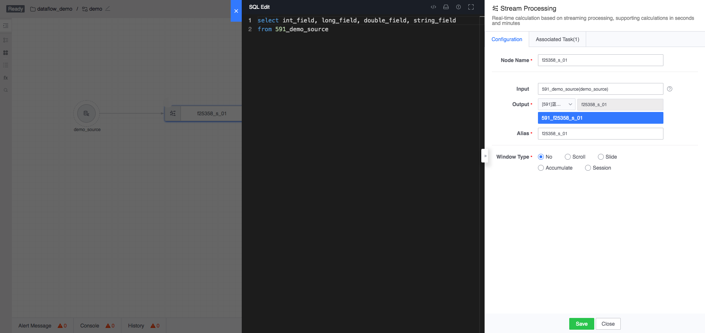

- Create HDFS storage node

   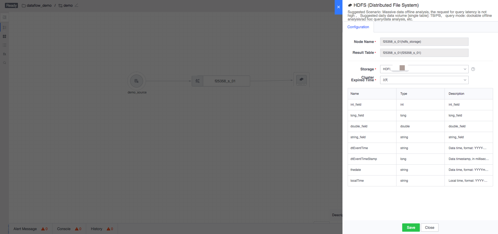

### Step 3. Start the task

Run the task by clicking the Start button on the action bar.

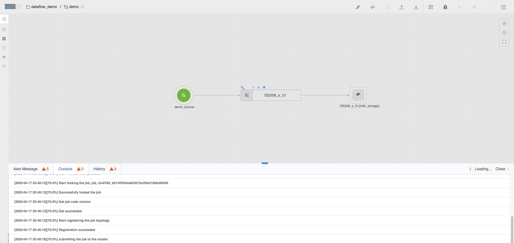

#### Startup configuration

Before starting the task, you need to configure the task information.

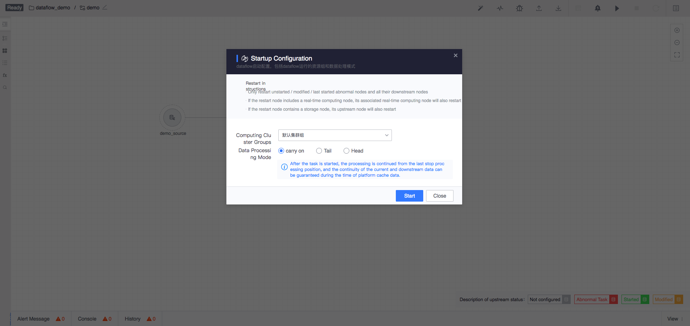

- Computing cluster group

   Used to identify the cluster group to which the current canvas task starts. If the cluster group is bound to a specific computing cluster, the task will be started in the cluster bound to the cluster group.

- Data processing mode

| Processing Mode | Description |
| ---- | ---- |
| Continue | After the task is started, processing will continue from the last stopped processing position. During the platform cache data time, the continuity of current and downstream data can be guaranteed |
| Tail | After the task is started, processing will start from the latest arriving data. Data between the last stop and the current startup will not be processed |
| Head | After the task is started, processing starts from the oldest data cached by the platform. If part of the data has been processed when it was stopped last time, it may cause repeated processing of current and downstream data |

Note: For a new task started for the first time, selecting "Continue" will consume from the head. Afterwards, when restarting again, selecting "Continue" will continue consuming from the point where processing stopped last time.

#### Startup instructions

- If the current canvas only has data source nodes, it is not allowed to be started.
- If there is no node stored in the current canvas, it is not allowed to start.
- If there is a real-time computing node leaf node in the canvas that has not been stored, it is not allowed to start.

### Step 4. Restart the task

Restart the task by clicking the Restart button on the action bar.

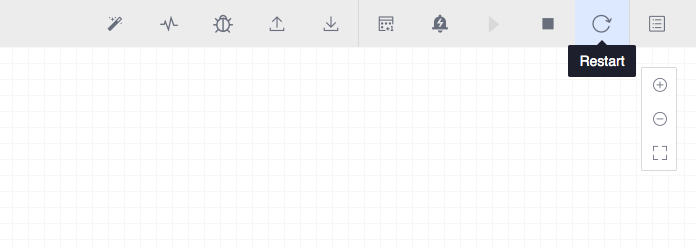

#### Restart configuration

The startup configuration of the restart task is the same as described in **Step 3.**.

#### Restart instructions

- If the data processing mode is selected as Continue
   - If all nodes in the canvas have not been modified, restarting will have no effect.
   - If nodes or connections are added, deleted, or modified on a running task, only the affected tasks will be restarted.
- If the data processing mode is selected as tail
   - Restart all tasks, and real-time computing tasks will be processed starting from the latest data
- If the data processing mode is selected as head
   - Restart all tasks, and real-time computing tasks will be processed starting from the oldest data cached by the platform.

### Step 5. Stop the task

Stop the task by clicking the Stop button on the action bar.

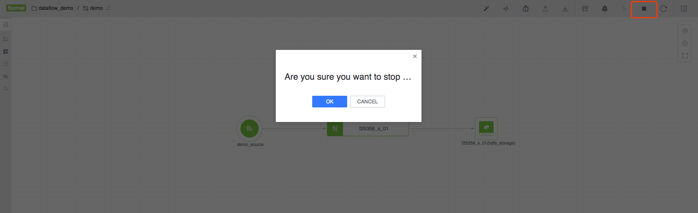