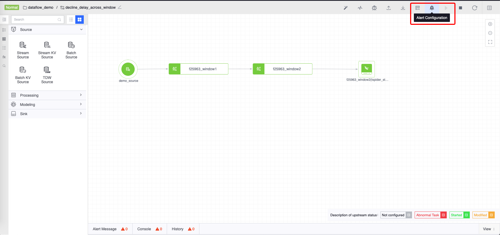
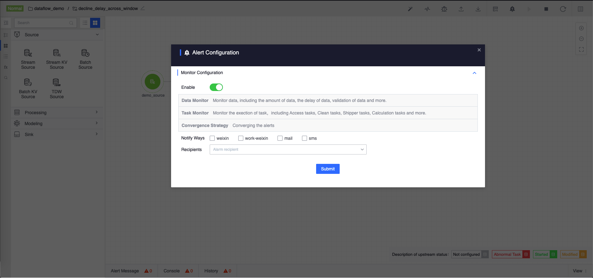
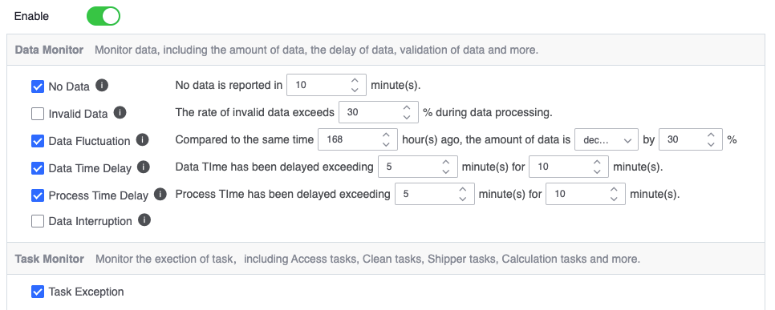
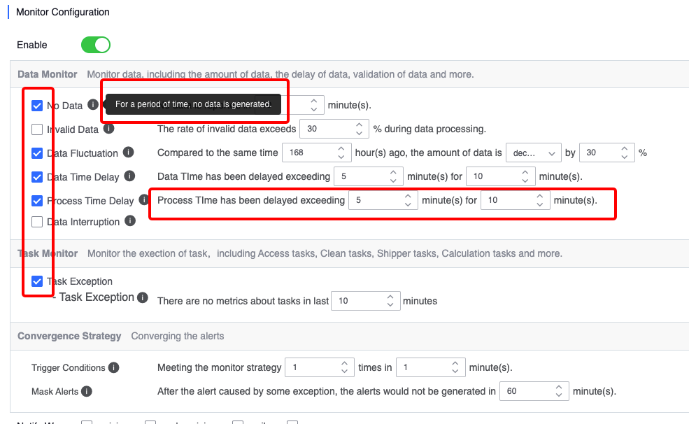
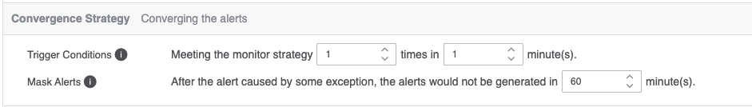

### Function introduction

User computing tasks may have data quality that does not meet user expectations due to **data source problems**, **data link exception** and **task exception**, etc., and if such problems If not discovered in time, it may have adverse effects on upper-layer applications that rely on the result data. The data flow monitoring alarm function can detect data from **No data in the data source**, **Invalid data**, **Data fluctuations* *, **Data time delay**, **Processing time delay**, **Data interruption**, **Task exception** These seven strategies monitor the quality of data. Users only need to monitor in **` By configuring the monitoring parameters on the Alarm`** page, you can receive an alarm notification when the data quality of the **data development task** is not satisfactory, so that you can promptly intervene to solve possible problems with the data source or task.

### Monitoring alarm strategy description

* **No data in the data source** - The data source has no **data reporting** for a period of time, or the cleaning, warehousing or calculation tasks have no **data output** for a period of time. For those with continuous reporting or output Data; this strategy can promptly detect abnormal situations such as service unavailability and ensure the **continuity** of data
* **Invalid data** - Data is actively discarded due to reasons such as **does not comply with calculation logic** or **format error** during the flow or processing process; this strategy is mainly used to discover resources caused by too much invalid data Waste and other situations to ensure the **validity** of data
* **Data Fluctuation** - The amount of data in data sources, cleaning, warehousing and computing tasks has decreased (increased) by more than the preset ratio compared to the previous period. This strategy is mainly used to discover that the data is abnormal due to anomalies. Comply with expected fluctuations and ensure data **stability**
* **Data time delay** ——During the process of data transfer or processing, the time of the data itself is delayed relative to the local time. This strategy is mainly used to find the situation where the result query is incomplete due to excessive data delay to ensure the results. **Real-time** of data
* **Processing time delay** - During the process of data transfer or processing, the delay in data processing time relative to local time. This strategy is mainly used to find situations where data is backlogged due to excessive processing delays to ensure that intermediate data can be processed promptly
* **Data Interruption** - Cleaning, warehousing and computing tasks are interrupted during execution or the task execution cannot be tracked. This strategy is mainly used to find problems where the actual running status of the task is inconsistent with its status to ensure data security* *reliability**
* **Task Abnormality** - During the process of data access, cleaning, warehousing and calculation, an abnormality occurs in the task at any link. This strategy is mainly used to discover abnormal situations of the task and ensure the **availability* of the task. *

### Alarm convergence strategy description
* **Trigger conditions** - The alarm must be triggered a certain number of times within the set period before the alarm will occur. This is mainly to solve the problem of alarm flooding caused by instantaneous jitter of alarm indicators.
* **Alarm Convergence** - Shield the alarms generated by the original detection according to a certain period of time, which can reduce the frequency of effective alarms and prevent alarm avalanche. The default shielding time is **60** minutes, and each monitoring alarm strategy blocks Time is independent of each other
* **Alarm Summary** - Summarize valid alarms after convergence into one message notification to reduce the frequency of alarm notifications to users. The default summary time is **10** minutes

### How to configure data development monitoring alarms

First, enter the `details editing page` of a data development task and click `Alarm Configuration` in the toolbar in the upper right corner of the data development canvas.

After clicking, an alarm configuration panel will open.

Monitoring configuration is mainly divided into two categories, namely `data monitoring` and `task monitoring`. Monitoring configuration is not enabled by default. Users can enable monitoring alarms by clicking the switch. After enabling it, the alarm policy can be further configured.

Each `alarm policy` can be turned on or off independently. The parameters of the alarm policy can be configured by referring to the `Monitoring Alarm Policy Description` above.

After configuring the alarm policy, you need to configure the `convergence policy`. For specific parameters, please refer to the `Alarm Convergence Policy Description` above for configuration.

After configuring the policy alarm policy and convergence policy, you need to configure the **notification method** and **recipient** of the alarm. The alarm can be configured only if there is at least one recipient and at least one notification method is turned on. Successfully saved as open

