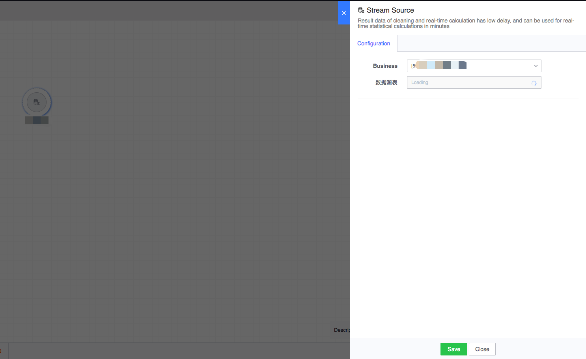
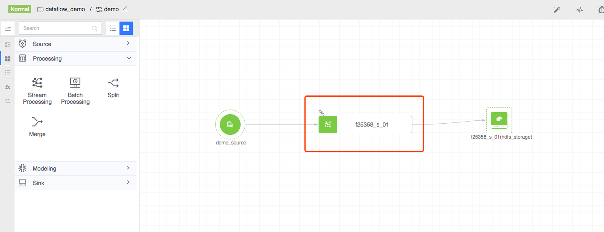
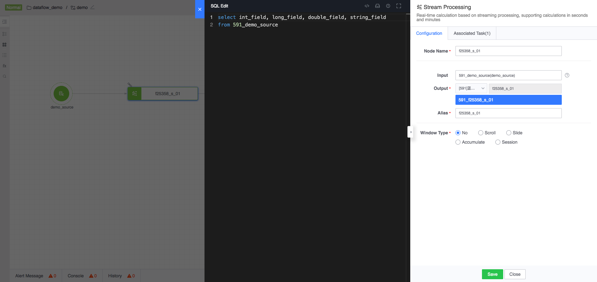
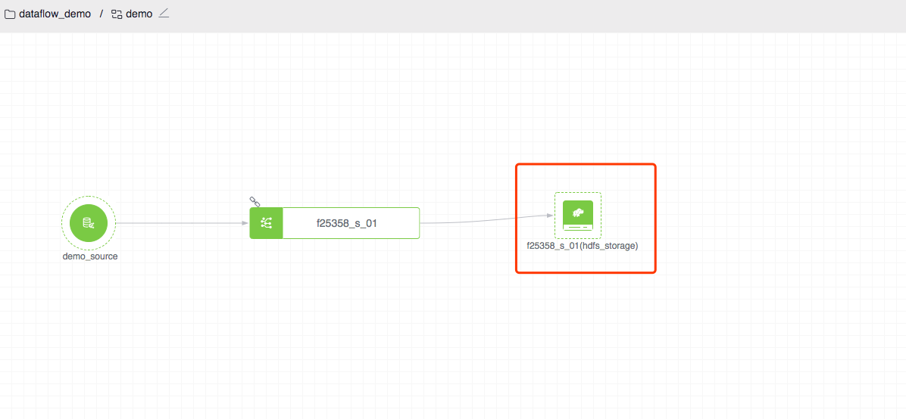

## What is real-time computing

The traditional big data computing model completely separates online data processing and offline data analysis in terms of time series. With the continuous development of business and technology, people's demand for high timeliness and operability of information continues to increase. It is obvious that this architecture can no longer meet the real-time processing needs of big data.

The value of data decreases with the passage of time, so it is particularly important to calculate and process the data immediately after it occurs. The generation of real-time computing is a process of people mining the value of data. In many scenarios such as real-time recommendation, monitoring and warning, real-time prediction, financial transactions, etc., traditional big data processing cannot meet the business needs. As a computing model for streaming data, real-time computing can handle the business needs of big data in real time and efficiently.

- Real-time, unbounded data source

Streaming data is calculated and consumed in real time in chronological order. And due to the persistence of data generation, data flows will be integrated into real-time computing systems for a long time and continuously. For example, a game's login log stream will be generated and entered into real-time calculations as long as the game is running normally. . Therefore, for real-time computing, the data is real-time and unterminated\(unbounded\).

- Continuous and efficient computing

Real-time computing is an "event-triggered" computing model, and the trigger source is the above-mentioned unbounded streaming data. Once new stream data enters the real-time calculation, the real-time calculation immediately initiates and performs a calculation task, so the entire real-time calculation is a continuous calculation.

## How to configure real-time calculation

- First select the real-time data source, double-click the data source to configure, and select the data source used for calculations

- Select real-time computing nodes for configuration

- Use SQL to express calculation logic and save it

- Finally configure the storage node to store the calculation results

#### Time introduction

  - Data time: event time, usually the time when the event occurs. The corresponding reserved field in the platform is [`dtEventTime`](../../../faq/localtime.md).
  - Local time: The local time when event data is calculated and stored in the database. The corresponding reserved field in the platform is [`localTime`](../../../faq/localtime.md).
  - Start time: window start time, generally refers to the start time of the window where the data is marked when the real-time computing node processes this data. The corresponding reserved field in the platform is [`_startTime_`](../../../faq /starttime.md).
  - End time: window end time, generally refers to the end time of the window where the data is marked when the real-time computing node processes this data. The corresponding reserved field in the platform is [`_endTime_`](../../../faq /starttime.md).

#### Window Introduction

Real-time calculations support using data time attributes as windows. Four window types are supported: rolling window, sliding window, cumulative window and session window.
  - Waiting time: It is used to deal with the situation where data time is out of order. For example, if the waiting time is set to 60 seconds, window calculation can be entered when the data source data arrives within 60 seconds of delay. At this time, the calculation results will be output with a delay of 60 seconds.
  - Window output time: The output time of rolling window and sliding window is the starting time of the window. Due to the uniqueness of the accumulation window and the session window, these two windows use the end time of the window as the output time of the window.