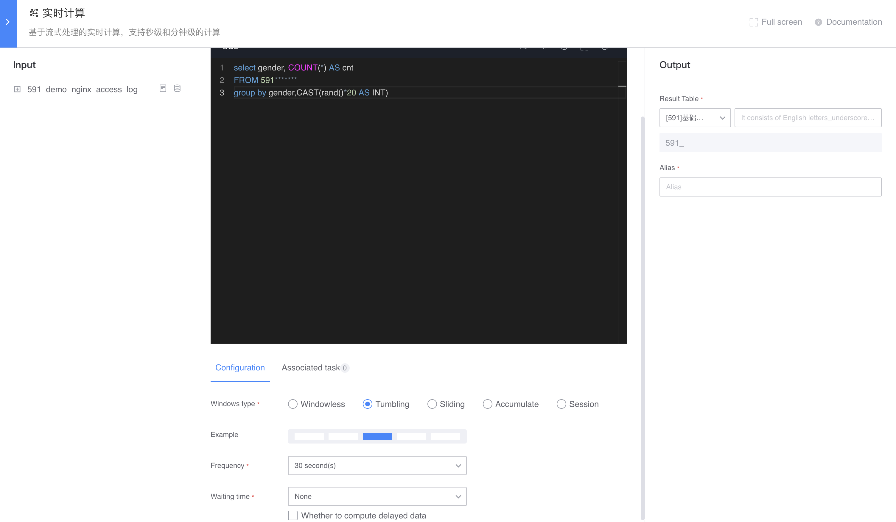
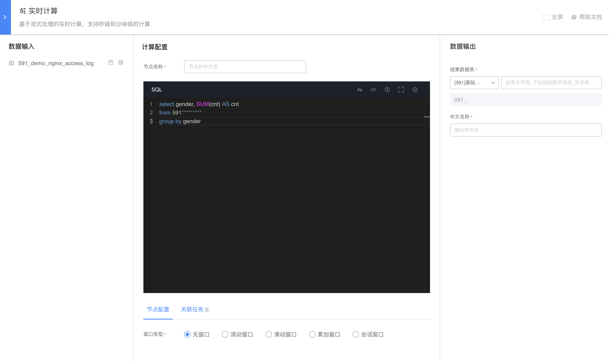

## Reduce data skew

## Typical Case

Real-time calculation of SQL When grouping and aggregating nodes with windows based on certain keys, due to the characteristics of the original data itself, there may be data skew. At this time, the parallelism of data processing cannot be effectively expanded. for example:

Input table company_programmer:

| data time | gender | name |
| :------------------: | :-----: | :----: |
| 2020-01-01 00:00:01 | male | n1 |
| 2020-01-01 00:00:02 | male | n2 |
| 2020-01-01 00:00:03 | male | n3 |
| 2020-01-01 00:00:04 | male | n4 |
| 2020-01-01 00:00:05 | male | n5 |
| 2020-01-01 00:00:06 | female | n6 |
| 2020-01-01 00:00:07 | female | n7 |
| 2020-01-01 00:00:08 | male | n8 |
| 2020-01-01 00:00:09 | ... | ... |
| 2020-01-01 00:00:10 | ... | ... |

As shown in the figure above, for each 60-second window, the values of the field `gender` are grouped and counted. Since there are only two types of `gender` values, and `male` has far more data than `female`, and the values of the same key will be processed in the same task during grouping, the grouping calculation can only have a maximum of 2 degrees of concurrency. Calculate the presence of data skew.

## optimization

When the data source has a large amount of data and there is data skew, it cannot be processed in time, causing data delays. It can be optimized for specific SQL usage. Take the above figure as an example. You can construct the following two real-time computing nodes, break up the data for pre-aggregation and then finally perform aggregation to achieve the same computing effect.

