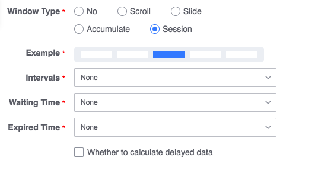

## Reduce the delay between window nodes

Data Development Current window calculations are data driven.

## Typical Case

There are two real-time computing nodes in the above figure, window node `f25963_window1` and window node `f25963_window2`, and their window configurations are the same:

The window node `f25963_window2` triggers the calculation of the Nth window when the node `f25963_window1` triggers the N+1th window. This is explained below with a data example.

- Assuming no delay in data reporting
- Assume that there is no delay from the output to the input of the upstream node to the downstream node

| Local time | Data time reported by data source | `f25963_window1` data time | `f25963_window2` data time |
| :------------------: | :------------------: | :----------------------: | :----------------------: |
| 2020-01-01 00:00:00 | 2020-01-01 00:00:00 | | |
| 2020-01-01 00:01:00 | 2020-01-01 00:01:00 | | |
| 2020-01-01 00:02:00 | 2020-01-01 00:02:00 | | |
| 2020-01-01 00:03:00 | 2020-01-01 00:03:00 | | |
| 2020-01-01 00:04:00 | 2020-01-01 00:04:00 | | |
| 2020-01-01 00:05:00 | 2020-01-01 00:05:00 | 2020-01-01 00:00:00 | |
| 2020-01-01 00:06:00 | 2020-01-01 00:06:00 | | |
| 2020-01-01 00:07:00 | 2020-01-01 00:07:00 | | |
| 2020-01-01 00:08:00 | 2020-01-01 00:08:00 | | |
| 2020-01-01 00:09:00 | 2020-01-01 00:09:00 | | |
| 2020-01-01 00:10:00 | 2020-01-01 00:10:00 | 2020-01-01 00:05:00 | 2020-01-01 00:00:00 |
| 2020-01-01 00:11:00 | 2020-01-01 00:11:00 | | |
| 2020-01-01 00:12:00 | 2020-01-01 00:12:00 | | |
| ... | ... | ... | ... |

The post-computing node requires a driver for the output data of the pre-computing node. You can see:

- The window node `f25963_window1` outputs the result data of one window every minute. The phenomenon is **data output is delayed by 5 minutes**
- The window node `f25963_window2` also outputs the result data of one window every minute, but compared with the data source, the phenomenon is **data output is delayed by 10 minutes**

## Ways to reduce latency

`f25963_window2` can be considered to output ordered data regularly. When the post-node is also configured with the same window and the same statistical frequency, the waiting of the post-node is slightly redundant. Therefore, the node `f25963_window2` can be set as the session window, and through reasonable configuration of the expiration time, the window calculation of the downstream node can be promoted as soon as possible.

### Configuration instructions

The sum of window interval time and expiration time should be less than the statistical frequency of the upstream node

- Intervals

   Since the upstream outputs in window batches, the current node needs to calculate a batch of data from the upstream, and the data time of the upstream batch is the same, so the interval can be set to 0

- Expiration

   The expiration time is a session window that has no data for a long time and automatically triggers the calculated **local waiting time** configuration, so the value can be set to a smaller value other than 0.

### Case configuration example

Depending on the case, the following session window can be configured:

